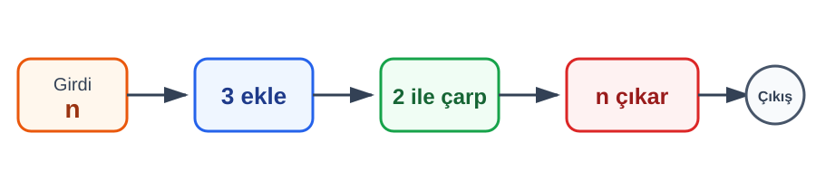

# Konu 01 — Temel Kavramlar ve Sayı Kümeleri

## Test 41 — İleri ve Yeni Nesil Düzeyi

- Soru sayısı: 10
- Her soruda yalnız bir doğru seçenek vardır.
- Önerilen süre: 25 dakika

## Soru 1

`K01-T41-Q01`

Aşağıdaki işlem şemasında tam sayı $n$ için adımlar soldan sağa uygulanıyor.

Şemanın sonunda tek sayı elde edildiğine göre $n$ için hangisi kesindir?

A) Çifttir.

B) Tektir.

C) Pozitiftir.

D) Negatiftir.

E) 3'ün katıdır.

## Soru 2

`K01-T41-Q02`

İrrasyonel $t$ ve rasyonel $r$ sayıları için $x=t+r$ ve $y=2t-r$ tanımlanıyor.

Aşağıdaki ifadelerden hangisi kesinlikle rasyoneldir?

A) $x+y$

B) $x-y$

C) $xy$

D) $x^2-y^2$

E) $2x-y$

## Soru 3

`K01-T41-Q03`

Bir koridordaki beş dolabın numaraları ardışık tam sayılardır. Bu numaraların toplamı, en büyük dolap numarasının 3 katından 34 fazladır.

En büyük dolabın numarası kaçtır?

A) $19$

B) $20$

C) $21$

D) $22$

E) $23$

## Soru 4

`K01-T41-Q04`

$a=\sqrt{31}-4$, $b=\dfrac{47}{30}$ ve $c=1,568$ olduğuna göre bu sayıların küçükten büyüğe doğru sıralaması hangisidir?

A) $a<b<c$

B) $c<a<b$

C) $b<a<c$

D) $b<c<a$

E) $c<b<a$

## Soru 5

`K01-T41-Q05`

Bir hesabın başlangıç bakiyesi $x<0$ TL, hesaba yatırılan para $y>0$ TL'dir. Borcun büyüklüğü yatırılan paranın $\dfrac32$ katıdır.

İşlem sonrası $x+y$ bakiyesi için hangisi kesindir?

A) Negatiftir.

B) Pozitiftir.

C) Sıfırdır.

D) Tam sayıdır.

E) Rasyoneldir.

## Soru 6

`K01-T41-Q06`

$a=5k+3$ ve $b=5\ell+3$ olmak üzere $k$ ve $\ell$ tam sayılardır. Aşağıdaki ifadelerden hangisi bir $m$ tam sayısı için $5m+4$ biçiminde yazılabilir?

A) $2a+b$

B) $a+b$

C) $a-b$

D) $ab$

E) $ab+1$

## Soru 7

`K01-T41-Q07`

Kenar uzunlukları $\sqrt{10}+\sqrt6$ ve $\sqrt{10}-\sqrt6$ metre olan dikdörtgen biçimindeki bir alanın yüz ölçümü kaç metrekaredir?

A) $2$

B) $3$

C) $4$

D) $8$

E) $2\sqrt{15}$

## Soru 8

`K01-T41-Q08`

$m$ ve $n$ tam sayılarının toplamı tektir. Aşağıdaki ifadelerden hangisi kesinlikle tektir?

A) $mn$

B) $m^2+n^2+1$

C) $m+n+1$

D) $m^2+mn+n^2$

E) $2m+n+1$

## Soru 9

`K01-T41-Q09`

$-\sqrt{120}$ ile $2\pi+5$ arasında kaç farklı tam sayı vardır?

A) $18$

B) $19$

C) $20$

D) $21$

E) $22$

## Soru 10

`K01-T41-Q10`

Bir öğrenci “İki gerçek sayının toplamı negatifse iki sayı da negatiftir.” sonucuna ulaşıyor.

Hangi sayı çifti öğrencinin sonucunun her zaman doğru olmadığını gösterir?

A) $(-3,-2)$

B) $(4,-7)$

C) $(-5,-1)$

D) $(-2,-4)$

E) $(-6,-3)$
