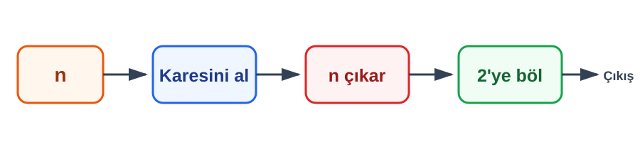

# Konu 01 — Temel Kavramlar ve Sayı Kümeleri

## Test 47 — İleri ve Yeni Nesil Düzeyi

- Soru sayısı: 10
- Her soruda yalnız bir doğru seçenek vardır.
- Önerilen süre: 25 dakika

## Soru 1

`K01-T47-Q01`

Tam sayı $n$'ye aşağıdaki işlemler sırasıyla uygulanıyor.

Elde edilen sonuç için hangisi her zaman doğrudur?

A) Pozitiftir.

B) Tektir.

C) Tam sayıdır.

D) 4'ün katıdır.

E) Negatiftir.

## Soru 2

`K01-T47-Q02`

$t=\sqrt3+\sqrt{12}$ olduğuna göre $t^2$ kaçtır?

A) $27$

B) $18$

C) $15$

D) $12$

E) $9$

## Soru 3

`K01-T47-Q03`

Ardışık yedi pozitif tek sayıdan oluşan bir kanal dizisinin numaraları toplamı 217'dir. En büyük kanal numarası kaçtır?

A) $29$

B) $31$

C) $33$

D) $35$

E) $37$

## Soru 4

`K01-T47-Q04`

$a=\sqrt{47}-5$, $b=\dfrac{13}{7}$ ve $c=1,856$ olduğuna göre küçükten büyüğe doğru sıralama hangisidir?

A) $c<a<b$

B) $a<c<b$

C) $b<a<c$

D) $a<b<c$

E) $c<b<a$

## Soru 5

`K01-T47-Q05`

$x<0<y$ ve $|x|=3y$ olduğuna göre $\dfrac{x-y}{x+y}$ oranı kaçtır?

A) $-2$

B) $-\dfrac12$

C) $\dfrac12$

D) $2$

E) $3$

## Soru 6

`K01-T47-Q06`

$a$ ve $b$ tam sayılarının her biri 12 ile bölündüğünde 5 kalanını veriyor. Aşağıdakilerden hangisi 12 ile bölündüğünde yine 5 kalanını verir?

A) $a+b$

B) $a-b$

C) $ab$

D) $a+b+7$

E) $ab+1$

## Soru 7

`K01-T47-Q07`

Kenarları $\sqrt{21}+\sqrt{13}$ ve $\sqrt{21}-\sqrt{13}$ birim olan dikdörtgenin alanı kaç birimkaredir?

A) $7$

B) $8$

C) $13$

D) $21$

E) $2\sqrt{273}$

## Soru 8

`K01-T47-Q08`

Tek tam sayılar olan $m,n$ için hangi ifade kesinlikle tek tam sayıdır?

A) $m+n$

B) $mn+1$

C) $m^2+n^2$

D) $\dfrac{m+n}{2}$

E) $\dfrac{m^2+n^2}{2}$

## Soru 9

`K01-T47-Q09`

$-5\pi$ ile $\sqrt{260}$ arasında kaç tam sayı vardır?

A) $32$

B) $31$

C) $30$

D) $33$

E) $34$

## Soru 10

`K01-T47-Q10`

Bir öğrenci, toplamı rasyonel olan iki sayının ayrı ayrı da rasyonel olduğunu iddia ediyor.

Hangi sayı çifti bu iddianın yanlış olduğunu gösterir?

A) $(1,2)$

B) $(0,3)$

C) $(\sqrt2,-\sqrt2)$

D) $(-2,5)$

E) $(1/2,3/2)$
