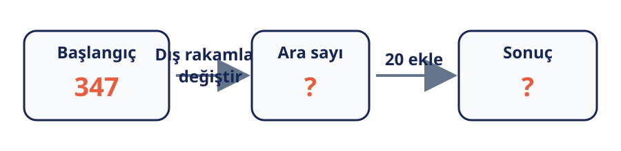

# Konu 02 — Sayı Basamakları

## Test 31 — Gelişim ve Pekiştirme Düzeyi

- Soru sayısı: 10
- Her soruda yalnız bir doğru seçenek vardır.
- Önerilen süre: 18 dakika

## Soru 1

`K02-T31-Q01`

Aşağıdaki işlemler soldan sağa uygulanıyor.

Elde edilen sonuç kaçtır?

A) $743$

B) $763$

C) $367$

D) $437$

E) $783$

## Soru 2

`K02-T31-Q02`

Dört haneli $2a5b$ ürün numarasının rakamları toplamı 16'dır. $b=a-1$ olduğuna göre numara hangisidir?

A) $2352$

B) $2453$

C) $2653$

D) $2752$

E) $2554$

## Soru 3

`K02-T31-Q03`

Bir sayaç 598 değerini gösterirken her adımda 1 artıyor. 27 adım sonra sayaç kaçı gösterir?

A) $615$

B) $619$

C) $625$

D) $635$

E) $698$

## Soru 4

`K02-T31-Q04`

472 sayısının önce ilk ve son rakamı yer değiştiriliyor, sonra elde edilen sayıya 100 ekleniyor. Sonuç kaçtır?

A) $374$

B) $274$

C) $472$

D) $572$

E) $742$

## Soru 5

`K02-T31-Q05`

47 sayısının rakamları ters çevriliyor ve elde edilen sayıya 47'nin rakamları toplamı ekleniyor. Sonuç kaçtır?

A) $74$

B) $81$

C) $83$

D) $85$

E) $88$

## Soru 6

`K02-T31-Q06`

352 sayısının onlar basamağı 2 artırılıp birler basamağı 1 azaltılıyor. Elde edilen sayı kaçtır?

A) $342$

B) $361$

C) $362$

D) $371$

E) $372$

## Soru 7

`K02-T31-Q07`

468 sayısının son iki rakamı yer değiştirildikten sonra elde edilen sayıya 100 ekleniyor. Sonuç kaçtır?

A) $586$

B) $568$

C) $684$

D) $486$

E) $584$

## Soru 8

`K02-T31-Q08`

$ab0c$ biçimindeki bir numarada $a=2b$, $c=a+b$ ve $b=2$'dir. Numara hangisidir?

A) $2406$

B) $4026$

C) $4206$

D) $4260$

E) $2046$

## Soru 9

`K02-T31-Q09`

Üç haneli gösterim kullanan bir sayaç 098'i gösteriyor. Sayaç dört kez artırıldığında hangi değeri gösterir?

A) $099$

B) $100$

C) $101$

D) $103$

E) $102$

## Soru 10

`K02-T31-Q10`

731 sayısının rakamları ters çevriliyor, ardından elde edilen sayıdan 100 çıkarılıyor. Sonuç kaçtır?

A) $31$

B) $37$

C) $137$

D) $631$

E) $637$
