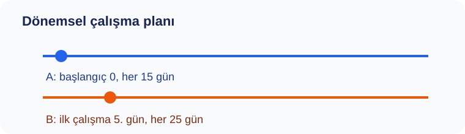

# Konu 03 — Bölme, Bölünebilme ve Kalan

## Test 42 — İleri Düzey Veri ve Döngü Problemleri

- Soru sayısı: 10
- Her soruda yalnız bir doğru seçenek vardır.
- Önerilen süre: 25 dakika

## Soru 1
`K03-T42-Q01`

Kütüphaneciler gezici kitaplık, sayım rafı ve sessiz salon düzenini birlikte izliyor. Şehir kütüphanesi için aşağıdaki iki dönemsel plan pazartesi günü başlatılıyor. 80. günden önceki ortak çalışmalar dikkate alınmadığında, iki planın ilk kez aynı güne geldiği gün haftanın hangi günüdür?

A) Perşembe  
B) Cuma  
C) Pazartesi  
D) Cumartesi  
E) Pazar  

## Soru 2
`K03-T42-Q02`

Bir şehir kütüphanesi deposundaki üç rafın ürün sayıları aşağıdaki gibi kaydedilmiştir. | Raf | I | II | III | |:--:|--:|--:|--:| | Ürün sayısı | 117 | 161 | 227 | Her raftaki ürünler aynı büyüklükte gruplara ayrıldığında her rafta 7 ürün artıyor. Buna göre bir grubun alabileceği en fazla ürün sayısı kaçtır?

A) $22$  
B) $16$  
C) $19$  
D) $25$  
E) $28$  

## Soru 3
`K03-T42-Q03`

Bir ölçü listesi hazırlanırken, verilen bağıntıdan yararlanarak: 9 ile bölündüğünde 4, 15 ile bölündüğünde 7 kalanını veren kayıtlar seçiliyor. Uç değerler aralığa dâhil olduğuna göre kaç kayıt seçilir?

A) $1$  
B) $2$  
C) $4$  
D) $5$  
E) $3$  

## Soru 4
`K03-T42-Q04`

Kütüphaneciler gezici kitaplık, sayım rafı ve sessiz salon düzenini birlikte izliyor. Dört basamaklı $4ab4$ sayısı 18 ile tam bölünüyor. $a$ ve $b$ birer rakam ve $a+b≥7$ olduğuna göre $(a,b)$ sıralı ikilisi kaç farklı değer alır?

A) $5$  
B) $9$  
C) $7$  
D) $11$  
E) $13$  

## Soru 5
`K03-T42-Q05`

Kütüphaneciler gezici kitaplık, sayım rafı ve sessiz salon düzenini birlikte izliyor. Bir ölçüm numarası $n$, 19 ile bölündüğünde 7 kalanını veriyor. İşlem şemasında önce sayı 5 ile çarpılıyor, ardından 12 ekleniyor. Şemanın ürettiği $5n+12$ sayısının 19 ile bölümünden kalan kaçtır?

A) $6$  
B) $8$  
C) $10$  
D) $9$  
E) $12$  

## Soru 6
`K03-T42-Q06`

Kütüphaneciler gezici kitaplık, sayım rafı ve sessiz salon düzenini birlikte izliyor. Konumları 0 ile 18 arasında numaralanmış dairesel bir parkurda bir araç 7. konumdadır. Önce saat yönünde 113 konum, sonra ters yönde 37 konum ilerliyor. Son konumu kaçtır?

A) $3$  
B) $5$  
C) $7$  
D) $9$  
E) $11$  

## Soru 7
`K03-T42-Q07`

Bir ölçü listesi hazırlanırken, verilen bağıntıdan yararlanarak: Bir yarışmada kullanılacak en küçük etiket numarası 650'den büyüktür. Etiket numarası 16 ile bölündüğünde 5, 24 ile bölündüğünde 13 kalanını vermelidir. Bu etiket numarası kaçtır?

A) $661$  
B) $653$  
C) $669$  
D) $677$  
E) $685$  

## Soru 8
`K03-T42-Q08`

Kütüphaneciler gezici kitaplık, sayım rafı ve sessiz salon düzenini birlikte izliyor. Bir sayı $3^{38}+7^{29}$ toplamının 16 ile bölümünden kalan olarak tanımlanıyor. Kuvvetlerin tamamını hesaplamadan bu sayı kaç bulunur?

A) $1$  
B) $3$  
C) $2$  
D) $4$  
E) $0$  

## Soru 9
`K03-T42-Q09`

Kütüphaneciler gezici kitaplık, sayım rafı ve sessiz salon düzenini birlikte izliyor. 1'den 720'ye kadar numaralanmış kutulardan, numarası 10 ile bölündüğünde 3 ve 14 ile bölündüğünde 5 kalanını verenler işaretleniyor. Her iki koşulu aynı anda sağlayan kaç kutu işaretlenir?

A) $8$  
B) $10$  
C) $9$  
D) $11$  
E) $12$  

## Soru 10
`K03-T42-Q10`

Bir ölçü listesi hazırlanırken, verilen bağıntıdan yararlanarak: $A$ ve $B$ doğal sayılarının 20 ile bölümünden kalanlar sırasıyla 7 ve 6'dir. Buna göre $4A-3B+9$ ifadesinin 20 ile bölümünden kalan kaçtır?

A) $15$  
B) $17$  
C) $21$  
D) $19$  
E) $23$  
