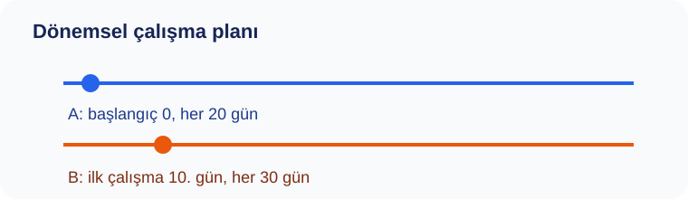

# Konu 03 — Bölme, Bölünebilme ve Kalan

## Test 46 — Yeni Nesil Çoklu Temsil ve Sentez

- Soru sayısı: 10
- Her soruda yalnız bir doğru seçenek vardır.
- Önerilen süre: 25 dakika

## Soru 1
`K03-T46-Q01`

Hazırlama tesisi için aşağıdaki iki dönemsel plan pazartesi günü başlatılıyor. 110. günden önceki ortak çalışmalar dikkate alınmadığında, iki planın ilk kez aynı güne geldiği gün haftanın hangi günüdür?

A) Pazartesi  
B) Pazar  
C) Salı  
D) Çarşamba  
E) Perşembe  

## Soru 2
`K03-T46-Q02`

Bir işletme deposundaki üç rafın ürün sayıları aşağıdaki gibi kaydedilmiştir. | Raf | I | II | III | |:--:|--:|--:|--:| | Ürün sayısı | 265 | 329 | 425 | Her raftaki ürünler aynı büyüklükte gruplara ayrıldığında her rafta 9 ürün artıyor. Buna göre bir grubun alabileceği en fazla ürün sayısı kaçtır?

A) $26$  
B) $29$  
C) $32$  
D) $35$  
E) $38$  

## Soru 3
`K03-T46-Q03`

Bir sayı doğrusu incelemesinde, koşulu bir eşitlik olarak yazdığımızda: 15 ile bölündüğünde 8, 21 ile bölündüğünde 11 kalanını veren kayıtlar seçiliyor. Uç değerler aralığa dâhil olduğuna göre kaç kayıt seçilir?

A) $2$  
B) $3$  
C) $5$  
D) $6$  
E) $4$  

## Soru 4
`K03-T46-Q04`

Bir sayı doğrusu incelemesinde, verilen bağıntıdan yararlanarak: Dört basamaklı $8ab4$ sayısı 24 ile tam bölünüyor. $a$ ve $b$ birer rakam ve $a+b≥7$ olduğuna göre $(a,b)$ sıralı ikilisi kaç farklı değer alır?

A) $5$  
B) $1$  
C) $3$  
D) $7$  
E) $9$  

## Soru 5
`K03-T46-Q05`

Bir ölçü listesi hazırlanırken, verilen bağıntıdan yararlanarak: Bir ölçüm numarası $n$, 29 ile bölündüğünde 13 kalanını veriyor. İşlem şemasında önce sayı 6 ile çarpılıyor, ardından 14 ekleniyor. Şemanın ürettiği $6n+14$ sayısının 29 ile bölümünden kalan kaçtır?

A) $2$  
B) $4$  
C) $6$  
D) $5$  
E) $8$  

## Soru 6
`K03-T46-Q06`

Bir ölçü listesi hazırlanırken, verilen bağıntıdan yararlanarak: Konumları 0 ile 27 arasında numaralanmış dairesel bir parkurda bir araç 5. konumdadır. Önce saat yönünde 221 konum, sonra ters yönde 84 konum ilerliyor. Son konumu kaçtır?

A) $0$  
B) $2$  
C) $4$  
D) $6$  
E) $1$  

## Soru 7
`K03-T46-Q07`

Bir sayı doğrusu incelemesinde, koşulu bir eşitlik olarak yazdığımızda: Bir yarışmada kullanılacak en küçük etiket numarası 1250'den büyüktür. Etiket numarası 24 ile bölündüğünde 11, 32 ile bölündüğünde 19 kalanını vermelidir. Bu etiket numarası kaçtır?

A) $1323$  
B) $1339$  
C) $1331$  
D) $1355$  
E) $1363$  

## Soru 8
`K03-T46-Q08`

Bir ölçü listesi hazırlanırken, verilen bağıntıdan yararlanarak: Bir sayı $6^{33}+5^{39}$ toplamının 25 ile bölümünden kalan olarak tanımlanıyor. Kuvvetlerin tamamını hesaplamadan bu sayı kaç bulunur?

A) $13$  
B) $15$  
C) $17$  
D) $19$  
E) $16$  

## Soru 9
`K03-T46-Q09`

Bir ölçü listesi hazırlanırken, verilen bağıntıdan yararlanarak: 1'den 1200'ye kadar numaralanmış kutulardan, numarası 16 ile bölündüğünde 9 ve 24 ile bölündüğünde 17 kalanını verenler işaretleniyor. Her iki koşulu aynı anda sağlayan kaç kutu işaretlenir?

A) $25$  
B) $23$  
C) $24$  
D) $26$  
E) $27$  

## Soru 10
`K03-T46-Q10`

Bir sayı doğrusu incelemesinde, koşulu bir eşitlik olarak yazdığımızda: $A$ ve $B$ doğal sayılarının 28 ile bölümünden kalanlar sırasıyla 15 ve 14'dir. Buna göre $3A-4B+17$ ifadesinin 28 ile bölümünden kalan kaçtır?

A) $2$  
B) $4$  
C) $8$  
D) $6$  
E) $10$  
