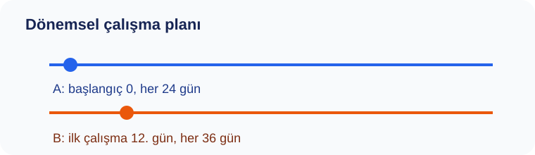

# Konu 03 — Bölme, Bölünebilme ve Kalan

## Test 48 — Yeni Nesil Çoklu Temsil ve Sentez

- Soru sayısı: 10
- Her soruda yalnız bir doğru seçenek vardır.
- Önerilen süre: 25 dakika

## Soru 1
`K03-T48-Q01`

Ulaşım merkezi için aşağıdaki iki dönemsel plan pazartesi günü başlatılıyor. 130. günden önceki ortak çalışmalar dikkate alınmadığında, iki planın ilk kez aynı güne geldiği gün haftanın hangi günüdür?

A) Çarşamba  
B) Cuma  
C) Cumartesi  
D) Perşembe  
E) Pazar  

## Soru 2
`K03-T48-Q02`

Bir ulaşım merkezi deposundaki üç rafın ürün sayıları aşağıdaki gibi kaydedilmiştir. | Raf | I | II | III | |:--:|--:|--:|--:| | Ürün sayısı | 341 | 413 | 521 | Her raftaki ürünler aynı büyüklükte gruplara ayrıldığında her rafta 17 ürün artıyor. Buna göre bir grubun alabileceği en fazla ürün sayısı kaçtır?

A) $30$  
B) $33$  
C) $39$  
D) $42$  
E) $36$  

## Soru 3
`K03-T48-Q03`

Bir sınıf etkinliğinde, koşulu bir eşitlik olarak yazdığımızda: 18 ile bölündüğünde 13, 27 ile bölündüğünde 22 kalanını veren kayıtlar seçiliyor. Uç değerler aralığa dâhil olduğuna göre kaç kayıt seçilir?

A) $1$  
B) $3$  
C) $2$  
D) $4$  
E) $5$  

## Soru 4
`K03-T48-Q04`

Bir sayı doğrusu incelemesinde, verilen bağıntıdan yararlanarak: Dört basamaklı $2ab8$ sayısı 36 ile tam bölünüyor. $a$ ve $b$ birer rakam ve $a+b≥9$ olduğuna göre $(a,b)$ sıralı ikilisi kaç farklı değer alır?

A) $1$  
B) $3$  
C) $5$  
D) $0$  
E) $2$  

## Soru 5
`K03-T48-Q05`

Bir sınıf etkinliğinde, verilen bağıntıdan yararlanarak: Bir ölçüm numarası $n$, 32 ile bölündüğünde 15 kalanını veriyor. İşlem şemasında önce sayı 9 ile çarpılıyor, ardından 13 ekleniyor. Şemanın ürettiği $9n+13$ sayısının 32 ile bölümünden kalan kaçtır?

A) $17$  
B) $19$  
C) $20$  
D) $21$  
E) $23$  

## Soru 6
`K03-T48-Q06`

Bir sınıf etkinliğinde, verilen bağıntıdan yararlanarak: Konumları 0 ile 31 arasında numaralanmış dairesel bir parkurda bir araç 14. konumdadır. Önce saat yönünde 275 konum, sonra ters yönde 106 konum ilerliyor. Son konumu kaçtır?

A) $19$  
B) $21$  
C) $25$  
D) $23$  
E) $27$  

## Soru 7
`K03-T48-Q07`

Bir sınıf etkinliğinde, koşulu bir eşitlik olarak yazdığımızda: Bir yarışmada kullanılacak en küçük etiket numarası 1550'den büyüktür. Etiket numarası 27 ile bölündüğünde 10, 36 ile bölündüğünde 19 kalanını vermelidir. Bu etiket numarası kaçtır?

A) $1594$  
B) $1612$  
C) $1630$  
D) $1639$  
E) $1603$  

## Soru 8
`K03-T48-Q08`

Bir sınıf etkinliğinde, verilen bağıntıdan yararlanarak: Bir sayı $9^{31}+4^{28}$ toplamının 29 ile bölümünden kalan olarak tanımlanıyor. Kuvvetlerin tamamını hesaplamadan bu sayı kaç bulunur?

A) $2$  
B) $5$  
C) $4$  
D) $6$  
E) $8$  

## Soru 9
`K03-T48-Q09`

Bir sayı tablosu okunurken, verilen bağıntıdan yararlanarak: 1'den 1440'ye kadar numaralanmış kutulardan, numarası 20 ile bölündüğünde 13 ve 30 ile bölündüğünde 23 kalanını verenler işaretleniyor. Her iki koşulu aynı anda sağlayan kaç kutu işaretlenir?

A) $24$  
B) $22$  
C) $23$  
D) $25$  
E) $26$  

## Soru 10
`K03-T48-Q10`

Bir sınıf etkinliğinde, koşulu bir eşitlik olarak yazdığımızda: $A$ ve $B$ doğal sayılarının 32 ile bölümünden kalanlar sırasıyla 19 ve 18'dir. Buna göre $5A-3B+21$ ifadesinin 32 ile bölümünden kalan kaçtır?

A) $26$  
B) $28$  
C) $30$  
D) $32$  
E) $34$  
