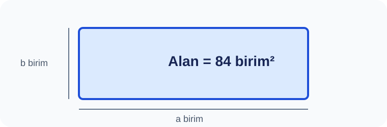

# Konu 04 — Asal Sayılar, Çarpanlar ve Bölen Sayısı

## Test 16 — Temel Düzey

- Soru sayısı: 10
- Her soruda yalnız bir doğru seçenek vardır.
- Önerilen süre: 15 dakika

## Soru 1
`K04-T16-Q01`

Bir sayı doğrusu incelemesinde, verilen bağıntıdan yararlanarak: $a$ ve $b$ pozitif tam sayılardır. Döndürülünce aynı olan modeller bir kez sayılırsa kaç farklı $(a,b)$ kenar çifti kullanılabilir?

A) $4$  
B) $6$  
C) $5$  
D) $7$  
E) $8$  

## Soru 2
`K04-T16-Q02`

72 eş karo, her kenarında en az 2 karo bulunan dikdörtgenler oluşturacaktır. Döndürülmüş düzenler aynı sayılırsa kaç düzen kurulabilir?

A) $3$  
B) $4$  
C) $6$  
D) $5$  
E) $7$  

## Soru 3
`K04-T16-Q03`

Alanı 60 birimkare, kenarları pozitif tam sayı olan bir dikdörtgenin alabileceği en küçük çevre kaç birimdir?

A) $32$  
B) $28$  
C) $30$  
D) $34$  
E) $36$  

## Soru 4
`K04-T16-Q04`

Alanı 48 birimkare olan ve hiçbir kenarı 1 olmayan tam sayı kenarlı dikdörtgenlerin en büyük çevresi kaçtır?

A) $48$  
B) $50$  
C) $54$  
D) $56$  
E) $52$  

## Soru 5
`K04-T16-Q05`

Alanı 36 birimkare olan farklı tam sayı kenarlı dikdörtgenlerin kısa kenarları toplamı kaçtır?

A) $12$  
B) $14$  
C) $16$  
D) $18$  
E) $20$  

## Soru 6
`K04-T16-Q06`

Aşağıdaki alanlardan hangisi tam sayı kenarlı bir kareye aittir?

A) $120$  
B) $121$  
C) $126$  
D) $130$  
E) $132$  

## Soru 7
`K04-T16-Q07`

Aşağıdaki sayılardan hangisi yön eşliğiyle tam 6 farklı dikdörtgen düzenine sahiptir?

A) $80$  
B) $100$  
C) $20$  
D) $84$  
E) $21$  

## Soru 8
`K04-T16-Q08`

$a·b=90$ eşitliğini sağlayan kaç pozitif tam sayı sıralı ikilisi $(a,b)$ vardır?

A) $12$  
B) $8$  
C) $10$  
D) $14$  
E) $16$  

## Soru 9
`K04-T16-Q09`

Pozitif bölen sayısı 9 olan bir doğal sayı, yönü önemsenmeyen kaç farklı dikdörtgen kenar çifti verir?

A) $3$  
B) $4$  
C) $6$  
D) $7$  
E) $5$  

## Soru 10
`K04-T16-Q10`

Alanı 144 birimkare olan tam sayı kenarlı dikdörtgenlerden kaçının iki kenarı da çifttir?

A) $3$  
B) $4$  
C) $5$  
D) $6$  
E) $7$  
