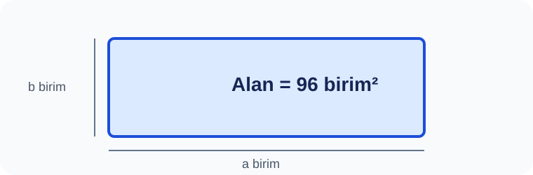

# Konu 04 — Asal Sayılar, Çarpanlar ve Bölen Sayısı

## Test 17 — Temel Düzey

- Soru sayısı: 10
- Her soruda yalnız bir doğru seçenek vardır.
- Önerilen süre: 15 dakika

## Soru 1
`K04-T17-Q01`

Bir sayı doğrusu incelemesinde, verilen bağıntıdan yararlanarak: Aşağıdaki alan modelinde $a$ ve $b$ pozitif tam sayılardır. Döndürülünce aynı olan modeller bir kez sayılırsa kaç farklı $(a,b)$ kenar çifti kullanılabilir?

A) $4$  
B) $5$  
C) $6$  
D) $7$  
E) $8$  

## Soru 2
`K04-T17-Q02`

Bir raf yüzeyi 90 eş kareyle ve tek sıralı düzen kullanılmadan kaplanıyor. Kenar sırası önemsenmezse kaç dikdörtgen oluşur?

A) $3$  
B) $4$  
C) $6$  
D) $7$  
E) $5$  

## Soru 3
`K04-T17-Q03`

Bu çevre kaç birimdir?

A) $30$  
B) $34$  
C) $32$  
D) $36$  
E) $38$  

## Soru 4
`K04-T17-Q04`

Bir raf alanı 60 birimkaredir ve şerit biçimli 1 birimlik kenar yasaktır. En uzun çevre kaç birim olur?

A) $64$  
B) $60$  
C) $62$  
D) $66$  
E) $68$  

## Soru 5
`K04-T17-Q05`

Bir ölçü listesi hazırlanırken, verilen bağıntıdan yararlanarak: Yazılan sayıların toplamı nedir?

A) $12$  
B) $14$  
C) $18$  
D) $16$  
E) $20$  

## Soru 6
`K04-T17-Q06`

Bir raf yüzeyinin hem kısa hem uzun kenarı aynı tam sayıdır. Alanı hangisi olabilir?

A) $135$  
B) $140$  
C) $144$  
D) $150$  
E) $154$  

## Soru 7
`K04-T17-Q07`

Bir raf alanı 6 farklı tam sayı kenar çifti veriyor. Bu alan hangisidir?

A) $112$  
B) $20$  
C) $21$  
D) $22$  
E) $96$  

## Soru 8
`K04-T17-Q08`

Bir rafın satır ve sütun sayıları sıralı olarak kaydediliyor ve çarpımları 108 oluyor. Kaç $(satır,sütun)$ kaydı mümkündür?

A) $8$  
B) $12$  
C) $10$  
D) $14$  
E) $16$  

## Soru 9
`K04-T17-Q09`

Bir raf alanının 12 pozitif böleni vardır. Kenarların yer değiştirmesi aynı düzen sayılırsa kaç dikdörtgen oluşur?

A) $6$  
B) $4$  
C) $5$  
D) $7$  
E) $8$  

## Soru 10
`K04-T17-Q10`

$192$ karelik raf yüzeyinde satır ve sütun sayılarının ikisi de çift olacaktır. Yön eşliğiyle kaç düzen vardır?

A) $3$  
B) $4$  
C) $6$  
D) $5$  
E) $7$  
