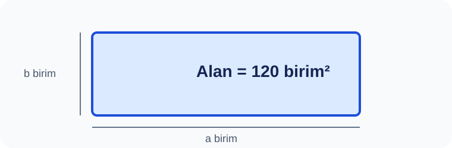

# Konu 04 — Asal Sayılar, Çarpanlar ve Bölen Sayısı

## Test 18 — Temel Düzey

- Soru sayısı: 10
- Her soruda yalnız bir doğru seçenek vardır.
- Önerilen süre: 15 dakika

## Soru 1
`K04-T18-Q01`

Bir ölçü listesi hazırlanırken, verilen bağıntıdan yararlanarak: Aşağıdaki alan modelinde $a$ ve $b$ pozitif tam sayılardır. Döndürülünce aynı olan modeller bir kez sayılırsa kaç farklı $(a,b)$ kenar çifti kullanılabilir?

A) $6$  
B) $7$  
C) $9$  
D) $8$  
E) $10$  

## Soru 2
`K04-T18-Q02`

108 numune kabı, satır ve sütunların ikisi de 1'den büyük olacak biçimde dikdörtgen diziliyor. Kaç farklı diziliş vardır?

A) $5$  
B) $3$  
C) $4$  
D) $6$  
E) $7$  

## Soru 3
`K04-T18-Q03`

Alan değeri 84 olan tam sayı kenarlı numune tablasının en küçük çevresi nedir?

A) $34$  
B) $36$  
C) $38$  
D) $40$  
E) $42$  

## Soru 4
`K04-T18-Q04`

Çevre nedir?

A) $72$  
B) $76$  
C) $74$  
D) $78$  
E) $80$  

## Soru 5
`K04-T18-Q05`

Bir sayı tablosu okunurken, koşulu bir eşitlik olarak yazdığımızda: Sonuç kaçtır?

A) $17$  
B) $19$  
C) $23$  
D) $25$  
E) $21$  

## Soru 6
`K04-T18-Q06`

Numune tablalarından hangisi eşit tam sayı kenarlı kare biçiminde hazırlanabilir?

A) $156$  
B) $160$  
C) $168$  
D) $169$  
E) $170$  

## Soru 7
`K04-T18-Q07`

Numune tablasının alanı 8 farklı dikdörtgen modeli oluşturuyor. Seçeneklerden hangisi uygundur?

A) $120$  
B) $96$  
C) $108$  
D) $126$  
E) $132$  

## Soru 8
`K04-T18-Q08`

Kaç düzen vardır?

A) $8$  
B) $10$  
C) $12$  
D) $14$  
E) $16$  

## Soru 9
`K04-T18-Q09`

Pozitif bölen sayısı 15 olan numune sayı kaç farklı sırasız çarpan çiftine ayrılır?

A) $6$  
B) $8$  
C) $7$  
D) $9$  
E) $10$  

## Soru 10
`K04-T18-Q10`

240 numune kabı, hem satır hem sütun sayısı çift olan dikdörtgenlere diziliyor. Kaç farklı kenar çifti oluşur?

A) $4$  
B) $5$  
C) $7$  
D) $8$  
E) $6$  
