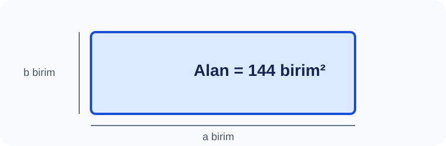

# Konu 04 — Asal Sayılar, Çarpanlar ve Bölen Sayısı

## Test 19 — Temel Düzey

- Soru sayısı: 10
- Her soruda yalnız bir doğru seçenek vardır.
- Önerilen süre: 15 dakika

## Soru 1
`K04-T19-Q01`

Bir ölçü listesi hazırlanırken, verilen bağıntıdan yararlanarak: $a$ ve $b$ pozitif tam sayılardır. Döndürülünce aynı olan modeller bir kez sayılırsa kaç farklı $(a,b)$ kenar çifti kullanılabilir?

A) $6$  
B) $7$  
C) $9$  
D) $10$  
E) $8$  

## Soru 2
`K04-T19-Q02`

120 pano kullanılıyor; yalnız bir pano genişliğindeki şeritler kabul edilmiyor. Döndürme eşliğiyle kaç dikdörtgen yüzey kalır?

A) $7$  
B) $5$  
C) $6$  
D) $8$  
E) $9$  

## Soru 3
`K04-T19-Q03`

Çerçeve uzunluğu kaç birimdir?

A) $36$  
B) $38$  
C) $42$  
D) $40$  
E) $44$  

## Soru 4
`K04-T19-Q04`

Alanı 84 olan sergi panolarında kenarlar tam sayı ve 1'den büyüktür. En büyük çevre kaçtır?

A) $84$  
B) $86$  
C) $88$  
D) $90$  
E) $92$  

## Soru 5
`K04-T19-Q05`

Alanı 72 olan sergi panolarının her birinde kısa kenar kaydediliyor. Farklı kenar çiftleri için kayıtların toplamı nedir?

A) $20$  
B) $24$  
C) $22$  
D) $26$  
E) $28$  

## Soru 6
`K04-T19-Q06`

Sergi panolarından yalnız biri tam kare alan değerine sahiptir. Bu alan hangisidir?

A) $180$  
B) $189$  
C) $198$  
D) $200$  
E) $196$  

## Soru 7
`K04-T19-Q07`

Tam 8 farklı tam sayı kenarlı sergi panosu üreten alan değeri hangisidir?

A) $144$  
B) $126$  
C) $150$  
D) $160$  
E) $20$  

## Soru 8
`K04-T19-Q08`

Alanı 150 olan panolarda kısa-uzun ayrımı yapılmadan kenar sırası önemseniyor. Kaç sıralı kenar çifti oluşur?

A) $8$  
B) $10$  
C) $14$  
D) $12$  
E) $16$  

## Soru 9
`K04-T19-Q09`

16 pozitif bölenlidir. Döndürülmüş panolar özdeş kabul edildiğinde kaç kenar çifti kalır?

A) $6$  
B) $7$  
C) $8$  
D) $9$  
E) $10$  

## Soru 10
`K04-T19-Q10`

Alanı 288 olan sergi panolarında iki kenar da çift tam sayıdır. Döndürme eşliğiyle kaç pano ölçüsü vardır?

A) $4$  
B) $6$  
C) $5$  
D) $7$  
E) $8$  
