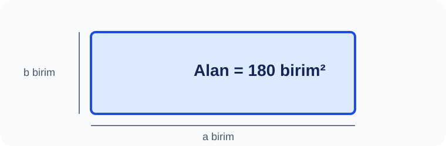

# Konu 04 — Asal Sayılar, Çarpanlar ve Bölen Sayısı

## Test 20 — Temel Düzey

- Soru sayısı: 10
- Her soruda yalnız bir doğru seçenek vardır.
- Önerilen süre: 15 dakika

## Soru 1
`K04-T20-Q01`

Bir sınıf etkinliğinde, verilen bağıntıdan yararlanarak: Aşağıdaki alan modelinde $a$ ve $b$ pozitif tam sayılardır. Döndürülünce aynı olan modeller bir kez sayılırsa kaç farklı $(a,b)$ kenar çifti kullanılabilir?

A) $9$  
B) $7$  
C) $8$  
D) $10$  
E) $11$  

## Soru 2
`K04-T20-Q02`

Kaç farklı kenar çifti vardır?

A) $5$  
B) $6$  
C) $7$  
D) $8$  
E) $9$  

## Soru 3
`K04-T20-Q03`

Alanı 120 birimkare olan kamp bölgesinin tam sayı kenarları arasında çevreyi en aza indiren modelin çevresi kaçtır?

A) $40$  
B) $44$  
C) $42$  
D) $46$  
E) $48$  

## Soru 4
`K04-T20-Q04`

96 taşlık kamp bölgesinde her iki kenar en az 2 birimdir. Olası en büyük çevre kaç birim olur?

A) $96$  
B) $98$  
C) $102$  
D) $104$  
E) $100$  

## Soru 5
`K04-T20-Q05`

84 taşla kurulan farklı dikdörtgen kamp bölgelerinin kısa kenarlarının toplamı kaçtır?

A) $19$  
B) $21$  
C) $25$  
D) $23$  
E) $27$  

## Soru 6
`K04-T20-Q06`

Kamp bölgelerinden hangisinin alanı bir doğal sayının karesidir?

A) $225$  
B) $210$  
C) $216$  
D) $224$  
E) $228$  

## Soru 7
`K04-T20-Q07`

9 farklı dikdörtgen bölge kurmaya izin veriyor. Bu sayı hangisidir?

A) $144$  
B) $168$  
C) $180$  
D) $192$  
E) $200$  

## Soru 8
`K04-T20-Q08`

$a·b=180$ için kaç pozitif sıralı çift vardır?

A) $14$  
B) $18$  
C) $16$  
D) $20$  
E) $22$  

## Soru 9
`K04-T20-Q09`

18 pozitif böleni vardır. Yön eşliğiyle kaç dikdörtgen bölge kurulabilir?

A) $7$  
B) $8$  
C) $10$  
D) $11$  
E) $9$  

## Soru 10
`K04-T20-Q10`

Kaç farklı düzen kurulabilir?

A) $4$  
B) $5$  
C) $7$  
D) $6$  
E) $8$  
