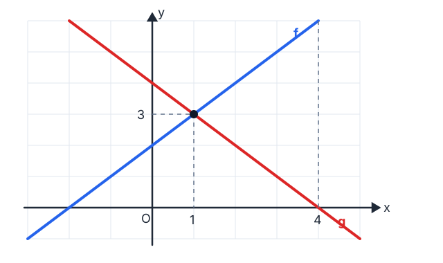
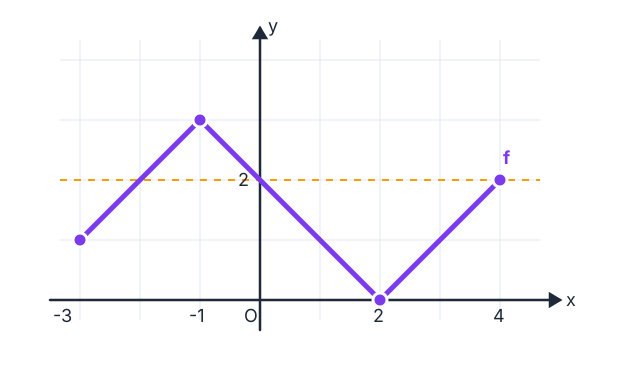

# Konu 18 — Fonksiyonlar

## Test 01 — Temel Düzey

- Soru sayısı: 10
- Her soruda yalnız bir doğru seçenek vardır.
- Önerilen süre: 18 dakika

## Soru 1

`K18-T01-Q01`

Bir $f$ fonksiyonunun bazı değerleri aşağıdaki tabloda verilmiştir.

| $x$ | $-2$ | $0$ | $3$ | $5$ |
|---|---:|---:|---:|---:|
| $f(x)$ | $4$ | $1$ | $-2$ | $-4$ |

Buna göre aşağıdakilerden hangisi doğrudur?

A) $f(-2)+f(5)=0$

B) $f(0)=0$

C) $f(3)>f(0)$

D) $f(5)=-5$

E) $f(-2)=f(3)$

## Soru 2

`K18-T01-Q02`

Aşağıdaki dik koordinat sisteminde $y=f(x)$ ve $y=g(x)$ doğruları gösterilmiştir.

Grafiklere göre

$$f(x)\ge g(x)$$

ve

$$g(x)>0$$

koşullarını birlikte sağlayan $x$ değerlerinin kümesi hangisidir?

A) $(-\infty,1]$

B) $[1,4]$

C) $[1,4)$

D) $(1,4)$

E) $[4,\infty)$

## Soru 3

`K18-T01-Q03`

$f$ ve $g$ fonksiyonlarının değerleri aşağıdaki tabloda verilmiştir.

| $x$ | $-1$ | $0$ | $1$ | $2$ | $3$ |
|---|---:|---:|---:|---:|---:|
| $f(x)$ | $2$ | $0$ | $3$ | $-1$ | $1$ |
| $g(x)$ | $1$ | $3$ | $2$ | $0$ | $-1$ |

Buna göre

$$ (f\circ g)(0)+(g\circ f)(3) $$

ifadesinin değeri kaçtır?

A) $0$

B) $1$

C) $2$

D) $3$

E) $4$

## Soru 4

`K18-T01-Q04`

Gerçek sayılarda

$$f(x)=\frac{\sqrt{x+2}}{x-1}$$

biçiminde tanımlanan $f$ fonksiyonunun tanım kümesi hangisidir?

A) $(-2,1)\cup(1,\infty)$

B) $[-2,1)\cup(1,\infty)$

C) $[-2,\infty)$

D) $(-\infty,1)\cup(1,\infty)$

E) $[-2,1)$

## Soru 5

`K18-T01-Q05`

Aşağıda $y=f(x)$ fonksiyonunun grafiği verilmiştir.

Buna göre $f(x)=2$ denkleminin kaç farklı gerçek sayı çözümü vardır?

A) $0$

B) $1$

C) $4$

D) $2$

E) $3$

## Soru 6

`K18-T01-Q06`

Bir bisiklet kiralama yerinde kullanım süresi $t$ saat olmak üzere ilk 2 saat için toplam 90 TL, 2 saatten sonraki her saat için ise 35 TL ek ücret alınmaktadır. Bisiklet en fazla 6 saat kiralanabilmektedir.

Toplam ücreti gösteren $F$ fonksiyonunun cebirsel temsili aşağıdakilerden hangisidir?

A) $F(t)=\begin{cases}90,&0<t\le2\\35t+20,&2<t\le6\end{cases}$

B) $F(t)=\begin{cases}90t,&0<t\le2\\35t+90,&2<t\le6\end{cases}$

C) $F(t)=\begin{cases}45t,&0<t\le2\\35t+20,&2<t\le6\end{cases}$

D) $F(t)=\begin{cases}90,&0<t<2\\35t-20,&2\le t\le6\end{cases}$

E) $F(t)=\begin{cases}90,&0<t\le2\\35(t-2),&2<t\le6\end{cases}$

## Soru 7

`K18-T01-Q07`

$$f=\{(-2,3),(0,1),(2,-1),(4,-3)\}$$

fonksiyonu veriliyor.

Buna göre aşağıdaki sıralı ikililerden hangisi $f^{-1}$ fonksiyonunun grafiği üzerindedir?

A) $(2,-1)$

B) $(1,0)$

C) $(-1,2)$

D) $(3,-2)$

E) $(-3,-4)$

## Soru 8

`K18-T01-Q08`

$f(x)=ax+b$ doğrusal fonksiyonu için

$$f(1)=5 \quad\text{ve}\quad f(4)=-1$$

olduğuna göre $f(-2)$ kaçtır?

A) $5$

B) $7$

C) $9$

D) $11$

E) $13$

## Soru 9

`K18-T01-Q09`

$f:[0,5]\to\mathbb{R}$ olmak üzere

$$f(x)=|x-2|-1$$

biçiminde tanımlanıyor.

Buna göre $f$ fonksiyonunun görüntü kümesi hangisidir?

A) $[-1,3]$

B) $[-1,2]$

C) $[0,2]$

D) $(-1,2]$

E) $[1,3]$

## Soru 10

`K18-T01-Q10`

$A=\{1,2,3,4\}$ ve $B=\{a,b,c\}$ olmak üzere

$$R=\{(1,a),(2,b),(3,a),(4,c)\}$$

bağıntısı $A$'dan $B$'ye bir fonksiyondur.

$R$'ye aşağıdaki sıralı ikililerden hangisinin eklenmesi, fonksiyon olma özelliğini bozar?

A) $(1,a)$

B) $(2,b)$

C) $(3,a)$

D) $(4,c)$

E) $(2,c)$
