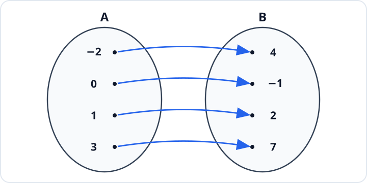
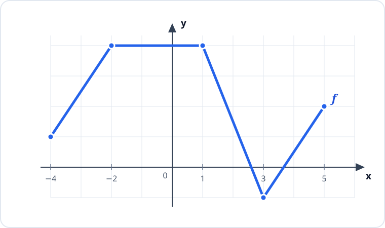

# Konu 18 — Fonksiyonlar

## Test 02 — Temel Düzey

- Soru sayısı: 10
- Her soruda yalnız bir doğru seçenek vardır.
- Önerilen süre: 20 dakika

## Soru 1

`K18-T02-Q01`

Aşağıdaki şemada $A$ kümesinden $B$ kümesine tanımlı bire bir $f$ fonksiyonu gösterilmiştir.

Buna göre

$$f^{-1}(2)+f(0)$$

ifadesinin değeri kaçtır?

A) $-2$

B) $0$

C) $1$

D) $2$

E) $3$

## Soru 2

`K18-T02-Q02`

Aşağıda $y=f(x)$ fonksiyonunun grafiği verilmiştir.

Buna göre $f$ fonksiyonu aşağıdaki aralıkların hangisinde kesinlikle azalandır?

A) $[-4,-2]$

B) $[-2,1]$

C) $[1,3]$

D) $[3,5]$

E) $[-4,1]$

## Soru 3

`K18-T02-Q03`

Bir $f$ fonksiyonu için

$$f(x+1)=2x-3$$

eşitliği her gerçek $x$ sayısı için sağlanmaktadır.

Buna göre $f(5)$ kaçtır?

A) $1$

B) $2$

C) $3$

D) $5$

E) $7$

## Soru 4

`K18-T02-Q04`

$f$ doğrusal bir fonksiyon ve $g(x)=2x+3$ olmak üzere

$$ (f\circ g)(x)=6x-1 $$

eşitliği veriliyor.

Buna göre $f(5)$ kaçtır?

A) $-1$

B) $1$

C) $3$

D) $4$

E) $5$

## Soru 5

`K18-T02-Q05`

$A=\{-2,-1,0,1,2\}$ olmak üzere $f:A\to\mathbb{Z}$ fonksiyonu

$$f(x)=x^2-x$$

biçiminde tanımlanıyor.

Buna göre $f(A)$ görüntü kümesi kaç elemanlıdır?

A) $3$

B) $2$

C) $4$

D) $5$

E) $6$

## Soru 6

`K18-T02-Q06`

$$f(x)=|x+1|$$

fonksiyonu veriliyor. $g$ fonksiyonu

$$g(x)=f(x-3)-2$$

biçiminde tanımlandığına göre $g$ fonksiyonunun en küçük değerini aldığı nokta hangisidir?

A) $(-2,2)$

B) $(2,-2)$

C) $(-1,-2)$

D) $(3,-1)$

E) $(2,2)$

## Soru 7

`K18-T02-Q07`

Bir matbaada kişiye özel kitapçık basımı için 60 TL hazırlık ücreti ve basılan her kitapçık için 18 TL alınmaktadır. Basılan kitapçık sayısı $n$ olmak üzere toplam ücret

$$M(n)=18n+60$$

fonksiyonuyla gösteriliyor.

Buna göre $M^{-1}(240)=10$ eşitliğinin bu durumdaki anlamı aşağıdakilerden hangisidir?

A) Bir kitapçığın baskı ücreti 240 TL'dir.

B) 240 kitapçığın toplam ücreti 10 TL'dir.

C) Toplam ücreti 240 TL olan siparişte 10 kitapçık basılmıştır.

D) 10 kitapçık için yalnız hazırlık ücreti 240 TL'dir.

E) Hazırlık ücreti çıkarılmadan bir kitapçığın ücreti 10 TL'dir.

## Soru 8

`K18-T02-Q08`

$A=\{1,2,3\}$ olmak üzere $f:A\to\mathbb{R}$ fonksiyonu

$$f(1)=2,\qquad f(2)=m-1,\qquad f(3)=5$$

eşitlikleriyle tanımlanıyor.

$f$ fonksiyonu bire bir olduğuna göre $m$ aşağıdaki kümelerden hangisindeki değerleri alamaz?

A) $\{1,4\}$

B) $\{2,5\}$

C) $\{3,5\}$

D) $\{3,6\}$

E) $\{2,6\}$

## Soru 9

`K18-T02-Q09`

$f:\mathbb{R}\to\mathbb{R}$ fonksiyonu

$$f(x)=x^2-4x+a$$

biçiminde tanımlanıyor. $f$ fonksiyonunun görüntü kümesi $[1,\infty)$ olduğuna göre $a$ kaçtır?

A) $1$

B) $2$

C) $3$

D) $4$

E) $5$

## Soru 10

`K18-T02-Q10`

Gerçek sayılarda

$$f(x)=\frac{x-1}{x+2}$$

biçiminde tanımlanan $f$ fonksiyonunun görüntü kümesi hangisidir?

A) $\mathbb{R}\setminus\{1\}$

B) $\mathbb{R}\setminus\{-2\}$

C) $(-\infty,1)$

D) $(-2,\infty)$

E) $\mathbb{R}$
