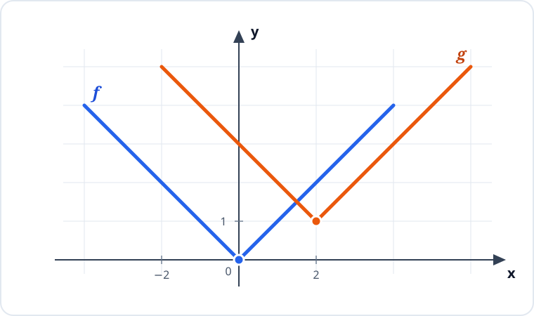
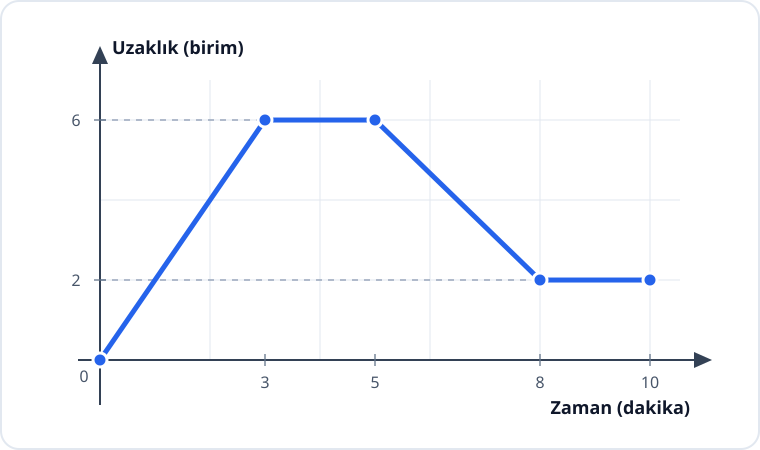

# Konu 18 — Fonksiyonlar

## Test 03 — Temel Düzey

- Soru sayısı: 10
- Her soruda yalnız bir doğru seçenek vardır.
- Önerilen süre: 21 dakika

## Soru 1

`K18-T03-Q01`

Aşağıdaki dik koordinat sisteminde $y=f(x)$ ve $y=g(x)$ fonksiyonlarının grafikleri verilmiştir.

Grafiklere göre $g$ fonksiyonu aşağıdakilerden hangisiyle ifade edilebilir?

A) $g(x)=f(x+2)+1$

B) $g(x)=f(x-2)-1$

C) $g(x)=f(x-2)+1$

D) $g(x)=f(x)+3$

E) $g(x)=f(x+1)-2$

## Soru 2

`K18-T03-Q02`

$f(x)=ax+b$ doğrusal fonksiyonu için her gerçek $x$ sayısında

$$f(x+2)-f(x)=6$$

eşitliği sağlanmaktadır. Ayrıca $f(1)=4$ olduğuna göre $f(5)$ kaçtır?

A) $10$

B) $12$

C) $14$

D) $16$

E) $18$

## Soru 3

`K18-T03-Q03`

Gerçek sayılarda tanımlı $f$ fonksiyonu

$$f(x)=\begin{cases}
2x+1, & x<1\\
4-x, & x\ge1
\end{cases}$$

biçiminde veriliyor.

$f(x)=2$ denkleminin gerçek sayı çözümleri toplamı kaçtır?

A) $\frac{1}{2}$

B) $1$

C) $\frac{3}{2}$

D) $2$

E) $\frac{5}{2}$

## Soru 4

`K18-T03-Q04`

$$f(x)=\sqrt{x-1}\qquad\text{ve}\qquad g(x)=\frac{1}{x+2}$$

fonksiyonları veriliyor.

Buna göre $(f\circ g)$ bileşke fonksiyonunun tanım kümesi hangisidir?

A) $(-2,-1]$

B) $[-2,-1]$

C) $(-\infty,-2)\cup[-1,\infty)$

D) $[-1,\infty)$

E) $\mathbb{R}\setminus\{-2\}$

## Soru 5

`K18-T03-Q05`

$f$ çift, $g$ tek fonksiyondur.

$$f(3)=4\qquad\text{ve}\qquad g(-2)=5$$

olduğuna göre $f(-3)+g(2)$ kaçtır?

A) $-9$

B) $-1$

C) $1$

D) $5$

E) $9$

## Soru 6

`K18-T03-Q06`

Doğrusal bir yol üzerinde yürüyen bir öğrencinin başlangıç noktasına olan uzaklığının zamana göre değişimi aşağıdaki grafikte verilmiştir.

Grafiğe göre aşağıdakilerden hangisi kesinlikle doğrudur?

A) Öğrenci 10. dakikada başlangıç noktasına dönmüştür.

B) Öğrenci 10 dakika boyunca hiç durmadan yürümüştür.

C) Öğrenci 3. dakika ile 5. dakika arasında bulunduğu yerde kalmıştır.

D) Öğrenci 5. dakika ile 8. dakika arasında başlangıç noktasından uzaklaşmıştır.

E) Öğrencinin başlangıç noktasına en büyük uzaklığı 8 birimdir.

## Soru 7

`K18-T03-Q07`

$f$ bire bir bir fonksiyon olmak üzere

$$f^{-1}(2)=5$$

ve

$$ (f\circ g)(3)=2 $$

eşitlikleri veriliyor.

Buna göre $g(3)$ kaçtır?

A) $1$

B) $2$

C) $3$

D) $5$

E) $7$

## Soru 8

`K18-T03-Q08`

Bir $f$ fonksiyonu

$$f(x)=\begin{cases}
mx+1, & x\le2\\
x+2m-1, & x>2
\end{cases}$$

biçiminde tanımlanıyor.

Fonksiyonun grafiğini oluşturan iki doğrusal parça $(2,7)$ noktasında kesintisiz biçimde birleştiğine göre $m$ kaçtır?

A) $-1$

B) $0$

C) $1$

D) $2$

E) $3$

## Soru 9

`K18-T03-Q09`

$f:[0,\infty)\to[4,\infty)$ olmak üzere

$$f(x)=x^2+4$$

biçiminde tanımlanıyor.

Buna göre $f^{-1}(x)$ aşağıdakilerden hangisidir?

A) $\sqrt{x-4}$

B) $\sqrt{x}+4$

C) $x^2-4$

D) $\sqrt{4-x}$

E) $-\sqrt{x-4}$

## Soru 10

`K18-T03-Q10`

120 kişilik bir gösteri salonunda bilet fiyatı 200 TL olduğunda bütün biletler satılmaktadır. Bilet fiyatına yapılan her 10 TL'lik artışta satılan bilet sayısının 4 azaldığı gözlenmiştir.

Bu değişimin aynı biçimde süreceği kabul edilirse salonun bilet satışından elde edeceği gelirin en büyük olması için bir biletin fiyatı kaç TL olmalıdır?

A) $240$

B) $250$

C) $260$

D) $270$

E) $280$
