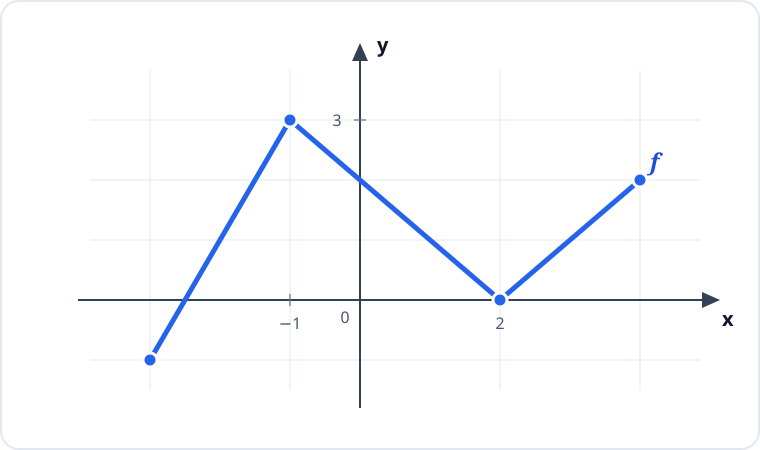
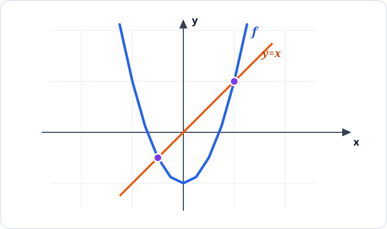

# Konu 18 — Fonksiyonlar

## Test 04 — Temel Düzey

- Soru sayısı: 10
- Her soruda yalnız bir doğru seçenek vardır.
- Önerilen süre: 21 dakika

## Soru 1

`K18-T04-Q01`

Aşağıda $y=f(x)$ fonksiyonunun grafiği verilmiştir.

Grafiğe göre

I. $f(-1)=3$'tür.

II. $f$ fonksiyonunun iki farklı sıfırı vardır.

III. $f$ fonksiyonu $[-1,2]$ aralığında artandır.

ifadelerinden hangileri doğrudur?

A) Yalnız I

B) Yalnız II

C) Yalnız III

D) I ve II

E) II ve III

## Soru 2

`K18-T04-Q02`

Bir $f$ fonksiyonu için

$$f(x+1)=f(x)-2$$

eşitliği her gerçek $x$ sayısında sağlanmaktadır.

$f(0)=7$ olduğuna göre $f(4)$ kaçtır?

A) $7$

B) $5$

C) $3$

D) $1$

E) $-1$

## Soru 3

`K18-T04-Q03`

$$f(x)=2x-1\qquad\text{ve}\qquad g(x)=x^2$$

fonksiyonları veriliyor.

$$ (g\circ f)(x)=9 $$

denkleminin gerçek sayı çözümleri toplamı kaçtır?

A) $1$

B) $-1$

C) $2$

D) $3$

E) $4$

## Soru 4

`K18-T04-Q04`

$$f(x)=|2x-3|$$

fonksiyonu veriliyor.

$f(x)\le1$ eşitsizliğini sağlayan gerçek sayıların kümesi hangisidir?

A) $[0,1]$

B) $[1,2]$

C) $[-1,1]$

D) $(-\infty,1]\cup[2,\infty)$

E) $[1,\infty)$

## Soru 5

`K18-T04-Q05`

$$f(x)=x+2\qquad\text{ve}\qquad g(x)=x^2-4$$

fonksiyonlarının grafiklerinin kaç farklı kesişim noktası vardır?

A) $0$

B) $1$

C) $2$

D) $3$

E) $4$

## Soru 6

`K18-T04-Q06`

Aşağıdaki dik koordinat sisteminde $y=f(x)$ fonksiyonunun grafiği ile $y=x$ doğrusu verilmiştir.

Buna göre $f(x)=x$ denkleminin kaç farklı gerçek sayı çözümü vardır?

A) $0$

B) $1$

C) $3$

D) $2$

E) $4$

## Soru 7

`K18-T04-Q07`

Gerçek sayılarda tanımlı

$$f(x)=(m-2)x^2+3x+n+1$$

fonksiyonu tek fonksiyon olduğuna göre $m+n$ kaçtır?

A) $-3$

B) $-1$

C) $0$

D) $2$

E) $1$

## Soru 8

`K18-T04-Q08`

$f$ ve $g$ fonksiyonlarının bazı değerleri aşağıdaki tabloda verilmiştir.

| $x$ | $1$ | $2$ | $3$ | $4$ |
|---|---:|---:|---:|---:|
| $f(x)$ | $4$ | $1$ | $3$ | $2$ |
| $g(x)$ | $2$ | $3$ | $4$ | $1$ |

Buna göre

$$ (f^{-1}\circ g)(4) $$

ifadesinin değeri kaçtır?

A) $2$

B) $1$

C) $3$

D) $4$

E) $5$

## Soru 9

`K18-T04-Q09`

$f:[1,5]\to\mathbb{R}$ olmak üzere

$$f(x)=x^2-4x+1$$

biçiminde tanımlanıyor.

$f$ fonksiyonunun en küçük ve en büyük değerlerinin toplamı kaçtır?

A) $1$

B) $3$

C) $4$

D) $5$

E) $6$

## Soru 10

`K18-T04-Q10`

$f$ doğrusal fonksiyonunun grafiği $(0,6)$ ve $(3,0)$ noktalarından geçmektedir.

$$g(x)=f(x-1)+2$$

olduğuna göre $g$ grafiğinin $y$ eksenini kestiği noktanın ordinatı kaçtır?

A) $6$

B) $8$

C) $10$

D) $12$

E) $14$
