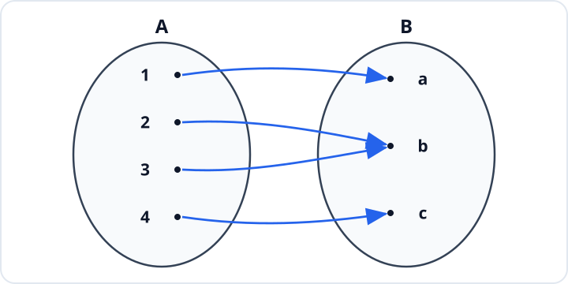
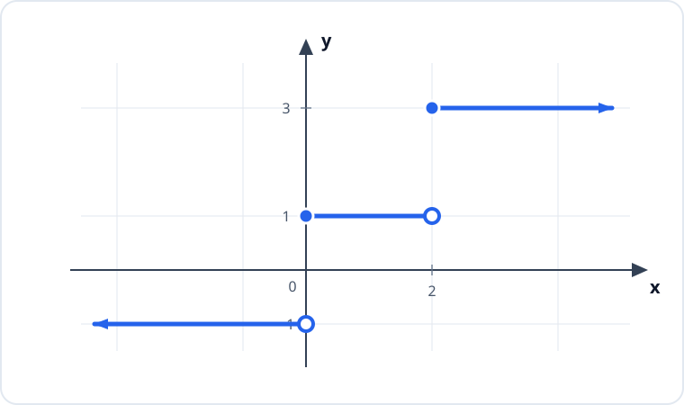

# Konu 18 — Fonksiyonlar

## Test 05 — Temel Düzey

- Soru sayısı: 10
- Her soruda yalnız bir doğru seçenek vardır.
- Önerilen süre: 21 dakika

## Soru 1

`K18-T05-Q01`

Aşağıda $A$ kümesinden $B$ kümesine tanımlı $f$ fonksiyonunun eşleme şeması verilmiştir.

Buna göre $f$ fonksiyonu için aşağıdakilerden hangisi doğrudur?

A) Bire bir ve örtendir.

B) Bire birdir ancak örten değildir.

C) Ne bire birdir ne de örtendir.

D) Aynı girdinin iki farklı çıktısı olduğu için fonksiyon değildir.

E) Örtendir ancak bire bir değildir.

## Soru 2

`K18-T05-Q02`

Gerçek sayılarda tanımlı bir $f$ fonksiyonu için

$$f(x)+f(-x)=2x^2+6$$

eşitliği her gerçek $x$ sayısında sağlanmaktadır.

Buna göre $f(0)$ kaçtır?

A) $3$

B) $2$

C) $4$

D) $6$

E) $8$

## Soru 3

`K18-T05-Q03`

Bire bir ve örten bir $f$ fonksiyonu için

$$f(2x-1)=3x+2$$

eşitliği her gerçek $x$ sayısında sağlanmaktadır.

Buna göre $f^{-1}(8)$ kaçtır?

A) $1$

B) $3$

C) $5$

D) $7$

E) $9$

## Soru 4

`K18-T05-Q04`

Gerçek sayılarda

$$f(x)=\sqrt{4-x}+2$$

biçiminde tanımlanan $f$ fonksiyonunun görüntü kümesi hangisidir?

A) $(-\infty,2]$

B) $[0,4]$

C) $[2,\infty)$

D) $[4,\infty)$

E) $\mathbb{R}$

## Soru 5

`K18-T05-Q05`

$$f(x)=|x-1|+|x+1|$$

fonksiyonu veriliyor.

$f(x)=4$ denkleminin kaç farklı gerçek sayı çözümü vardır?

A) $0$

B) $1$

C) $3$

D) $2$

E) $4$

## Soru 6

`K18-T05-Q06`

Aşağıda $y=f(x)$ basamak fonksiyonunun grafiği verilmiştir.

Buna göre $f$ fonksiyonunun cebirsel temsili hangisidir?

A) $f(x)=\begin{cases}-1,&x\le0\\1,&0<x\le2\\3,&x>2\end{cases}$

B) $f(x)=\begin{cases}1,&x<0\\-1,&0\le x<2\\3,&x\ge2\end{cases}$

C) $f(x)=\begin{cases}-1,&x<0\\3,&0\le x<2\\1,&x\ge2\end{cases}$

D) $f(x)=\begin{cases}-1,&x<0\\1,&0<x<2\\3,&x\ge2\end{cases}$

E) $f(x)=\begin{cases}-1,&x<0\\1,&0\le x<2\\3,&x\ge2\end{cases}$

## Soru 7

`K18-T05-Q07`

$f$ ve $g$ doğrusal fonksiyonları için

$$f(2)=g(2)=5,$$

$$f(x+1)-f(x)=3$$

ve

$$g(x+1)-g(x)=-1$$

eşitlikleri veriliyor.

Buna göre $f(4)-g(4)$ kaçtır?

A) $8$

B) $6$

C) $4$

D) $10$

E) $12$

## Soru 8

`K18-T05-Q08`

Fahrenheit cinsinden sıcaklığı Celsius cinsine dönüştüren fonksiyon

$$C(F)=\frac{5}{9}(F-32)$$

biçiminde tanımlanıyor.

$$C^{-1}(20)=68$$

eşitliğinin anlamı aşağıdakilerden hangisidir?

A) $20$ Fahrenheit, $68$ Celsius'a eşittir.

B) $20$ Celsius, $68$ Fahrenheit'a eşittir.

C) $68$ Celsius, $20$ Fahrenheit'a eşittir.

D) Fahrenheit sıcaklığı her zaman Celsius sıcaklığından $48$ fazladır.

E) $20$ Fahrenheit ile $68$ Fahrenheit aynı sıcaklıktır.

## Soru 9

`K18-T05-Q09`

$$f(x)=x^2-2mx+7$$

fonksiyonu $(-\infty,4]$ aralığında azalan, $[4,\infty)$ aralığında artandır.

Buna göre $m$ kaçtır?

A) $2$

B) $3$

C) $4$

D) $5$

E) $6$

## Soru 10

`K18-T05-Q10`

Aynı anda yakılan iki mumun $t$ saat sonraki boyları santimetre cinsinden

$$A(t)=30-2t\qquad\text{ve}\qquad B(t)=24-t$$

fonksiyonlarıyla gösteriliyor.

Buna göre mumların boyları yakıldıktan kaç saat sonra eşit olur?

A) $3$

B) $4$

C) $5$

D) $6$

E) $7$
