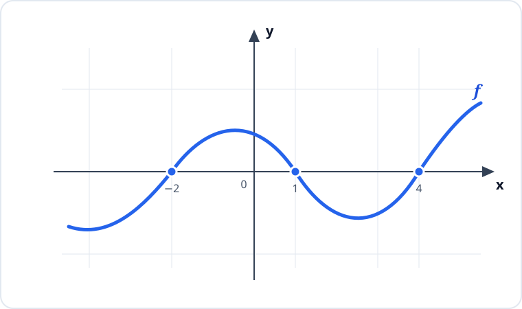

# Konu 18 — Fonksiyonlar

## Test 07 — Temel Düzey

- Soru sayısı: 10
- Her soruda yalnız bir doğru seçenek vardır.
- Önerilen süre: 21 dakika

## Soru 1

`K18-T07-Q01`

$$f(x)=\frac{x+2}{3}$$

olduğuna göre

$$ (f^{-1}\circ f^{-1})(2) $$

ifadesinin değeri kaçtır?

A) $8$

B) $10$

C) $12$

D) $14$

E) $16$

## Soru 2

`K18-T07-Q02`

$A=\{a,b\}$ ve $B=\{1,2,3\}$ kümeleri veriliyor.

$A$ kümesinden $B$ kümesine kaç farklı fonksiyon tanımlanabilir?

A) $6$

B) $8$

C) $9$

D) $12$

E) $16$

## Soru 3

`K18-T07-Q03`

$f:[0,\infty)\to[1,\infty)$ olmak üzere

$$f(x)=x^2+1$$

biçiminde tanımlanıyor.

$$f^{-1}(a)=4$$

olduğuna göre $a$ kaçtır?

A) $9$

B) $12$

C) $15$

D) $17$

E) $18$

## Soru 4

`K18-T07-Q04`

Bire bir ve örten bir $f$ fonksiyonunun grafiği $(-2,4)$ noktasından geçmektedir.

Buna göre aşağıdaki noktalardan hangisi $f^{-1}$ fonksiyonunun grafiği üzerindedir?

A) $(-4,2)$

B) $(-2,-4)$

C) $(2,4)$

D) $(4,2)$

E) $(4,-2)$

## Soru 5

`K18-T07-Q05`

$$f(x)=x^2+ax+b$$

fonksiyonunun sıfırları 1 ve 3'tür.

Buna göre $f(4)$ kaçtır?

A) $3$

B) $4$

C) $5$

D) $6$

E) $7$

## Soru 6

`K18-T07-Q06`

Aşağıda $y=f(x)$ fonksiyonunun işaret değişimini gösteren grafiği verilmiştir.

Buna göre $f(x)\le0$ eşitsizliğinin çözüm kümesi hangisidir?

A) $[-2,1]\cup[4,\infty)$

B) $(-\infty,-2]\cup[1,4]$

C) $(-\infty,-2)\cup(1,4)$

D) $[-2,1]$

E) $[1,\infty)$

## Soru 7

`K18-T07-Q07`

Tanım kümesi $\mathbb{R}$ olan herhangi bir $f$ fonksiyonu için

$$g(x)=f(x)-f(-x)$$

biçiminde $g$ fonksiyonu tanımlanıyor.

Buna göre $g$ fonksiyonu için aşağıdakilerden hangisi her zaman doğrudur?

A) Sabittir.

B) Çifttir.

C) Tektir.

D) Bire birdir.

E) Örtendir.

## Soru 8

`K18-T07-Q08`

$$f(x)=\frac{1}{x-1}\qquad\text{ve}\qquad g(x)=\sqrt{x}$$

fonksiyonları veriliyor.

Buna göre $(g\circ f)$ bileşke fonksiyonunun tanım kümesi hangisidir?

A) $(-\infty,1)$

B) $[1,\infty)$

C) $\mathbb{R}\setminus\{1\}$

D) $(1,\infty)$

E) $(-\infty,0]\cup(1,\infty)$

## Soru 9

`K18-T07-Q09`

$$f(x)=|x-a|+b$$

fonksiyonunun grafiğinin en küçük noktası $(5,-2)$ olduğuna göre $f(1)$ kaçtır?

A) $-2$

B) $-1$

C) $0$

D) $1$

E) $2$

## Soru 10

`K18-T07-Q10`

$$f(x)=2x+1$$

ve

$$g(x)=f(2x)-2f(x)$$

olduğuna göre $g(7)$ kaçtır?

A) $-1$

B) $0$

C) $1$

D) $2$

E) $3$
