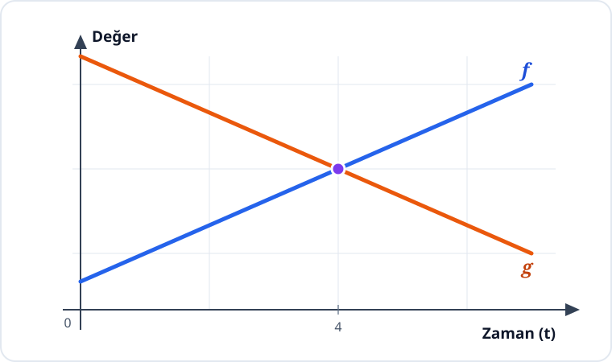

# Konu 18 — Fonksiyonlar

## Test 08 — Temel Düzey

- Soru sayısı: 10
- Her soruda yalnız bir doğru seçenek vardır.
- Önerilen süre: 21 dakika

## Soru 1

`K18-T08-Q01`

$f$ ve $g$ fonksiyonlarının bazı değerleri aşağıdaki tabloda verilmiştir.

| $x$ | $-1$ | $0$ | $1$ | $2$ |
|---|---:|---:|---:|---:|
| $f(x)$ | $2$ | $4$ | $1$ | $3$ |
| $g(x)$ | $3$ | $1$ | $4$ | $2$ |

Buna göre

$$ (f^{-1}\circ g)(2)+g(f(1)) $$

ifadesinin değeri kaçtır?

A) $1$

B) $2$

C) $3$

D) $4$

E) $5$

## Soru 2

`K18-T08-Q02`

Bire bir ve örten $f$ fonksiyonunun tersi

$$f^{-1}(x)=\frac{x-2}{3}$$

biçiminde veriliyor.

$f(x)=ax+b$ olduğuna göre $a+b$ kaçtır?

A) $1$

B) $2$

C) $3$

D) $5$

E) $6$

## Soru 3

`K18-T08-Q03`

$$f(x)=x^2-4x+7$$

fonksiyonunun gerçek sayılardaki görüntü kümesinin alt sınırı kaçtır?

A) $-1$

B) $0$

C) $1$

D) $2$

E) $3$

## Soru 4

`K18-T08-Q04`

$f$ fonksiyonu $[1,5]$ aralığında artandır.

$$g(x)=f(x+2)$$

olduğuna göre $g$ fonksiyonu aşağıdaki aralıkların hangisinde artandır?

A) $[-1,3]$

B) $[1,5]$

C) $[2,6]$

D) $[3,7]$

E) $[-2,2]$

## Soru 5

`K18-T08-Q05`

$$|x|=x+2$$

denkleminin kaç farklı gerçek sayı çözümü vardır?

A) $0$

B) $1$

C) $2$

D) $3$

E) $4$

## Soru 6

`K18-T08-Q06`

Aşağıdaki grafikte $f$ ve $g$ doğrusal fonksiyonlarının zamana göre değişimleri gösterilmiştir.

Buna göre $f(t)=g(t)$ eşitliği hangi $t$ değerinde sağlanır?

A) $2$

B) $3$

C) $4$

D) $5$

E) $6$

## Soru 7

`K18-T08-Q07`

$A=\{1,2,3\}$ ve $B=\{a,b\}$ kümeleri veriliyor.

$A$ kümesinden $B$ kümesine tanımlanabilecek örten fonksiyonların sayısı kaçtır?

A) $2$

B) $4$

C) $5$

D) $6$

E) $8$

## Soru 8

`K18-T08-Q08`

$$f(x)=\frac{2x+1}{x-1}$$

fonksiyonu bire bir ve örten olduğu uygun tanım ve değer kümelerinde ele alınıyor.

Buna göre $f^{-1}(x)$ hangisidir?

A) $\frac{2x-1}{x+1}$

B) $\frac{x-1}{2x+1}$

C) $\frac{x-1}{x-2}$

D) $\frac{1-x}{x+2}$

E) $\frac{x+1}{x-2}$

## Soru 9

`K18-T08-Q09`

Uzunluğu $L$ metre olan bir ipin salınım süresi saniye cinsinden

$$T(L)=2\sqrt{L},\qquad L\ge0$$

fonksiyonuyla modelleniyor.

Salınım süresi 6 saniye olan ipin uzunluğu kaç metredir?

A) $9$

B) $12$

C) $16$

D) $18$

E) $36$

## Soru 10

`K18-T08-Q10`

Gerçek sayılarda

$$R=\{(x,y):y^2=x\}$$

bağıntısı veriliyor.

$R$ bağıntısının $\mathbb{R}$'den $\mathbb{R}$'ye bir fonksiyon olmamasının nedeni hangisidir?

A) Bazı $y$ değerleri hiçbir $x$ ile eşleşmez.

B) Bazı $x$ değerleri iki farklı $y$ değeriyle eşleşir.

C) Her $x$ değeri yalnız bir $y$ değeriyle eşleşir.

D) Bağıntıda sıralı ikili bulunmaz.

E) Bütün $x$ değerleri aynı $y$ değeriyle eşleşir.
