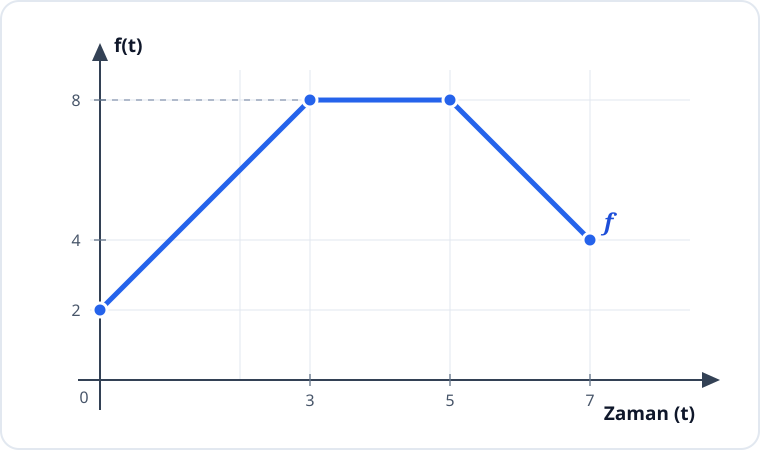

# Konu 18 — Fonksiyonlar

## Test 10 — Temel Düzey

- Soru sayısı: 10
- Her soruda yalnız bir doğru seçenek vardır.
- Önerilen süre: 22 dakika

## Soru 1

`K18-T10-Q01`

Bir doğrusal $f$ fonksiyonunun bazı değerleri aşağıdaki tabloda verilmiştir.

| $x$ | $0$ | $2$ | $5$ |
|---|---:|---:|---:|
| $f(x)$ | $4$ | $10$ | $19$ |

Buna göre $f$ fonksiyonunun kuralı hangisidir?

A) $f(x)=2x+4$

B) $f(x)=3x+1$

C) $f(x)=4x+3$

D) $f(x)=2x+6$

E) $f(x)=3x+4$

## Soru 2

`K18-T10-Q02`

$$f(x)=|x+2|-3$$

fonksiyonunun sıfırlarının toplamı kaçtır?

A) $-4$

B) $-2$

C) $0$

D) $2$

E) $4$

## Soru 3

`K18-T10-Q03`

Gerçek sayılarda tanımlı

$$f(x)=\begin{cases}
x+1,&x<0\\
x^2+1,&x\ge0
\end{cases}$$

fonksiyonunun görüntü kümesi hangisidir?

A) $[0,\infty)$

B) $\mathbb{R}$

C) $(-\infty,1)$

D) $[1,\infty)$

E) $(-\infty,0]\cup[1,\infty)$

## Soru 4

`K18-T10-Q04`

$$f(x)=(x-1)^2$$

fonksiyonunun tersi de bir fonksiyon olacak biçimde tanım kümesi aşağıdakilerden hangisi olarak seçilebilir?

A) $\mathbb{R}$

B) $[-1,2]$

C) $[1,\infty)$

D) $[-2,2]$

E) $[0,2]$

## Soru 5

`K18-T10-Q05`

$$f(x)=\frac{x}{|x|+1}$$

fonksiyonunun görüntü kümesi hangisidir?

A) $[-1,1]$

B) $[0,1)$

C) $(-\infty,1)$

D) $(-1,1)$

E) $\mathbb{R}$

## Soru 6

`K18-T10-Q06`

Aşağıda $y=f(t)$ fonksiyonunun grafiği verilmiştir.

Buna göre $f$ fonksiyonunun cebirsel temsili hangisidir?

A) $f(t)=\begin{cases}2t,&0\le t\le3\\8,&3<t\le5\\-2t+18,&5<t\le7\end{cases}$

B) $f(t)=\begin{cases}2t+2,&0\le t<3\\8,&3\le t<5\\2t-2,&5\le t\le7\end{cases}$

C) $f(t)=\begin{cases}t+2,&0\le t\le3\\8,&3<t\le5\\-t+13,&5<t\le7\end{cases}$

D) $f(t)=\begin{cases}2t+2,&0\le t\le3\\6,&3<t\le5\\-2t+18,&5<t\le7\end{cases}$

E) $f(t)=\begin{cases}2t+2,&0\le t\le3\\8,&3<t\le5\\-2t+18,&5<t\le7\end{cases}$

## Soru 7

`K18-T10-Q07`

$f$ tek fonksiyon ve $f(2)=3$'tür.

$$h(x)=f(x)+4$$

olduğuna göre $h(-2)$ kaçtır?

A) $1$

B) $3$

C) $4$

D) $5$

E) $7$

## Soru 8

`K18-T10-Q08`

$f$ doğrusal bir fonksiyon olmak üzere

$$f(f(x))=x$$

ve $f(0)=4$ eşitlikleri veriliyor.

Buna göre $f(4)$ kaçtır?

A) $-4$

B) $0$

C) $2$

D) $4$

E) $8$

## Soru 9

`K18-T10-Q09`

$f:[-2,1]\to\mathbb{R}$ olmak üzere

$$f(x)=x^2+2x$$

biçiminde tanımlanıyor.

$f$ fonksiyonunun en küçük ve en büyük değerlerinin toplamı kaçtır?

A) $0$

B) $1$

C) $2$

D) $3$

E) $4$

## Soru 10

`K18-T10-Q10`

$$f(x)=|x-1|$$

olduğuna göre

$$f(x)=f(5)$$

denkleminin gerçek sayı çözümleri toplamı kaçtır?

A) $-2$

B) $0$

C) $1$

D) $2$

E) $4$
