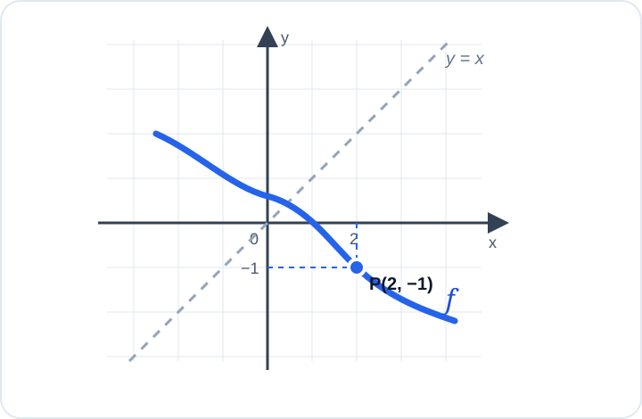

# Konu 18 — Fonksiyonlar

## Test 11 — Temel Düzey

- Soru sayısı: 10
- Her soruda yalnız bir doğru seçenek vardır.
- Önerilen süre: 17 dakika

## Soru 1

`K18-T11-Q01`

Gerçek sayılarda tanımlı doğrusal bir $f$ fonksiyonunun bazı değerleri aşağıdaki tabloda verilmiştir.

| $x$ | $-2$ | $0$ | $3$ |
|---:|---:|---:|---:|
| $f(x)$ | $5$ | $1$ | $-5$ |

Buna göre $f(x)$ aşağıdakilerden hangisidir?

A) $-2x+1$

B) $2x+1$

C) $-x+3$

D) $-2x-1$

E) $x+1$

## Soru 2

`K18-T11-Q02`

$A$ kümesi 3 elemanlı, $B$ kümesi 5 elemanlıdır.

$A$ kümesinden $B$ kümesine kaç farklı bire bir fonksiyon tanımlanabilir?

A) $30$

B) $60$

C) $90$

D) $125$

E) $243$

## Soru 3

`K18-T11-Q03`

$$f(x)=\sqrt{2x-4} \quad\text{ve}\quad g(x)=x-3$$

fonksiyonları veriliyor.

$(f\circ g)(x)$ bileşke fonksiyonunun tanım kümesi hangisidir?

A) $(-\infty,5]$

B) $(5,\infty)$

C) $[5,\infty)$

D) $[3,\infty)$

E) $[2,\infty)$

## Soru 4

`K18-T11-Q04`

Aşağıdaki şekilde $f$ fonksiyonunun grafiği üzerinde bulunan $P(2,-1)$ noktası ve $y=x$ doğrusu gösterilmiştir.

$f^{-1}$ fonksiyonunun grafiği üzerinde aşağıdaki noktalardan hangisi bulunur?

A) $(1,-2)$

B) $(2,1)$

C) $(-2,1)$

D) $(-1,2)$

E) $(1,2)$

## Soru 5

`K18-T11-Q05`

Tam sayılarda tanımlı bir $f$ fonksiyonu için

$$f(x+1)=f(x)+2x+1$$

eşitliği veriliyor.

$f(0)=3$ olduğuna göre $f(3)$ kaçtır?

A) $8$

B) $9$

C) $10$

D) $11$

E) $12$

## Soru 6

`K18-T11-Q06`

Gerçek sayılarda tanımlı $f(x)=ax+b$ fonksiyonu için

$$f(1)=4 \quad\text{ve}\quad f(3)=10$$

olduğuna göre $f^{-1}(13)$ kaçtır?

A) $4$

B) $5$

C) $6$

D) $7$

E) $8$

## Soru 7

`K18-T11-Q07`

$$f(x)=x^2-4x+7$$

fonksiyonunun gerçek sayılardaki görüntü kümesi hangisidir?

A) $(-\infty,3]$

B) $[3,\infty)$

C) $[2,\infty)$

D) $(-\infty,7]$

E) $[7,\infty)$

## Soru 8

`K18-T11-Q08`

Gerçek sayılarda tanımlı $f$ fonksiyonu için

$$f(x-2)=3x+1$$

eşitliği veriliyor.

Buna göre $f(4)$ kaçtır?

A) $13$

B) $16$

C) $19$

D) $22$

E) $25$

## Soru 9

`K18-T11-Q09`

$$A=\{-1,0,1\}, \qquad B=\{0,1\}$$

olmak üzere $f:A\to B$, $f(x)=x^2$ biçiminde tanımlanıyor.

$f$ fonksiyonu için aşağıdakilerden hangisi doğrudur?

A) Bire birdir fakat örten değildir.

B) Hem bire birdir hem örtendir.

C) Ne bire birdir ne örtendir.

D) Örtendir fakat bire bir değildir.

E) Sabit fonksiyondur.

## Soru 10

`K18-T11-Q10`

$$f(x)=|x-2| \quad\text{ve}\quad g(x)=x+1$$

olduğuna göre

$$f(g(x))=2$$

denkleminin gerçek sayı çözümlerinin çarpımı kaçtır?

A) $3$

B) $1$

C) $-1$

D) $-2$

E) $-3$
