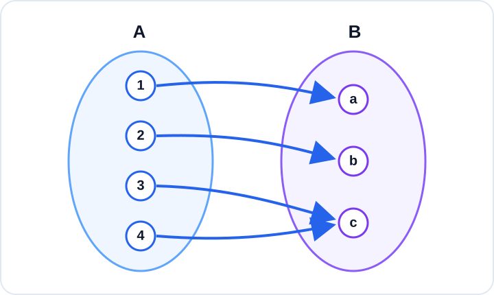

# Konu 18 — Fonksiyonlar

## Test 12 — Temel Düzey

- Soru sayısı: 10
- Her soruda yalnız bir doğru seçenek vardır.
- Önerilen süre: 17 dakika

## Soru 1

`K18-T12-Q01`

Gerçek sayılarda tanımlı $f$ fonksiyonu için

$$f(2x-1)=x+4$$

eşitliği veriliyor.

Buna göre $f(5)$ kaçtır?

A) $6$

B) $7$

C) $8$

D) $9$

E) $10$

## Soru 2

`K18-T12-Q02`

Aşağıdaki şemada $A$ kümesinden $B$ kümesine tanımlı $f$ fonksiyonu gösterilmiştir.

Bu fonksiyon için aşağıdakilerden hangisi doğrudur?

A) Bire birdir fakat örten değildir.

B) Hem bire birdir hem örtendir.

C) Örtendir fakat bire bir değildir.

D) Ne bire birdir ne örtendir.

E) Sabit fonksiyondur.

## Soru 3

`K18-T12-Q03`

$$f(x)=|2x-4|+1$$

fonksiyonunun gerçek sayılardaki görüntü kümesi hangisidir?

A) $(-\infty,1]$

B) $(1,\infty)$

C) $[0,\infty)$

D) $[1,\infty)$

E) $\mathbb{R}$

## Soru 4

`K18-T12-Q04`

Bire bir bir $f$ fonksiyonunun bazı değerleri aşağıdaki tabloda verilmiştir.

| $x$ | $-1$ | $0$ | $2$ | $4$ |
|---:|---:|---:|---:|---:|
| $f(x)$ | $3$ | $-2$ | $0$ | $1$ |

Buna göre

$$f^{-1}(0)+f^{-1}(1)$$

ifadesinin değeri kaçtır?

A) $2$

B) $3$

C) $4$

D) $5$

E) $6$

## Soru 5

`K18-T12-Q05`

$$f(x)=\frac{x}{x-2}$$

olduğuna göre $f(x)=3$ denklemini sağlayan $x$ değeri kaçtır?

A) $3$

B) $4$

C) $5$

D) $6$

E) $8$

## Soru 6

`K18-T12-Q06`

$$A=\{-2,-1,0,1,2\}$$

olmak üzere $f:A\to\mathbb{R}$ fonksiyonu

$$f(x)=x^2-x$$

biçiminde tanımlanıyor.

$f$ fonksiyonunun görüntü kümesi kaç elemanlıdır?

A) $2$

B) $3$

C) $4$

D) $5$

E) $6$

## Soru 7

`K18-T12-Q07`

Tam sayılarda tanımlı bir $f$ fonksiyonu için

$$f(x+1)-f(x)=2x+1$$

eşitliği veriliyor.

$f(0)=4$ olduğuna göre $f(3)$ kaçtır?

A) $10$

B) $11$

C) $13$

D) $14$

E) $15$

## Soru 8

`K18-T12-Q08`

$$f(x)=\frac{\sqrt{3-x}}{x-1}$$

fonksiyonunun gerçek sayılardaki tanım kümesi hangisidir?

A) $(-\infty,3]$

B) $[1,3]$

C) $(-\infty,1)\cup(1,3)$

D) $(-\infty,1)\cup(1,3]$

E) $(1,3]$

## Soru 9

`K18-T12-Q09`

Gerçek sayılarda tanımlı $f$ fonksiyonu kesin artandır.

$$f(2a-1)<f(a+5)$$

olduğuna göre $a$ için aşağıdakilerden hangisi doğrudur?

A) $a>-6$

B) $a\ge6$

C) $a>6$

D) $a\le6$

E) $a<6$

## Soru 10

`K18-T12-Q10`

Gerçek sayılarda tanımlı $f$ fonksiyonu

$$
f(x)=
\begin{cases}
x+2, & x<1\\
3-x, & x\ge1
\end{cases}
$$

biçiminde veriliyor.

Buna göre $f(f(0))$ kaçtır?

A) $1$

B) $2$

C) $3$

D) $4$

E) $5$
