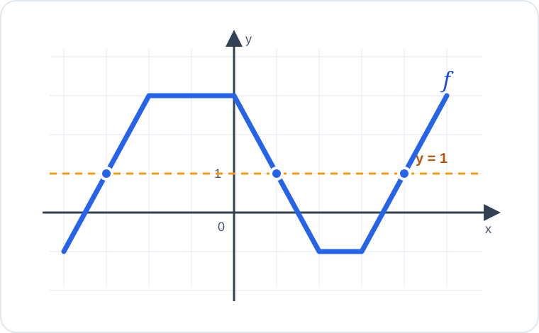

# Konu 18 — Fonksiyonlar

## Test 14 — Temel Düzey

- Soru sayısı: 10
- Her soruda yalnız bir doğru seçenek vardır.
- Önerilen süre: 17 dakika

## Soru 1

`K18-T14-Q01`

Yakıldıktan sonra boyu sabit hızla azalan bir mumun $t$ saat sonraki boyu

$$h(t)=24-2t, \qquad 0\le t\le12$$

fonksiyonuyla modelleniyor.

Mumun boyu 10 cm olduğunda yakılmasının üzerinden kaç saat geçmiştir?

A) $4$

B) $5$

C) $6$

D) $7$

E) $8$

## Soru 2

`K18-T14-Q02`

$$f(x)=|x+1|$$

fonksiyonu için $f^{-1}(\{3\})$ kümesi hangisidir?

A) $\{-3,3\}$

B) $\{-2,4\}$

C) $\{-4,3\}$

D) $\{-2,2\}$

E) $\{-4,2\}$

## Soru 3

`K18-T14-Q03`

$$f(x)=2x-1 \quad\text{ve}\quad g(x)=x^2$$

olduğuna göre

$$ (f\circ g)(2)-(g\circ f)(2) $$

ifadesinin değeri kaçtır?

A) $-2$

B) $-1$

C) $0$

D) $1$

E) $2$

## Soru 4

`K18-T14-Q04`

$$f(x)=(m^2-9)x+2$$

fonksiyonunun gerçek sayılarda bire bir olmadığı $m$ değerlerinin toplamı kaçtır?

A) $-6$

B) $0$

C) $3$

D) $6$

E) $9$

## Soru 5

`K18-T14-Q05`

$$f:[2,\infty)\to[1,\infty), \qquad f(x)=\sqrt{x-2}+1$$

fonksiyonu veriliyor.

$f^{-1}$ fonksiyonu aşağıdakilerden hangisidir?

A) $f^{-1}(x)=\sqrt{x-1}+2$, $x\ge1$

B) $f^{-1}(x)=(x+1)^2-2$, $x\ge1$

C) $f^{-1}(x)=(x-1)^2+2$, $x\ge1$

D) $f^{-1}(x)=(x-2)^2+1$, $x\ge2$

E) $f^{-1}(x)=x^2-1$, $x\ge1$

## Soru 6

`K18-T14-Q06`

$$f(x)=x^2-2 \quad\text{ve}\quad g(x)=2x+1$$

fonksiyonlarının grafiklerinin kaç farklı kesişim noktası vardır?

A) $0$

B) $1$

C) $3$

D) $2$

E) $4$

## Soru 7

`K18-T14-Q07`

Bir $f$ fonksiyonunun bazı değerleri aşağıdaki tabloda verilmiştir.

| $x$ | $-1$ | $0$ | $2$ |
|---:|---:|---:|---:|
| $f(x)$ | $2$ | $5$ | $1$ |

$$g(x)=f(x-1)+3$$

olduğuna göre $g(1)$ kaçtır?

A) $4$

B) $5$

C) $6$

D) $7$

E) $8$

## Soru 8

`K18-T14-Q08`

$$A=\{-2,-1,0,1,2\}$$

olmak üzere $f:A\to\mathbb{R}$ fonksiyonu $f(x)=|x|+1$ biçiminde tanımlanıyor.

$f$ fonksiyonunun görüntü kümesindeki elemanların toplamı kaçtır?

A) $6$

B) $7$

C) $8$

D) $9$

E) $10$

## Soru 9

`K18-T14-Q09`

Gerçek sayılarda tanımlı $f$ fonksiyonu kesin azalandır.

$$f(3a+1)>f(7-a)$$

olduğuna göre $a$ için aşağıdakilerden hangisi doğrudur?

A) $a>\frac32$

B) $a<\frac32$

C) $a\le\frac32$

D) $a\ge\frac32$

E) $a<-\frac32$

## Soru 10

`K18-T14-Q10`

Aşağıda gerçek sayılarda tanımlı $f$ fonksiyonunun grafiği verilmiştir.

Grafiğe göre $f(x)=1$ denkleminin kaç farklı gerçek sayı çözümü vardır?

A) $1$

B) $2$

C) $3$

D) $4$

E) $5$
