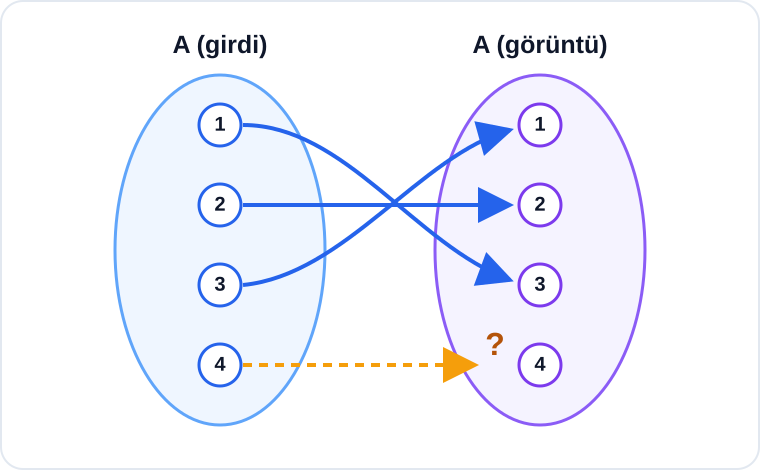

# Konu 18 — Fonksiyonlar

## Test 15 — Temel Düzey

- Soru sayısı: 10
- Her soruda yalnız bir doğru seçenek vardır.
- Önerilen süre: 17 dakika

## Soru 1

`K18-T15-Q01`

$$A=\{1,2,3,4\}, \qquad B=\{a,b,c\}$$

olmak üzere $f:A\to B$ fonksiyonları tanımlanıyor.

$f(1)=a$ ve $f(2)=b$ koşullarını sağlayan kaç farklı $f$ fonksiyonu vardır?

A) $3$

B) $4$

C) $6$

D) $8$

E) $9$

## Soru 2

`K18-T15-Q02`

Gerçek sayılarda tanımlı bir $f$ fonksiyonu için

$$f(x)+f(-x)=2x^2+6$$

eşitliği veriliyor.

Buna göre $f(0)$ kaçtır?

A) $3$

B) $4$

C) $5$

D) $6$

E) $9$

## Soru 3

`K18-T15-Q03`

$$f(x)=\sqrt{x+2} \quad\text{ve}\quad g(x)=\frac{1}{x-1}$$

fonksiyonları veriliyor.

$(f\circ g)(x)$ bileşke fonksiyonunun gerçek sayılardaki tanım kümesi hangisidir?

A) $\left(-\infty,\frac12\right)\cup(1,\infty)$

B) $\left(-\infty,\frac12\right]\cup(1,\infty)$

C) $\left[\frac12,1\right)$

D) $(-\infty,1)\cup(1,\infty)$

E) $\left[\frac12,\infty\right)$

## Soru 4

`K18-T15-Q04`

Bire bir $f$ ve $g$ fonksiyonlarının bazı değerleri aşağıdaki tablolarda verilmiştir.

| $x$ | $-2$ | $0$ | $1$ | $3$ |
|---:|---:|---:|---:|---:|
| $f(x)$ | $4$ | $1$ | $5$ | $2$ |

| $x$ | $-2$ | $0$ | $1$ | $3$ |
|---:|---:|---:|---:|---:|
| $g(x)$ | $4$ | $-1$ | $2$ | $5$ |

Buna göre $g(f^{-1}(2))$ kaçtır?

A) $1$

B) $3$

C) $5$

D) $6$

E) $7$

## Soru 5

`K18-T15-Q05`

$$f(x)=3-\frac{2}{x^2+1}$$

fonksiyonunun gerçek sayılardaki görüntü kümesi hangisidir?

A) $(1,3)$

B) $[1,3]$

C) $(1,3]$

D) $[1,3)$

E) $(-\infty,3)$

## Soru 6

`K18-T15-Q06`

$$f(x)=x^2-1$$

fonksiyonunun grafiği 2 birim sola ötelenerek $g$ fonksiyonunun grafiği elde ediliyor.

$g$ fonksiyonunun sıfırlarının toplamı kaçtır?

A) $4$

B) $2$

C) $-2$

D) $-3$

E) $-4$

## Soru 7

`K18-T15-Q07`

$f$ ve $g$ bire bir ve örten fonksiyonlardır.

$$f^{-1}(4)=2 \quad\text{ve}\quad g^{-1}(2)=5$$

olduğuna göre

$$ (f\circ g)^{-1}(4) $$

kaçtır?

A) $5$

B) $4$

C) $3$

D) $2$

E) $1$

## Soru 8

`K18-T15-Q08`

$$h(x)=|x-2|+|x+1|$$

fonksiyonu aşağıdaki aralıkların hangisinde sabittir?

A) $[-2,1]$

B) $[-1,2]$

C) $[0,3]$

D) $(-\infty,-1]$

E) $[2,\infty)$

## Soru 9

`K18-T15-Q09`

$$f(x)=(2m-3)x+4$$

fonksiyonunun gerçek sayılarda kesin azalan olması için $m$ aşağıdaki koşullardan hangisini sağlamalıdır?

A) $m>\frac32$

B) $m\ge\frac32$

C) $m<\frac32$

D) $m\le\frac32$

E) $m=\frac32$

## Soru 10

`K18-T15-Q10`

Aşağıdaki şemada $A=\{1,2,3,4\}$ kümesinden kendisine tanımlı $f$ fonksiyonunun bilinen eşlemeleri gösterilmiştir.

$f$ fonksiyonu bire bir ve $f(f(x))=x$ olduğuna göre $f(4)$ kaçtır?

A) $1$

B) $2$

C) $3$

D) $4$

E) $5$
