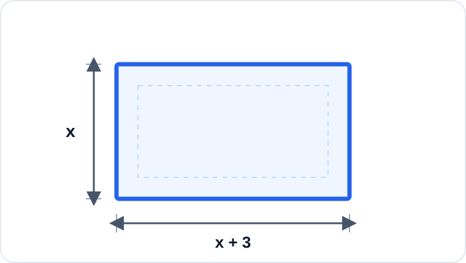

# Konu 18 — Fonksiyonlar

## Test 17 — Temel Düzey

- Soru sayısı: 10
- Her soruda yalnız bir doğru seçenek vardır.
- Önerilen süre: 17 dakika

## Soru 1

`K18-T17-Q01`

Gerçek sayılarda tanımlı $f(x)=ax+b$ fonksiyonu için

$$f(-1)=5 \quad\text{ve}\quad f(2)=-1$$

olduğuna göre $f(4)$ kaçtır?

A) $-6$

B) $-5$

C) $-4$

D) $-3$

E) $-2$

## Soru 2

`K18-T17-Q02`

$$A=\{-2,-1,0,1,2\}$$

olmak üzere $f:A\to\mathbb{R}$ fonksiyonu

$$f(x)=x^3-x$$

biçiminde tanımlanıyor.

$f$ fonksiyonunun görüntü kümesindeki elemanların toplamı kaçtır?

A) $-6$

B) $-3$

C) $0$

D) $3$

E) $6$

## Soru 3

`K18-T17-Q03`

Gerçek sayılarda tanımlı bire bir ve örten bir $f$ fonksiyonu için

$$f(2x+1)=4x-3$$

eşitliği veriliyor.

Buna göre $f^{-1}(5)$ kaçtır?

A) $2$

B) $3$

C) $4$

D) $5$

E) $6$

## Soru 4

`K18-T17-Q04`

$$f(x)=\frac{\sqrt{x+1}}{x^2-4}$$

fonksiyonunun gerçek sayılardaki tanım kümesi hangisidir?

A) $[-1,\infty)$

B) $(-\infty,-1]\cup(2,\infty)$

C) $[-1,2)$

D) $(-1,2)\cup(2,\infty)$

E) $[-1,2)\cup(2,\infty)$

## Soru 5

`K18-T17-Q05`

Gerçek sayılarda tanımlı $f$ fonksiyonu tek fonksiyondur.

$f(2)=5$ olduğuna göre

$$f(-2)+f(0)$$

kaçtır?

A) $-5$

B) $-2$

C) $0$

D) $2$

E) $5$

## Soru 6

`K18-T17-Q06`

Bir $f$ fonksiyonunun bazı değerleri aşağıdaki tabloda verilmiştir.

| $x$ | $-2$ | $-1$ | $0$ | $1$ | $2$ |
|---:|---:|---:|---:|---:|---:|
| $f(x)$ | $1$ | $4$ | $0$ | $-3$ | $2$ |

$$g(x)=2-f(-x)$$

olduğuna göre $g(1)$ kaçtır?

A) $-3$

B) $-2$

C) $-1$

D) $1$

E) $2$

## Soru 7

`K18-T17-Q07`

$$A=\{1,2,3\}, \qquad B=\{a,b,c,d\}$$

olmak üzere $f:A\to B$ fonksiyonları tanımlanıyor.

$f(1)=f(2)$ koşulunu sağlayan kaç farklı $f$ fonksiyonu vardır?

A) $8$

B) $12$

C) $16$

D) $24$

E) $32$

## Soru 8

`K18-T17-Q08`

$$f(x)=\frac{1}{x^2+1}$$

fonksiyonunun gerçek sayılardaki görüntü kümesi hangisidir?

A) $[0,1]$

B) $[0,1)$

C) $(0,1)$

D) $(0,1]$

E) $[1,\infty)$

## Soru 9

`K18-T17-Q09`

$$f(x)=(m-1)x^2+(m+2)x+1$$

ifadesinin doğrusal ve sabit olmayan bir fonksiyon belirtmesi için $m$ kaç olmalıdır?

A) $-2$

B) $-1$

C) $0$

D) $2$

E) $1$

## Soru 10

`K18-T17-Q10`

Aşağıdaki dikdörtgenin kısa kenarı $x$ birim, uzun kenarı ise kısa kenarından 3 birim fazladır.

Dikdörtgenin çevresi 18 birim olduğuna göre alanı kaç birimkaredir?

A) $18$

B) $20$

C) $21$

D) $24$

E) $27$
