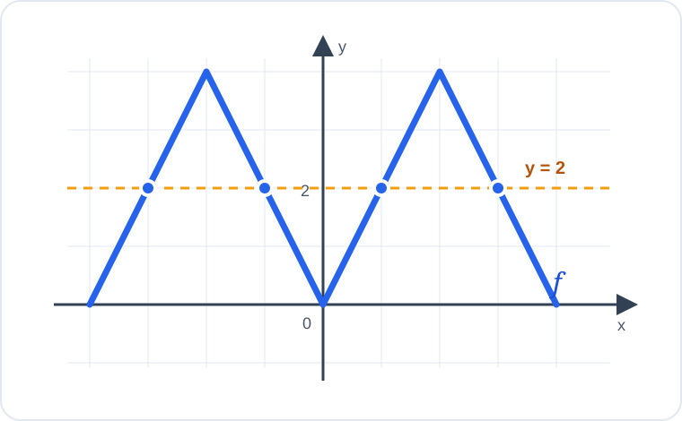

# Konu 18 — Fonksiyonlar

## Test 20 — Temel Düzey

- Soru sayısı: 10
- Her soruda yalnız bir doğru seçenek vardır.
- Önerilen süre: 17 dakika

## Soru 1

`K18-T20-Q01`

$$f:[2,\infty)\to[0,\infty), \qquad f(x)=\sqrt{2x-4}$$

fonksiyonu veriliyor.

$f^{-1}$ fonksiyonu aşağıdakilerden hangisidir?

A) $f^{-1}(x)=2x^2-4$, $x\ge0$

B) $f^{-1}(x)=\sqrt{\dfrac{x+4}{2}}$, $x\ge0$

C) $f^{-1}(x)=\dfrac{x^2-4}{2}$, $x\ge0$

D) $f^{-1}(x)=\dfrac{x^2}{2}-2$, $x\ge0$

E) $f^{-1}(x)=\dfrac{x^2}{2}+2$, $x\ge0$

## Soru 2

`K18-T20-Q02`

$f$ ve $g$ fonksiyonlarının bazı değerleri aşağıdaki tabloda verilmiştir.

| $x$ | $-1$ | $0$ | $1$ | $2$ |
|---:|---:|---:|---:|---:|
| $f(x)$ | $0$ | $3$ | $-2$ | $4$ |
| $g(x)$ | $2$ | $-1$ | $0$ | $1$ |

Buna göre $(f\circ g)(-1)$ kaçtır?

A) $4$

B) $3$

C) $2$

D) $1$

E) $0$

## Soru 3

`K18-T20-Q03`

$$f(x)=x^2+mx+n$$

fonksiyonunun görüntü kümesi $[-4,\infty)$ ve $f(1)=-4$ olduğuna göre $m+n$ kaçtır?

A) $-6$

B) $-5$

C) $-4$

D) $-3$

E) $-2$

## Soru 4

`K18-T20-Q04`

$$|x+2|+|x-2|=4$$

denkleminin kaç farklı gerçek sayı çözümü vardır?

A) $0$

B) $1$

C) Sonsuz sayıda

D) $2$

E) $4$

## Soru 5

`K18-T20-Q05`

Bir kitabın okunmamış sayfa sayısı, okumaya başladıktan $n$ gün sonra

$$P(n)=180-12n, \qquad n\in\{0,1,2,\ldots,15\}$$

fonksiyonuyla modelleniyor.

Okunmamış 60 sayfa kaldığında kaç gün geçmiştir?

A) $6$

B) $8$

C) $9$

D) $10$

E) $12$

## Soru 6

`K18-T20-Q06`

Gerçek sayılarda tanımlı $f$ fonksiyonu kesin artandır.

$$f(a)=f(2a-3)$$

olduğuna göre $a$ kaçtır?

A) $-3$

B) $0$

C) $1$

D) $2$

E) $3$

## Soru 7

`K18-T20-Q07`

Gerçek sayılarda tanımlı $f$ fonksiyonu

$$
f(x)=
\begin{cases}
x+2, & x<0\\
x^2+2, & x\ge0
\end{cases}
$$

biçiminde veriliyor.

$f$ fonksiyonunun görüntü kümesi hangisidir?

A) $\mathbb{R}$

B) $[2,\infty)$

C) $(-\infty,2)$

D) $(-\infty,2]$

E) $(2,\infty)$

## Soru 8

`K18-T20-Q08`

Aşağıda gerçek sayılarda tanımlı $f$ fonksiyonunun grafiği verilmiştir.

Grafiğe göre $f(x)=2$ denkleminin kaç farklı gerçek sayı çözümü vardır?

A) $3$

B) $4$

C) $5$

D) $6$

E) $7$

## Soru 9

`K18-T20-Q09`

$$f(x)=2x-3$$

fonksiyonu ile $f^{-1}$ fonksiyonunun grafikleri hangi noktada kesişir?

A) $(1,1)$

B) $(2,2)$

C) $(3,3)$

D) $(3,0)$

E) $(0,3)$

## Soru 10

`K18-T20-Q10`

$$f(x)=\frac{1}{x-1}$$

olduğuna göre $(f\circ f)(x)$ aşağıdakilerden hangisidir?

A) $\dfrac{x}{x-1}$, $x\ne1$

B) $\dfrac{1}{x-2}$, $x\ne2$

C) $\dfrac{x-1}{x-2}$, $x\ne2$

D) $\dfrac{x-1}{2-x}$, $x\ne1,2$

E) $\dfrac{2-x}{x-1}$, $x\ne1$
