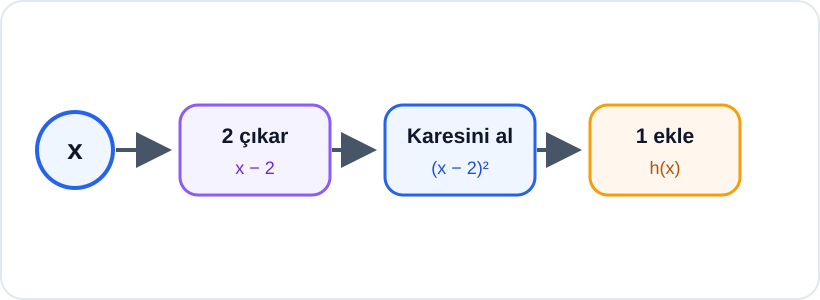

# Konu 18 — Fonksiyonlar

## Test 21 — Temel Düzey

- Soru sayısı: 10
- Her soruda yalnız bir doğru seçenek vardır.
- Önerilen süre: 17 dakika

## Soru 1

`K18-T21-Q01`

Gerçek sayılarda tanımlı $f$ fonksiyonu için

$$f(2x-3)=x^2+1$$

eşitliği veriliyor.

Buna göre $f(1)$ kaçtır?

A) $5$

B) $4$

C) $3$

D) $2$

E) $1$

## Soru 2

`K18-T21-Q02`

Bire bir bir $f$ fonksiyonunun bazı değerleri aşağıdaki tabloda verilmiştir.

| $x$ | $-2$ | $0$ | $1$ | $3$ |
|---:|---:|---:|---:|---:|
| $f(x)$ | $4$ | $-1$ | $2$ | $5$ |

$$h(x)=f^{-1}(x)+1$$

olduğuna göre $h(5)$ kaçtır?

A) $3$

B) $4$

C) $5$

D) $6$

E) $7$

## Soru 3

`K18-T21-Q03`

$$f(x)=\sqrt{\frac{x-1}{x+2}}$$

fonksiyonunun gerçek sayılardaki tanım kümesi hangisidir?

A) $(-\infty,-2]\cup[1,\infty)$

B) $(-2,1]$

C) $(-\infty,-2)\cup[1,\infty)$

D) $(-\infty,1]$

E) $[-2,1]$

## Soru 4

`K18-T21-Q04`

$$f(x)=x^3+ax^2+bx+4$$

fonksiyonu için

$$f(x)-f(-x)=2x^3-6x$$

eşitliği sağlanmaktadır.

Buna göre $b$ kaçtır?

A) $3$

B) $-1$

C) $-2$

D) $-3$

E) $-6$

## Soru 5

`K18-T21-Q05`

$$f(x)=|x+2|-1$$

fonksiyonunun sıfırlarının çarpımı kaçtır?

A) $-6$

B) $-3$

C) $-1$

D) $1$

E) $3$

## Soru 6

`K18-T21-Q06`

$$f(x)=2x+3 \quad\text{ve}\quad g(x)=ax-1$$

fonksiyonları için

$$ (g\circ f)(x)=6x+8$$

olduğuna göre $a$ kaçtır?

A) $3$

B) $2$

C) $1$

D) $4$

E) $6$

## Soru 7

`K18-T21-Q07`

3 elemanlı bir $A$ kümesinden 4 elemanlı bir $B$ kümesine tanımlanan fonksiyonlardan kaç tanesinin görüntü kümesi tam olarak 2 elemanlıdır?

A) $24$

B) $36$

C) $48$

D) $54$

E) $64$

## Soru 8

`K18-T21-Q08`

Gerçek sayılarda tanımlı $f$ fonksiyonu kesin azalandır.

$$f(2m-1)\le f(m+3)$$

olduğuna göre $m$ için aşağıdakilerden hangisi doğrudur?

A) $m<4$

B) $m\le4$

C) $m\ge4$

D) $m>4$

E) $m=4$

## Soru 9

`K18-T21-Q09`

$$f(x)=x^2-4x+a$$

fonksiyonunun gerçek sayılardaki en küçük değeri 2 olduğuna göre $a$ kaçtır?

A) $2$

B) $3$

C) $4$

D) $6$

E) $8$

## Soru 10

`K18-T21-Q10`

Aşağıdaki işlem şemasında bir $x$ girdisine sırasıyla üç işlem uygulanarak $h(x)$ çıktısı elde edilmektedir.

Buna göre $h(x)$ aşağıdakilerden hangisidir?

A) $x^2-3$

B) $(x+2)^2+1$

C) $(x-1)^2+2$

D) $x^2-2x+1$

E) $(x-2)^2+1$
