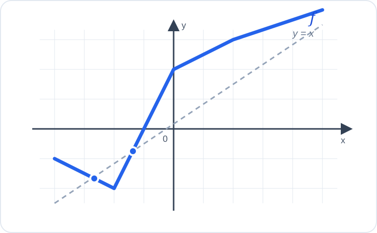

# Konu 18 — Fonksiyonlar

## Test 23 — Temel Düzey

- Soru sayısı: 10
- Her soruda yalnız bir doğru seçenek vardır.
- Önerilen süre: 17 dakika

## Soru 1

`K18-T23-Q01`

Gerçek sayılarda tanımlı $f$ fonksiyonu için

$$f(3x+1)=2x-5$$

eşitliği veriliyor.

Buna göre $f(10)$ kaçtır?

A) $-3$

B) $-1$

C) $1$

D) $3$

E) $5$

## Soru 2

`K18-T23-Q02`

$$f:[1,\infty)\to[-1,\infty), \qquad f(x)=x^2-2x$$

fonksiyonu veriliyor.

Buna göre $f^{-1}(3)$ kaçtır?

A) $-1$

B) $0$

C) $2$

D) $3$

E) $4$

## Soru 3

`K18-T23-Q03`

$$f(x)=\frac{\sqrt{x+3}}{x-1}$$

fonksiyonunun gerçek sayılardaki tanım kümesi hangisidir?

A) $[-3,1)$

B) $(-3,1)\cup(1,\infty)$

C) $[-3,\infty)$

D) $(-\infty,1)\cup(1,\infty)$

E) $[-3,1)\cup(1,\infty)$

## Soru 4

`K18-T23-Q04`

4 elemanlı bir $A$ kümesinden 5 elemanlı bir $B$ kümesine kaç farklı bire bir fonksiyon tanımlanabilir?

A) $120$

B) $100$

C) $80$

D) $60$

E) $20$

## Soru 5

`K18-T23-Q05`

Gerçek sayılarda tanımlı bir $f$ fonksiyonu için

$$f(x)-f(-x)=6x$$

eşitliği sağlanmaktadır.

Buna göre $f(-2)-f(2)$ kaçtır?

A) $-18$

B) $-12$

C) $-6$

D) $6$

E) $12$

## Soru 6

`K18-T23-Q06`

$$f(x)=|x-1|+2$$

fonksiyonu için $f(x)=4$ denkleminin gerçek sayı çözümlerinin toplamı kaçtır?

A) $-2$

B) $0$

C) $2$

D) $3$

E) $4$

## Soru 7

`K18-T23-Q07`

$$f(x)=\frac{x-2}{x+1}$$

fonksiyonunun gerçek sayılardaki görüntü kümesinde bulunmayan sayı hangisidir?

A) $-2$

B) $-1$

C) $0$

D) $1$

E) $2$

## Soru 8

`K18-T23-Q08`

$$f(x)=x^2+mx+n$$

fonksiyonunun en küçük değeri $-5$ ve bu değeri aldığı noktanın apsisi $-2$ olduğuna göre $m+n$ kaçtır?

A) $-5$

B) $-3$

C) $-1$

D) $1$

E) $3$

## Soru 9

`K18-T23-Q09`

Boş olmayan bir $A$ kümesinden 6 elemanlı bir $B$ kümesine kaç farklı sabit fonksiyon tanımlanabilir?

A) $6$

B) $12$

C) $18$

D) $24$

E) $36$

## Soru 10

`K18-T23-Q10`

Aşağıda gerçek sayılarda tanımlı $f$ fonksiyonunun grafiği ve $y=x$ doğrusu verilmiştir.

Grafiğe göre $f(x)=x$ denkleminin kaç farklı gerçek sayı çözümü vardır?

A) $1$

B) $2$

C) $3$

D) $4$

E) $5$
