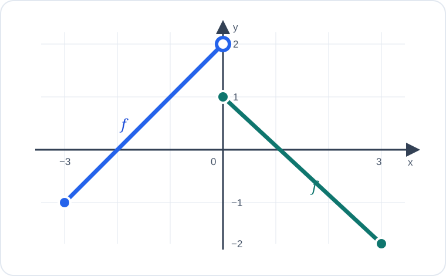

# Konu 18 — Fonksiyonlar

## Test 26 — Gelişim ve Pekiştirme

- Soru sayısı: 10
- Her soruda yalnız bir doğru seçenek vardır.
- Önerilen süre: 21 dakika

## Soru 1

`K18-T26-Q01`

Gerçek sayılarda tanımlı $f$ fonksiyonu için

$$f\left(\frac{x-1}{x+1}\right)=2x+3, \qquad x\ne-1$$

eşitliği veriliyor.

Buna göre $f(0)$ kaçtır?

A) $5$

B) $4$

C) $3$

D) $2$

E) $1$

## Soru 2

`K18-T26-Q02`

$$f:[2,\infty)\to[-4,\infty), \qquad f(x)=x^2-4x$$

fonksiyonu veriliyor.

Buna göre $f^{-1}(5)+f^{-1}(12)$ kaçtır?

A) $10$

B) $11$

C) $12$

D) $13$

E) $14$

## Soru 3

`K18-T26-Q03`

$$f(x)=\sqrt{3-x} \quad\text{ve}\quad g(x)=\frac{1}{x-2}$$

fonksiyonları veriliyor.

$(g\circ f)(x)$ bileşke fonksiyonunun tanım kümesi hangisidir?

A) $(-\infty,3]$

B) $[-1,3]$

C) $(-\infty,-1)\cup(-1,3]$

D) $(-\infty,-1]\cup(-1,3]$

E) $(-1,3]$

## Soru 4

`K18-T26-Q04`

Gerçek sayılarda tanımlı bir $f$ fonksiyonu için

$$f(x)+2f(-x)=3x+6$$

eşitliği sağlanmaktadır.

Buna göre $f(2)$ kaçtır?

A) $4$

B) $2$

C) $0$

D) $-4$

E) $-6$

## Soru 5

`K18-T26-Q05`

$$f(x)=x^2+4x+1$$

fonksiyonunun $[m,\infty)$ aralığında bire bir olması için alınabilecek en küçük $m$ değeri kaçtır?

A) $-5$

B) $-4$

C) $-3$

D) $-1$

E) $-2$

## Soru 6

`K18-T26-Q06`

$$A=\{1,2,3,4\}, \qquad B=\{a,b,c\}$$

olmak üzere $f:A\to B$ örten fonksiyonları tanımlanıyor.

$f(1)=a$ koşulunu sağlayan kaç farklı $f$ fonksiyonu vardır?

A) $12$

B) $10$

C) $8$

D) $6$

E) $4$

## Soru 7

`K18-T26-Q07`

$$f(x)=x+\frac1x, \qquad x>0$$

fonksiyonunun görüntü kümesi hangisidir?

A) $(0,\infty)$

B) $[2,\infty)$

C) $(2,\infty)$

D) $[1,\infty)$

E) $\mathbb{R}$

## Soru 8

`K18-T26-Q08`

Aşağıda gerçek sayılarda tanımlı $f$ fonksiyonunun grafiği verilmiştir.

Grafiğe göre $f$ fonksiyonunun görüntü kümesi hangisidir?

A) $[-2,2]$

B) $(-2,2)$

C) $[-2,2)$

D) $(-2,2]$

E) $[-1,2)$

## Soru 9

`K18-T26-Q09`

Gerçek sayılarda tanımlı $f$ fonksiyonu kesin artandır.

$$f(a^2+1)=f(5a-3)$$

olduğuna göre bu eşitliği sağlayan $a$ değerlerinin toplamı kaçtır?

A) $1$

B) $2$

C) $4$

D) $5$

E) $6$

## Soru 10

`K18-T26-Q10`

$$f(x)=\frac{2}{x+1}$$

olduğuna göre

$$f(f(x))=x$$

denkleminin gerçek sayı çözümlerinin toplamı kaçtır?

A) $-4$

B) $-3$

C) $-2$

D) $0$

E) $-1$
