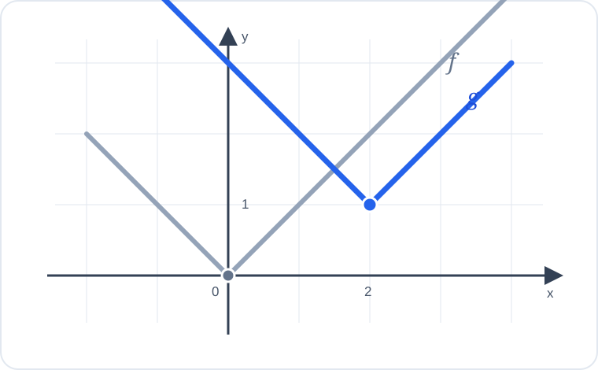

# Konu 18 — Fonksiyonlar

## Test 28 — Gelişim ve Pekiştirme

- Soru sayısı: 10
- Her soruda yalnız bir doğru seçenek vardır.
- Önerilen süre: 22 dakika

## Soru 1

`K18-T28-Q01`

Gerçek sayılarda tanımlı $f$ fonksiyonu için

$$f(x+1)-f(x)=2x+1$$

eşitliği sağlanmaktadır.

$f(0)=3$ olduğuna göre $f(3)$ kaçtır?

A) $9$

B) $10$

C) $12$

D) $14$

E) $15$

## Soru 2

`K18-T28-Q02`

$$f(x)=|x-2|$$

olduğuna göre $f(x)=3$ denkleminin gerçek sayı çözümlerinin toplamı kaçtır?

A) $-4$

B) $-1$

C) $2$

D) $4$

E) $6$

## Soru 3

`K18-T28-Q03`

$$f(x)=\sqrt{x+2} \quad\text{ve}\quad g(x)=\frac{1}{x-1}$$

fonksiyonları veriliyor.

$(f\circ g)(x)$ bileşke fonksiyonunun tanım kümesi hangisidir?

A) $(-\infty,1)\cup(1,\infty)$

B) $\left[\dfrac12,1\right)$

C) $(1,\infty)$

D) $\left(-\infty,\dfrac12\right]\cup[1,\infty)$

E) $\left(-\infty,\dfrac12\right]\cup(1,\infty)$

## Soru 4

`K18-T28-Q04`

$$f(x)=\frac{2x-1}{x+3}$$

fonksiyonunun gerçek sayılardaki görüntü kümesi hangisidir?

A) $\mathbb{R}\setminus\{2\}$

B) $\mathbb{R}\setminus\{-3\}$

C) $(-\infty,2)$

D) $(2,\infty)$

E) $\mathbb{R}$

## Soru 5

`K18-T28-Q05`

4 elemanlı bir kümeden 2 elemanlı bir kümeye tanımlanan fonksiyonların kaç tanesi sabit değildir?

A) $12$

B) $14$

C) $16$

D) $18$

E) $30$

## Soru 6

`K18-T28-Q06`

Gerçek sayılarda tanımlı $f(x)=ax+b$ fonksiyonu için

$$f(f(x))=9x-8$$

eşitliği her gerçek $x$ için sağlanmaktadır.

$a>0$ olduğuna göre $a+b$ kaçtır?

A) $-1$

B) $0$

C) $1$

D) $2$

E) $3$

## Soru 7

`K18-T28-Q07`

$$f:[-1,\infty)\to[0,\infty), \qquad f(x)=\sqrt{x+1}$$

fonksiyonu veriliyor.

Buna göre $f^{-1}(5)$ kaçtır?

A) $20$

B) $22$

C) $23$

D) $24$

E) $26$

## Soru 8

`K18-T28-Q08`

Aşağıda $y=f(x)$ ve $y=g(x)$ fonksiyonlarının grafikleri verilmiştir.

Buna göre $g$ fonksiyonu aşağıdakilerden hangisidir?

A) $g(x)=f(x)+2$

B) $g(x)=f(x-2)$

C) $g(x)=f(x+2)+1$

D) $g(x)=f(x+1)-2$

E) $g(x)=f(x-2)+1$

## Soru 9

`K18-T28-Q09`

Gerçek sayılarda tanımlı $f$ fonksiyonu kesin azalandır.

$$f(|a|)>f(3)$$

olduğuna göre $a$ için aşağıdakilerden hangisi doğrudur?

A) $-3<a<3$

B) $a<-3$

C) $a>3$

D) $a\ne3$

E) $-3\le a\le3$

## Soru 10

`K18-T28-Q10`

Çevresi 24 cm olan bir dikdörtgenin bir kenarının uzunluğu $x$ cm'dir.

Dikdörtgenin alanını veren $A(x)$ fonksiyonunun alabileceği en büyük değer kaçtır?

A) $32$

B) $36$

C) $40$

D) $48$

E) $72$
