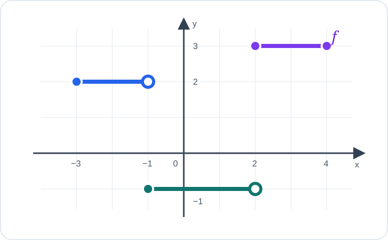

# Konu 18 — Fonksiyonlar

## Test 32 — Gelişim ve Pekiştirme

- Soru sayısı: 10
- Her soruda yalnız bir doğru seçenek vardır.
- Önerilen süre: 22 dakika

## Soru 1

`K18-T32-Q01`

Gerçek sayılarda tanımlı $f$ fonksiyonu için

$$f(x)+2f(1-x)=8-x$$

eşitliği her gerçek $x$ için sağlanmaktadır.

Buna göre $f(2)$ kaçtır?

A) $3$

B) $4$

C) $5$

D) $6$

E) $7$

## Soru 2

`K18-T32-Q02`

$$f:[3,\infty)\to[-4,\infty), \qquad f(x)=x^2-6x+5$$

fonksiyonu veriliyor.

Buna göre $f^{-1}(0)$ kaçtır?

A) $3$

B) $4$

C) $5$

D) $6$

E) $7$

## Soru 3

`K18-T32-Q03`

$$f(x)=\sqrt{x+1} \quad\text{ve}\quad g(x)=\frac1{x-2}$$

fonksiyonları veriliyor.

$(g\circ f)(x)$ bileşke fonksiyonunun gerçek sayılardaki tanım kümesi hangisidir?

A) $[-1,\infty)$

B) $[-1,3)$

C) $(3,\infty)$

D) $[-1,3)\cup(3,\infty)$

E) $(-\infty,3)\cup(3,\infty)$

## Soru 4

`K18-T32-Q04`

$$f(x)=\frac{2}{x^2+1}$$

fonksiyonu için $f(x)=1$ denkleminin kaç farklı gerçek sayı çözümü vardır?

A) Çözümü yoktur.

B) $1$

C) $3$

D) $4$

E) $2$

## Soru 5

`K18-T32-Q05`

5 elemanlı bir kümeden yine 5 elemanlı bir kümeye tanımlanan bire bir ve örten $f$ fonksiyonları ele alınıyor.

Belirli bir tanım kümesi elemanının görüntüsü önceden sabitlendiğine göre kaç farklı $f$ fonksiyonu tanımlanabilir?

A) $24$

B) $25$

C) $60$

D) $120$

E) $625$

## Soru 6

`K18-T32-Q06`

$A=\{1,2,3,4\}$ kümesinde tanımlı $f:A\to A$ fonksiyonu

$$f(1)=2,\quad f(2)=4,\quad f(3)=1,\quad f(4)=3$$

biçiminde veriliyor.

Buna göre $f^{2026}(1)$ kaçtır?

A) $2$

B) $4$

C) $1$

D) $3$

E) $2026$

## Soru 7

`K18-T32-Q07`

$$f(x)=2x-1, \qquad g(x)=x+3, \qquad h=g\circ f$$

olduğuna göre $h^{-1}(10)$ kaçtır?

A) $2$

B) $3$

C) $4$

D) $5$

E) $6$

## Soru 8

`K18-T32-Q08`

$m$ bir gerçek sayı olmak üzere

$$f_m(x)=(x-m)^2+2$$

fonksiyonunun gerçek sayılarda alabileceği en küçük değer kaçtır?

A) $-2$

B) $0$

C) $1$

D) $2$

E) $m$

## Soru 9

`K18-T32-Q09`

Gerçek sayılarda tanımlı $f$ fonksiyonu kesin azalandır.

$$f(3a-2)\le f(a+4)$$

olduğuna göre $a$ için aşağıdakilerden hangisi doğrudur?

A) $a<3$

B) $a\le3$

C) $a>3$

D) $a>2$

E) $a\ge3$

## Soru 10

`K18-T32-Q10`

Aşağıda gerçek sayılarda tanımlı $f$ fonksiyonunun grafiği verilmiştir.

Buna göre $f(-1)+f(2)$ kaçtır?

A) $2$

B) $1$

C) $0$

D) $3$

E) $4$
