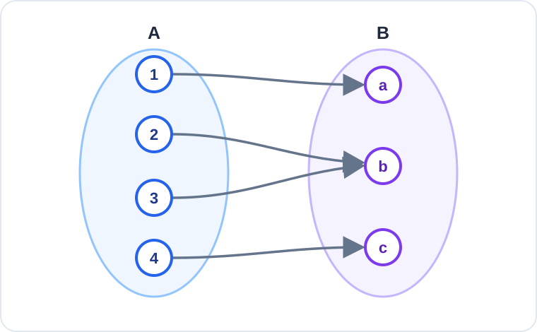

# Konu 18 — Fonksiyonlar

## Test 34 — Gelişim ve Pekiştirme

- Soru sayısı: 10
- Her soruda yalnız bir doğru seçenek vardır.
- Önerilen süre: 23 dakika

## Soru 1

`K18-T34-Q01`

Gerçek sayılarda tanımlı $f$ fonksiyonu için

$$f(x+2)=f(x)+3$$

eşitliği sağlanmaktadır.

$f(1)=4$ olduğuna göre $f(7)$ kaçtır?

A) $7$

B) $9$

C) $10$

D) $13$

E) $16$

## Soru 2

`K18-T34-Q02`

$\lfloor x\rfloor$, $x$'ten büyük olmayan en büyük tam sayıyı göstermektedir.

$$f(x)=\lfloor x\rfloor$$

olduğuna göre $f(-1{,}2)+f(2{,}8)$ kaçtır?

A) $-2$

B) $-1$

C) $1$

D) $2$

E) $0$

## Soru 3

`K18-T34-Q03`

Aşağıdaki şemada $f:A\to B$ fonksiyonu gösterilmiştir.

Buna göre $f$ fonksiyonu için aşağıdakilerden hangisi doğrudur?

A) Örtendir fakat bire bir değildir.

B) Bire birdir fakat örten değildir.

C) Hem bire bir hem örtendir.

D) Ne bire bir ne örtendir.

E) Sabit fonksiyondur.

## Soru 4

`K18-T34-Q04`

$$f(x)=\frac1{x-3} \quad\text{ve}\quad g(x)=x^2+2x$$

fonksiyonları veriliyor.

$(f\circ g)(x)$ bileşke fonksiyonunun gerçek sayılardaki tanım kümesi hangisidir?

A) $\mathbb{R}\setminus\{-3\}$

B) $\mathbb{R}\setminus\{-3,1\}$

C) $(-3,1)$

D) $(-\infty,-3)\cup(1,\infty)$

E) $\mathbb{R}\setminus\{3\}$

## Soru 5

`K18-T34-Q05`

$$f(x)=-|x-4|+2$$

fonksiyonunun gerçek sayılardaki görüntü kümesi hangisidir?

A) $[-2,\infty)$

B) $[2,\infty)$

C) $(-\infty,2]$

D) $(-\infty,4]$

E) $\mathbb{R}$

## Soru 6

`K18-T34-Q06`

$A=\{a,b,c,d,e\}$ ve $B=\{0,1\}$ kümeleri veriliyor.

$f:A\to B$ fonksiyonu için $f(a)=0$ ve $f(b)=1$ olduğu biliniyor.

Buna göre kaç farklı $f$ fonksiyonu tanımlanabilir?

A) $4$

B) $6$

C) $7$

D) $8$

E) $16$

## Soru 7

`K18-T34-Q07`

$$f(x)=3x-4$$

olduğuna göre

$$f^{-1}(a)=a$$

eşitliğini sağlayan $a$ değeri kaçtır?

A) $-2$

B) $-1$

C) $0$

D) $1$

E) $2$

## Soru 8

`K18-T34-Q08`

$$f(x)=2x+m \quad\text{ve}\quad g(x)=x-3$$

fonksiyonları için

$$(g\circ f)(x)=2x+1$$

eşitliği her gerçek $x$ için sağlanmaktadır.

Buna göre $m$ kaçtır?

A) $4$

B) $3$

C) $2$

D) $1$

E) $0$

## Soru 9

`K18-T34-Q09`

Gerçek sayılarda tanımlı $f$ fonksiyonu kesin artandır.

$$f(2x+1)\ge f(7-x)$$

olduğuna göre $x$ için aşağıdakilerden hangisi doğrudur?

A) $x>2$

B) $x\ge2$

C) $x<2$

D) $x\le2$

E) $x\ge3$

## Soru 10

`K18-T34-Q10`

$$f(x)=|x-1|, \qquad -2\le x\le4$$

fonksiyonu en büyük değerini aldığı $x$ değerleri toplamı kaçtır?

A) $-2$

B) $1$

C) $2$

D) $3$

E) $4$
