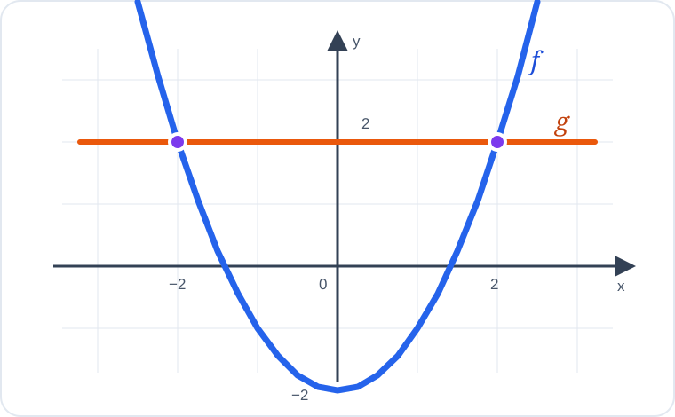

# Konu 18 — Fonksiyonlar

## Test 36 — Gelişim ve Pekiştirme

- Soru sayısı: 10
- Her soruda yalnız bir doğru seçenek vardır.
- Önerilen süre: 23 dakika

## Soru 1

`K18-T36-Q01`

Gerçek sayılarda tanımlı $f$ fonksiyonu için

$$f(x)+f(2-x)=x^2-2x+10$$

eşitliği sağlanmaktadır.

Buna göre $f(0)+f(2)$ kaçtır?

A) $10$

B) $8$

C) $6$

D) $4$

E) $2$

## Soru 2

`K18-T36-Q02`

$$f(x)=\frac{|x|}{x}, \qquad x\ne0$$

fonksiyonunun görüntü kümesindeki elemanların toplamı kaçtır?

A) $-1$

B) $0$

C) $1$

D) $2$

E) Fonksiyonun görüntü kümesi sonsuzdur.

## Soru 3

`K18-T36-Q03`

$$f(x)=\sqrt{4-x} \quad\text{ve}\quad g(x)=x^2+1$$

fonksiyonları veriliyor.

$(f\circ g)(x)$ bileşke fonksiyonunun gerçek sayılardaki tanım kümesi hangisidir?

A) $(-\infty,\sqrt3]$

B) $[-3,3]$

C) $[-\sqrt3,\sqrt3]$

D) $(-\sqrt3,\sqrt3)$

E) $\mathbb{R}$

## Soru 4

`K18-T36-Q04`

$$f(x)=x^2-4x+5, \qquad 0\le x\le4$$

fonksiyonunun görüntü kümesi hangisidir?

A) $[0,5]$

B) $[1,4]$

C) $[0,4]$

D) $[1,5]$

E) $[-1,5]$

## Soru 5

`K18-T36-Q05`

6 elemanlı bir kümeden yine 6 elemanlı bir kümeye tanımlanan bire bir ve örten fonksiyonlarda iki farklı tanım kümesi elemanının görüntüleri önceden sabitlenmiştir.

Buna göre kaç farklı fonksiyon tanımlanabilir?

A) $720$

B) $120$

C) $48$

D) $36$

E) $24$

## Soru 6

`K18-T36-Q06`

Bire bir ve örten $f$ ve $g$ fonksiyonları için

$$f(2)=5 \quad\text{ve}\quad g(5)=7$$

eşitlikleri veriliyor.

Buna göre $(g\circ f)^{-1}(7)$ kaçtır?

A) $2$

B) $5$

C) $7$

D) $10$

E) $12$

## Soru 7

`K18-T36-Q07`

Gerçek sayılarda tanımlı

$$f(x)=(m-1)x^2+3x$$

fonksiyonunun tek fonksiyon olması için $m$ kaç olmalıdır?

A) $0$

B) $1$

C) $2$

D) $3$

E) $4$

## Soru 8

`K18-T36-Q08`

Aşağıda $y=f(x)$ ve $y=g(x)$ fonksiyonlarının grafikleri verilmiştir.

Grafiklere göre $f(x)=g(x)$ denkleminin kaç gerçek sayı çözümü vardır?

A) $0$

B) $1$

C) $2$

D) $3$

E) $4$

## Soru 9

`K18-T36-Q09`

$$A=\{-2,-1,0,1,2\}, \qquad f:A\to\mathbb{R}, \qquad f(x)=x^2$$

olmak üzere

$$\{x\in A\mid f(x)\in\{1,4\}\}$$

kümesinin eleman sayısı kaçtır?

A) $1$

B) $2$

C) $3$

D) $4$

E) $5$

## Soru 10

`K18-T36-Q10`

Gerçek sayılarda tanımlı $f$ fonksiyonu için

$$f(x+1)=f(x)-2$$

eşitliği sağlanmaktadır.

$f(3)=5$ olduğuna göre $f(-1)$ kaçtır?

A) $5$

B) $7$

C) $9$

D) $11$

E) $13$
