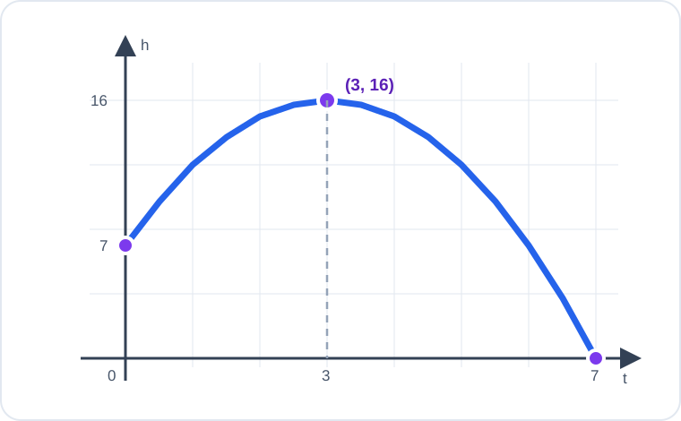

# Konu 18 — Fonksiyonlar

## Test 38 — Gelişim ve Pekiştirme

- Soru sayısı: 10
- Her soruda yalnız bir doğru seçenek vardır.
- Önerilen süre: 23 dakika

## Soru 1

`K18-T38-Q01`

Gerçek sayılarda tanımlı $f$ fonksiyonu için

$$f(x+1)-f(x)=x+2$$

eşitliği sağlanmaktadır.

$f(0)=1$ olduğuna göre $f(4)$ kaçtır?

A) $11$

B) $13$

C) $15$

D) $17$

E) $19$

## Soru 2

`K18-T38-Q02`

$$f(x)=\frac1{\sqrt{x^2-5x+6}}$$

fonksiyonunun gerçek sayılardaki tanım kümesi hangisidir?

A) $(-\infty,2]\cup[3,\infty)$

B) $(2,3)$

C) $\mathbb{R}\setminus\{2,3\}$

D) $(-\infty,2)\cup(3,\infty)$

E) $[2,3]$

## Soru 3

`K18-T38-Q03`

$$f(x)=\frac{x^2}{x^2+1}$$

fonksiyonunun gerçek sayılardaki görüntü kümesi hangisidir?

A) $(0,1)$

B) $(0,1]$

C) $[0,1]$

D) $[1,\infty)$

E) $[0,1)$

## Soru 4

`K18-T38-Q04`

4 elemanlı bir kümeden 6 elemanlı bir kümeye tanımlanan bire bir fonksiyonda bir elemanın görüntüsü önceden sabitlenmiştir.

Buna göre kaç farklı fonksiyon tanımlanabilir?

A) $60$

B) $120$

C) $180$

D) $240$

E) $360$

## Soru 5

`K18-T38-Q05`

$$f:[2,\infty)\to[-1,\infty), \qquad f(x)=(x-2)^2-1$$

fonksiyonu veriliyor.

Buna göre $f^{-1}(8)$ kaçtır?

A) $4$

B) $5$

C) $6$

D) $7$

E) $8$

## Soru 6

`K18-T38-Q06`

Gerçek sayılarda tanımlı $f$ fonksiyonu için

$$f(x)+f(-x)=4x^2+2$$

eşitliği sağlanmaktadır.

$$E(x)=\frac{f(x)+f(-x)}2$$

olduğuna göre $E(2)$ kaçtır?

A) $5$

B) $7$

C) $9$

D) $11$

E) $18$

## Soru 7

`K18-T38-Q07`

$$f(x)=ax+1 \quad\text{ve}\quad g(x)=x+a$$

fonksiyonları için

$$(f\circ g)(x)=3x+10$$

eşitliği her gerçek $x$ için sağlanmaktadır.

Buna göre $a$ kaçtır?

A) $0$

B) $1$

C) $2$

D) $3$

E) $4$

## Soru 8

`K18-T38-Q08`

$$f(x)=|x-1| \quad\text{ve}\quad g(x)=x+1$$

fonksiyonları veriliyor.

$$(f\circ g)(x)=2$$

denkleminin gerçek sayı çözümlerinin çarpımı kaçtır?

A) $-8$

B) $-2$

C) $0$

D) $4$

E) $-4$

## Soru 9

`K18-T38-Q09`

Gerçek sayılarda tanımlı $f$ fonksiyonu kesin azalandır.

$$f(a-1)>f(2a+3)$$

olduğuna göre $a$ için aşağıdakilerden hangisi doğrudur?

A) $a>-4$

B) $a\ge-4$

C) $a<-4$

D) $a>-2$

E) $a<2$

## Soru 10

`K18-T38-Q10`

Bir cismin yerden yüksekliğinin zamana göre değişimi aşağıdaki grafikte verilmiştir.

Buna göre cismin yerden yüksekliğinin en büyük değeri kaç metredir?

A) $14$

B) $16$

C) $18$

D) $20$

E) $22$
