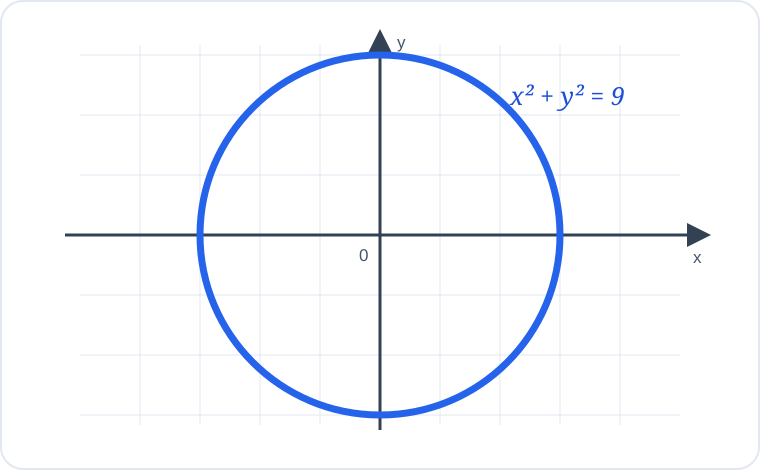

# Konu 18 — Fonksiyonlar

## Test 40 — Gelişim ve Pekiştirme

- Soru sayısı: 10
- Her soruda yalnız bir doğru seçenek vardır.
- Önerilen süre: 23 dakika

## Soru 1

`K18-T40-Q01`

Gerçek sayılarda tanımlı $f$ fonksiyonu için

$$f(x)-f(x-2)=3x-1$$

eşitliği sağlanmaktadır.

$f(0)=2$ olduğuna göre $f(4)$ kaçtır?

A) $10$

B) $12$

C) $14$

D) $16$

E) $18$

## Soru 2

`K18-T40-Q02`

$$f(x)=\frac{\sqrt{5-x}}{\sqrt{x+1}}$$

fonksiyonunun gerçek sayılardaki tanım kümesi hangisidir?

A) $(-1,5]$

B) $[-1,5]$

C) $(-1,5)$

D) $[-1,5)$

E) $(-\infty,5]$

## Soru 3

`K18-T40-Q03`

$$f(x)=|2x+1|+4$$

fonksiyonunun gerçek sayılardaki görüntü kümesi hangisidir?

A) $(4,\infty)$

B) $[4,\infty)$

C) $(-\infty,4]$

D) $[1,\infty)$

E) $\mathbb{R}$

## Soru 4

`K18-T40-Q04`

4 elemanlı bir kümeden 3 elemanlı bir kümeye tanımlanan fonksiyonların kaç tanesi örten değildir?

A) $27$

B) $36$

C) $45$

D) $48$

E) $81$

## Soru 5

`K18-T40-Q05`

$$f(x)=\frac{x+2}{x-3}$$

olduğuna göre $f(x)=x$ denkleminin kökleri toplamı kaçtır?

A) $-4$

B) $-2$

C) $2$

D) $4$

E) $6$

## Soru 6

`K18-T40-Q06`

$A=\{a,b,c\}$ kümesinde tanımlı $f:A\to A$ fonksiyonu

$$f(a)=b, \qquad f(b)=c, \qquad f(c)=a$$

biçiminde veriliyor.

Buna göre $f^{2025}(b)$ hangisidir?

A) $a$

B) $c$

C) $f$ fonksiyonunun sabit noktası

D) Belirlenemez.

E) $b$

## Soru 7

`K18-T40-Q07`

Gerçek sayılarda tanımlı $f$ fonksiyonu için

$$f(x)+f(-x)=6x^2+4$$

eşitliği sağlanmaktadır.

Fonksiyonun çift kısmı

$$E(x)=\frac{f(x)+f(-x)}2$$

olduğuna göre $E(1)$ kaçtır?

A) $5$

B) $4$

C) $3$

D) $2$

E) $1$

## Soru 8

`K18-T40-Q08`

Gerçek sayılarda tanımlı $f(x)=mx+2$ fonksiyonu için

$$f^{-1}(4)=1$$

eşitliği sağlanmaktadır.

Buna göre $m$ kaçtır?

A) $1$

B) $2$

C) $3$

D) $4$

E) $6$

## Soru 9

`K18-T40-Q09`

$(-2,3)$ noktası $y=f(x)$ fonksiyonunun grafiği üzerindedir.

$$g(x)=-f(x+1)$$

olduğuna göre aşağıdaki noktalardan hangisi $y=g(x)$ grafiği üzerindedir?

A) $(-1,-3)$

B) $(-2,3)$

C) $(-3,-3)$

D) $(3,-2)$

E) $(-3,3)$

## Soru 10

`K18-T40-Q10`

Aşağıda bir bağıntının koordinat düzlemindeki grafiği verilmiştir.

Bu bağıntının $y$'yi $x$'e bağlı bir fonksiyon olarak tanımlamamasının nedeni hangisidir?

A) Grafik $y$ eksenini kesmektedir.

B) Grafik kapalı bir eğridir.

C) Grafik orijinden geçmemektedir.

D) Bazı $x$ değerlerine iki farklı $y$ değeri karşılık gelmektedir.

E) Grafikteki $x$ ve $y$ değerleri sınırlıdır.
