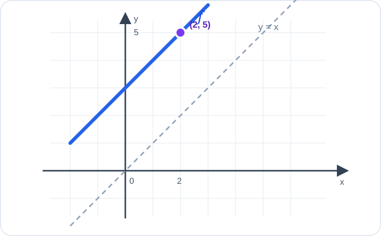

# Konu 18 — Fonksiyonlar

## Test 42 — İleri ve Yeni Nesil

- Soru sayısı: 10
- Her soruda yalnız bir doğru seçenek vardır.
- Önerilen süre: 25 dakika

## Soru 1

`K18-T42-Q01`

Gerçek sayılarda tanımlı $f$ fonksiyonu için

$$f(x+1)=2f(x)+x$$

eşitliği sağlanmaktadır.

$f(0)=1$ olduğuna göre $f(3)$ kaçtır?

A) $10$

B) $12$

C) $14$

D) $16$

E) $18$

## Soru 2

`K18-T42-Q02`

$$f(x)=\sqrt{\frac{x+3}{2-x}}$$

fonksiyonunun gerçek sayılardaki tanım kümesi hangisidir?

A) $(-3,2)$

B) $[-3,2]$

C) $[-3,2)$

D) $(-\infty,-3]\cup(2,\infty)$

E) $(-\infty,2)$

## Soru 3

`K18-T42-Q03`

$$f(x)=\frac{|x-1|}{|x-1|+1}$$

fonksiyonunun gerçek sayılardaki görüntü kümesi hangisidir?

A) $(0,1)$

B) $(0,1]$

C) $[0,1]$

D) $[0,1)$

E) $[1,\infty)$

## Soru 4

`K18-T42-Q04`

7 elemanlı bir kümeden yine 7 elemanlı bir kümeye tanımlanan bire bir ve örten fonksiyonlarda üç farklı tanım kümesi elemanının görüntüleri önceden sabitlenmiştir.

Buna göre kaç farklı fonksiyon tanımlanabilir?

A) $720$

B) $360$

C) $120$

D) $48$

E) $24$

## Soru 5

`K18-T42-Q05`

$$f:(-\infty,1]\to[2,\infty), \qquad f(x)=(x-1)^2+2$$

fonksiyonu veriliyor.

Buna göre $f^{-1}(11)$ kaçtır?

A) $-2$

B) $-1$

C) $0$

D) $2$

E) $4$

## Soru 6

`K18-T42-Q06`

$$f(x)=x^3+2x^2-4x+5$$

fonksiyonunun çift kısmı

$$E(x)=\frac{f(x)+f(-x)}2$$

biçiminde tanımlanıyor.

Buna göre $E(2)$ kaçtır?

A) $9$

B) $13$

C) $15$

D) $17$

E) $21$

## Soru 7

`K18-T42-Q07`

$$f(x)=ax+2 \quad\text{ve}\quad g(x)=3x-a$$

fonksiyonları için

$$(g\circ f)(x)=6x+4$$

eşitliği her gerçek $x$ için sağlanmaktadır.

Buna göre $a$ kaçtır?

A) $0$

B) $1$

C) $2$

D) $3$

E) $4$

## Soru 8

`K18-T42-Q08`

Gerçek sayılarda tanımlı bire bir $f$ fonksiyonu için

$$f(a+2)=f(a^2-4)$$

eşitliği veriliyor.

Buna göre bu eşitliği sağlayan $a$ değerlerinin toplamı kaçtır?

A) $-2$

B) $-1$

C) $0$

D) $1$

E) $3$

## Soru 9

`K18-T42-Q09`

Gerçek sayılarda tanımlı $f$ fonksiyonu kesin artandır.

$$f\left(\frac1{a-1}\right)>f(0)$$

olduğuna göre $a$ için aşağıdakilerden hangisi doğrudur?

A) $a<0$

B) $a<1$

C) $a\ne1$

D) $a<-1$

E) $a>1$

## Soru 10

`K18-T42-Q10`

Aşağıda $y=f(x)$ grafiği, $y=x$ doğrusu ve grafik üzerindeki bir nokta verilmiştir.

Buna göre aşağıdaki noktalardan hangisi $y=f^{-1}(x)$ grafiği üzerinde bulunur?

A) $(5,2)$

B) $(-2,5)$

C) $(2,-5)$

D) $(5,-2)$

E) $(2,5)$
