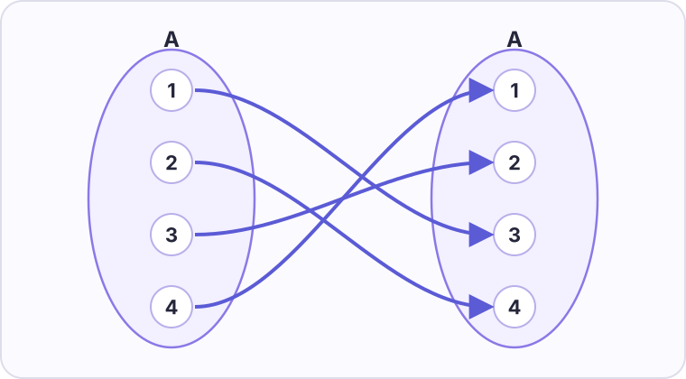

# Konu 18 — Fonksiyonlar

## Test 46 — İleri ve Yeni Nesil

- Soru sayısı: 10
- Her soruda yalnız bir doğru seçenek vardır.
- Önerilen süre: 25 dakika

## Soru 1

`K18-T46-Q01`

Gerçek sayılarda tanımlı $f$ fonksiyonu için

$$f(x+1)=f(x)+2x$$

eşitliği sağlanmaktadır.

$f(0)=1$ olduğuna göre $f(4)$ kaçtır?

A) $13$

B) $12$

C) $11$

D) $10$

E) $9$

## Soru 2

`K18-T46-Q02`

$$f(x)=\sqrt{\frac{x+2}{x-1}}$$

fonksiyonunun gerçek sayılardaki tanım kümesi hangisidir?

A) $[-2,1)$

B) $(-\infty,-2]\cup(1,\infty)$

C) $(-\infty,-2)\cup[1,\infty)$

D) $(-2,1)$

E) $[-2,\infty)\setminus\{1\}$

## Soru 3

`K18-T46-Q03`

$$f(x)=3-|x-2|$$

fonksiyonunun gerçek sayılardaki görüntü kümesi hangisidir?

A) $[0,3]$

B) $(-\infty,2]$

C) $(-\infty,3]$

D) $[3,\infty)$

E) $\mathbb R$

## Soru 4

`K18-T46-Q04`

5 elemanlı bir kümeden 4 elemanlı bir kümeye tanımlanan fonksiyonlardan görüntü kümesi tam olarak 3 elemanlı olanların sayısı kaçtır?

A) $240$

B) $360$

C) $480$

D) $600$

E) $720$

## Soru 5

`K18-T46-Q05`

$f(x)=ax+b$ doğrusal fonksiyonu için

$$f(1)=5 \quad\text{ve}\quad f^{-1}(1)=-1$$

eşitlikleri veriliyor.

Buna göre $a$ kaçtır?

A) $-2$

B) $-1$

C) $0$

D) $1$

E) $2$

## Soru 6

`K18-T46-Q06`

$$f(x)=\frac{x+1}{x-2}$$

fonksiyonu için $f^{-1}(2)$ kaçtır?

A) $5$

B) $4$

C) $3$

D) $2$

E) $1$

## Soru 7

`K18-T46-Q07`

$$f(x)=x^4+ax^3+2x^2+bx+1$$

fonksiyonu çift fonksiyondur.

Buna göre $f(1)$ kaçtır?

A) $3$

B) $4$

C) $5$

D) $6$

E) $7$

## Soru 8

`K18-T46-Q08`

Gerçek sayılarda tanımlı

$$
f(x)=
\begin{cases}
x^2, & x\le1\\
2x+1, & x>1
\end{cases}
$$

fonksiyonu için $f(x)=4$ denkleminin kaç farklı gerçek sayı çözümü vardır?

A) $1$

B) $3$

C) $2$

D) $4$

E) Çözümü yoktur.

## Soru 9

`K18-T46-Q09`

Gerçek sayılarda tanımlı bire bir $f$ fonksiyonu için

$$f(a^2+2a)=f(3-a)$$

eşitliği veriliyor.

Buna göre eşitliği sağlayan $a$ değerlerinin toplamı kaçtır?

A) $-1$

B) $-2$

C) $0$

D) $-3$

E) $3$

## Soru 10

`K18-T46-Q10`

$A=\{1,2,3,4\}$ kümesinde tanımlı $f:A\to A$ fonksiyonu aşağıdaki eşleme şemasında verilmiştir.

Buna göre $(f\circ f)(2)$ kaçtır?

A) $3$

B) $2$

C) $4$

D) $0$

E) $1$
