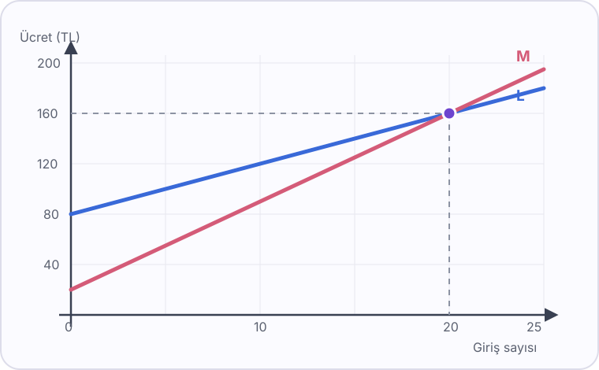

# Konu 18 — Fonksiyonlar

## Test 48 — İleri ve Yeni Nesil

- Soru sayısı: 10
- Her soruda yalnız bir doğru seçenek vardır.
- Önerilen süre: 25 dakika

## Soru 1

`K18-T48-Q01`

Gerçek sayılarda tanımlı $f$ fonksiyonu için

$$f(x+2)=f(x)+x^2$$

eşitliği sağlanmaktadır.

$f(0)=1$ olduğuna göre $f(6)$ kaçtır?

A) $17$

B) $19$

C) $21$

D) $23$

E) $25$

## Soru 2

`K18-T48-Q02`

$$f(x)=\frac1{\sqrt{(x-1)(x+3)}}$$

fonksiyonunun gerçek sayılardaki tanım kümesi hangisidir?

A) $(-\infty,-3]\cup[1,\infty)$

B) $[-3,1]$

C) $(-3,1)$

D) $(-\infty,-3)\cup(1,\infty)$

E) $\mathbb R\setminus\{-3,1\}$

## Soru 3

`K18-T48-Q03`

$$f(x)=\frac2{x^2+1}-1$$

fonksiyonunun gerçek sayılardaki görüntü kümesi hangisidir?

A) $[-1,1]$

B) $(-1,1)$

C) $[-1,1)$

D) $(-1,\infty)$

E) $(-1,1]$

## Soru 4

`K18-T48-Q04`

$A=\{a,b,c,d\}$ ve $B=\{1,2,3,4,5\}$ kümeleri veriliyor.

$f:A\to B$ fonksiyonu için $f(a)=1$ ve görüntü kümesinin tam olarak iki elemanlı olduğu biliniyor.

Buna göre kaç farklı $f$ fonksiyonu tanımlanabilir?

A) $28$

B) $24$

C) $20$

D) $16$

E) $12$

## Soru 5

`K18-T48-Q05`

$$f(x)=2x+a \quad\text{ve}\quad g(x)=x^2$$

fonksiyonları için

$$(g\circ f)(0)=16$$

ve $a<0$ olduğuna göre $a$ kaçtır?

A) $4$

B) $-4$

C) $8$

D) $-8$

E) $0$

## Soru 6

`K18-T48-Q06`

$$f(x)=\frac{3x+1}{x-2}$$

fonksiyonu için $f^{-1}(2)$ kaçtır?

A) $-7$

B) $-6$

C) $-5$

D) $5$

E) $7$

## Soru 7

`K18-T48-Q07`

Gerçek sayılarda tanımlı $f$ fonksiyonu için

$$f(x)+f(-x)=2x^2+6$$

eşitliği sağlanmaktadır.

Buna göre $f(3)+f(-3)$ kaçtır?

A) $18$

B) $20$

C) $22$

D) $24$

E) $26$

## Soru 8

`K18-T48-Q08`

$$f(x)=|x-2|+|x+2|$$

fonksiyonu için $f(x)=6$ denkleminin kaç farklı gerçek sayı çözümü vardır?

A) $4$

B) $3$

C) $1$

D) Çözümü yoktur.

E) $2$

## Soru 9

`K18-T48-Q09`

Gerçek sayılarda tanımlı bire bir $f$ fonksiyonu için

$$f(a^2-2a)=f(4a+3)$$

eşitliği veriliyor.

Buna göre eşitliği sağlayan $a$ değerlerinin toplamı kaçtır?

A) $6$

B) $5$

C) $4$

D) $3$

E) $2$

## Soru 10

`K18-T48-Q10`

Bir spor merkezinin iki kullanım planında, $x$ giriş için toplam ücretler

$$L(x)=80+4x \quad\text{ve}\quad M(x)=20+7x$$

fonksiyonlarıyla modelleniyor. Bu iki fonksiyonun grafikleri aşağıda verilmiştir.

İki planın toplam ücretleri kaç girişte eşit olur?

A) $15$

B) $20$

C) $25$

D) $30$

E) $35$
