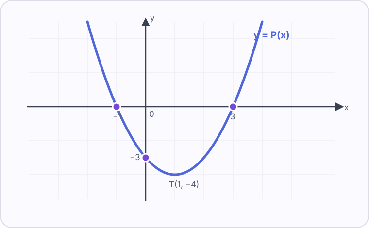

# Konu 19 — Polinomlar ve İkinci Dereceye Giriş

## Test 02 — Temel Düzey

- Soru sayısı: 10
- Her soruda yalnız bir doğru seçenek vardır.
- Önerilen süre: 17 dakika

## Soru 1

`K19-T02-Q01`

$$P(x)=(a-1)x^5+2x^4+(b+3)x^3-x^2+4$$

polinomu çift polinom olduğuna göre $a+b$ kaçtır?

A) $-3$

B) $-2$

C) $-1$

D) $0$

E) $1$

## Soru 2

`K19-T02-Q02`

Bir $P$ polinomu için

$$P(x+1)=x^2+3x-2$$

eşitliği sağlanmaktadır.

Buna göre $P(3)$ kaçtır?

A) $6$

B) $7$

C) $8$

D) $9$

E) $10$

## Soru 3

`K19-T02-Q03`

$$P(x)=x^5-2x^4+3x^3-x+4$$

polinomunun tek dereceli terimlerinin katsayıları toplamı kaçtır?

A) $0$

B) $1$

C) $2$

D) $3$

E) $4$

## Soru 4

`K19-T02-Q04`

$$P(x)=x^3+x^2-4x+1$$

olduğuna göre $P(x-2)$ polinomunun sabit terimi kaçtır?

A) $1$

B) $2$

C) $3$

D) $4$

E) $5$

## Soru 5

`K19-T02-Q05`

$$P(x)=x^2+2x-1,qquad Q(x)=3x-4$$

olduğuna göre $P(x)Q(x)$ polinomunda $x^2$ teriminin katsayısı kaçtır?

A) $2$

B) $-2$

C) $3$

D) $4$

E) $6$

## Soru 6

`K19-T02-Q06`

Sıfırdan farklı $P$, $Q$ ve $R$ polinomlarının dereceleri sırasıyla 4, 2 ve 3'tür.

$P(x)Q(x)^2$ polinomu $R(x)$ ile tam bölünebildiğine göre bölüm polinomunun derecesi kaçtır?

A) $4$

B) $5$

C) $6$

D) $7$

E) $8$

## Soru 7

`K19-T02-Q07`

$$P(x)=x^3+2x^2-x+5$$

polinomunun $x^2-1$ ile bölümünden kalan kaçtır?

A) $5$

B) $6$

C) $7$

D) $8$

E) $9$

## Soru 8

`K19-T02-Q08`

$$P(x)=x^3+ax^2+bx+2$$

polinomu $(x-2)(x+1)$ ile tam bölünebildiğine göre $a+b$ kaçtır?

A) $-6$

B) $-5$

C) $-4$

D) $-3$

E) $-2$

## Soru 9

`K19-T02-Q09`

$$x^2-8x+m=0$$

denkleminin gerçek kökleri arasındaki farkın mutlak değeri 2 olduğuna göre $m$ kaçtır?

A) $11$

B) $12$

C) $13$

D) $14$

E) $15$

## Soru 10

`K19-T02-Q10`

İkinci dereceden $P$ polinomunun grafiği aşağıda verilmiştir.

Buna göre $P(2)$ kaçtır?

A) $-3$

B) $-2$

C) $-1$

D) $2$

E) $3$
