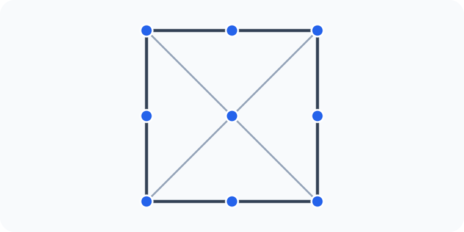
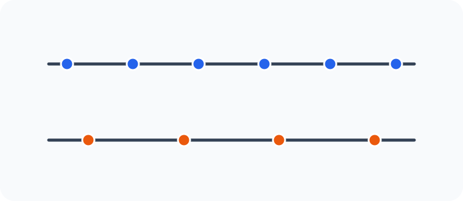
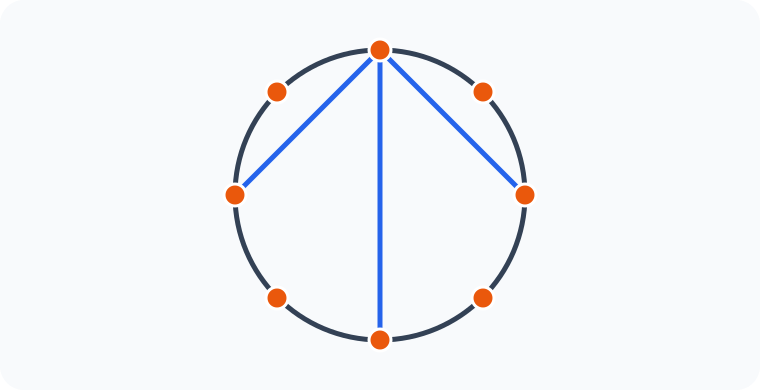

# Konu 21 — Kombinasyon

## Test 17 — Temel Düzey

- Soru sayısı: 10
- Her soruda yalnız bir doğru seçenek vardır.
- Önerilen süre: 17 dakika

## Soru 1

`K21-T17-Q01`

Bir kare üzerinde; dört köşe, dört kenar orta noktası ve köşegenlerin kesişim noktası işaretlenmiştir.

Bu dokuz noktadan üçü, aynı doğru üzerinde bulunmayacak biçimde seçilecektir.

Buna göre seçim kaç farklı biçimde yapılabilir?

A) $72$

B) $76$

C) $78$

D) $80$

E) $84$

## Soru 2

`K21-T17-Q02`

Sekiz elemanlı bir kümenin belirli bir elemanını içeren, iki veya altı elemanlı kaç alt kümesi vardır?

A) $21$

B) $24$

C) $28$

D) $32$

E) $35$

## Soru 3

`K21-T17-Q03`

Birbirine paralel iki doğru üzerinde sırasıyla 6 ve 4 nokta işaretlenmiştir. Bu noktaların dışında aynı doğru üzerinde bulunan üç nokta yoktur.

Köşeleri bu noktalardan seçilen kaç farklı üçgen çizilebilir?

A) $84$

B) $88$

C) $92$

D) $96$

E) $100$

## Soru 4

`K21-T17-Q04`

Aralarında A ve B'nin de bulunduğu 9 öğrenciden beş kişilik bir grup oluşturulacaktır.

A ile B'nin ikisinin birden grupta bulunmaması koşuluyla grup kaç farklı biçimde oluşturulabilir?

A) $70$

B) $84$

C) $86$

D) $90$

E) $91$

## Soru 5

`K21-T17-Q05`

Birbirinden farklı 6 kırmızı ve 4 mavi bilyeden dördü seçilecektir.

Seçilenlerin üçünün kırmızı, birinin mavi olması koşuluyla seçim kaç farklı biçimde yapılabilir?

A) $80$

B) $72$

C) $64$

D) $60$

E) $56$

## Soru 6

`K21-T17-Q06`

$1,2,3,\ldots,10$ sayılarından toplamı çift olan üç farklı sayı seçilecektir.

Buna göre seçim kaç farklı biçimde yapılabilir?

A) $50$

B) $60$

C) $70$

D) $80$

E) $90$

## Soru 7

`K21-T17-Q07`

Çember üzerinde işaretlenmiş 8 noktadan üç farklı doğru parçası çizilecektir. Çizilen doğru parçalarının üçünün de bir ortak uç noktası olacaktır.

Buna göre çizim kaç farklı biçimde yapılabilir?

A) $224$

B) $252$

C) $280$

D) $336$

E) $392$

## Soru 8

`K21-T17-Q08`

On elemanlı bir kümenin dört elemanı kırmızıyla işaretlenmiştir.

Tam olarak iki kırmızı işaretli eleman içeren beş elemanlı kaç alt küme vardır?

A) $90$

B) $100$

C) $110$

D) $120$

E) $130$

## Soru 9

`K21-T17-Q09`

10 öğrenci, gruplar adlandırılmadan beşer kişilik iki gruba ayrılacaktır.

Buna göre gruplandırma kaç farklı biçimde yapılabilir?

A) $84$

B) $100$

C) $112$

D) $120$

E) $126$

## Soru 10

`K21-T17-Q10`

$1,2,3,\ldots,9$ sayılarından beşi seçilecektir. Seçilen sayıların en küçüğü 2, en büyüğü 8 olacaktır.

Buna göre seçim kaç farklı biçimde yapılabilir?

A) $10$

B) $12$

C) $15$

D) $18$

E) $20$
