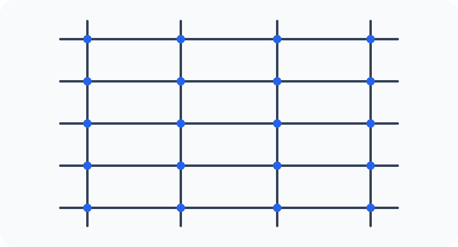

# Konu 21 — Kombinasyon

## Test 19 — Temel Düzey

- Soru sayısı: 10
- Her soruda yalnız bir doğru seçenek vardır.
- Önerilen süre: 17 dakika

## Soru 1

`K21-T19-Q01`

$1,2,3,\ldots,9$ sayılarından dördü seçilecektir. Seçilen sayıların tam olarak ikisi 3'ün katı olacaktır.

Buna göre seçim kaç farklı biçimde yapılabilir?

A) $30$

B) $36$

C) $40$

D) $45$

E) $48$

## Soru 2

`K21-T19-Q02`

Yedi elemanlı bir kümenin en fazla iki elemanlı kaç alt kümesi vardır?

A) $22$

B) $24$

C) $26$

D) $28$

E) $29$

## Soru 3

`K21-T19-Q03`

Birbirinden farklı 12 kitabın dördü şiir kitabıdır. Beş kitaplık bir seçkide en az üç şiir kitabı bulunacaktır.

Buna göre seçki kaç farklı biçimde oluşturulabilir?

A) $120$

B) $112$

C) $108$

D) $128$

E) $132$

## Soru 4

`K21-T19-Q04`

9 öğrenciden üç kişilik kırmızı takım ve bu takımdan farklı üç kişilik mavi takım oluşturulacaktır. Üç öğrenci hiçbir takımda yer almayacaktır.

Buna göre iki takım kaç farklı biçimde oluşturulabilir?

A) $1440$

B) $1680$

C) $1800$

D) $1920$

E) $2160$

## Soru 5

`K21-T19-Q05`

$1,2,3,\ldots,10$ sayılarından çarpımı çift olan üç farklı sayı seçilecektir.

Buna göre seçim kaç farklı biçimde yapılabilir?

A) $90$

B) $100$

C) $110$

D) $115$

E) $120$

## Soru 6

`K21-T19-Q06`

Aralarında A, B ve C'nin de bulunduğu 9 kişiden beş kişilik bir kurul seçilecektir.

A, B ve C'den en az ikisinin kurulda bulunması koşuluyla seçim kaç farklı biçimde yapılabilir?

A) $60$

B) $65$

C) $70$

D) $75$

E) $80$

## Soru 7

`K21-T19-Q07`

Aşağıdaki şekilde 5 yatay ve 4 düşey doğru verilmiştir.

Buna göre şekilde kaç dikdörtgen vardır?

A) $36$

B) $40$

C) $45$

D) $50$

E) $60$

## Soru 8

`K21-T19-Q08`

8 öğrenci; üç, üç ve iki kişilik üç gruba ayrılacaktır. Grupların adları yoktur.

Buna göre gruplandırma kaç farklı biçimde yapılabilir?

A) $280$

B) $240$

C) $210$

D) $180$

E) $160$

## Soru 9

`K21-T19-Q09`

Birbirinden farklı 11 kitabın A ve B adlı ikisi matematik kitabıdır. Dört kitap seçilirken A ile B'den en az biri seçilecektir.

Buna göre seçim kaç farklı biçimde yapılabilir?

A) $180$

B) $204$

C) $210$

D) $220$

E) $225$

## Soru 10

`K21-T19-Q10`

Aralarında A ile B'nin de bulunduğu 12 öğrenciden beş kişilik bir grup oluşturulacaktır.

A ile B ya birlikte grupta bulunacak ya da ikisi de grupta bulunmayacaktır.

Buna göre grup kaç farklı biçimde oluşturulabilir?

A) $330$

B) $360$

C) $372$

D) $380$

E) $396$
