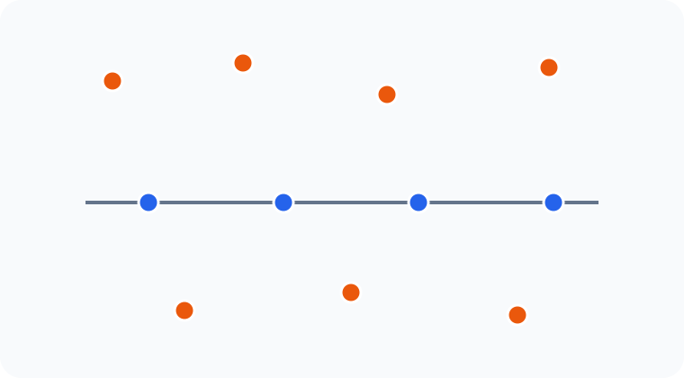
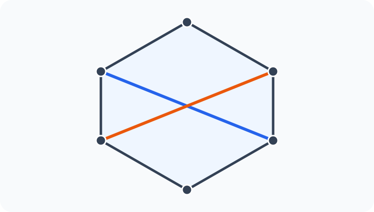
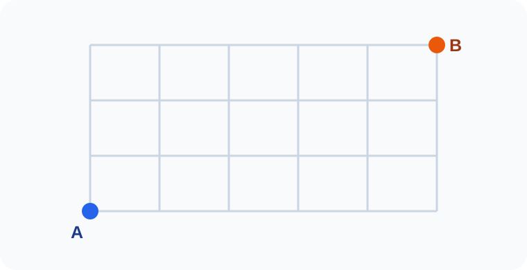

# Konu 21 — Kombinasyon

## Test 20 — Temel Düzey

- Soru sayısı: 10
- Her soruda yalnız bir doğru seçenek vardır.
- Önerilen süre: 17 dakika

## Soru 1

`K21-T20-Q01`

$1,2,3,\ldots,12$ sayılarından toplamı tek olan iki farklı sayı seçilecektir.

Buna göre seçim kaç farklı biçimde yapılabilir?

A) $24$

B) $28$

C) $30$

D) $32$

E) $36$

## Soru 2

`K21-T20-Q02`

Dokuz elemanlı bir kümenin belirli iki elemanını birlikte içeren üç elemanlı kaç alt kümesi vardır?

A) $7$

B) $8$

C) $9$

D) $10$

E) $12$

## Soru 3

`K21-T20-Q03`

Dördü aynı doğru üzerinde bulunan 11 noktadan herhangi ikisi birleştirilerek doğrular çizilecektir. Verilen dört noktanın dışında aynı doğru üzerinde bulunan üç nokta yoktur.

Buna göre kaç farklı doğru çizilebilir?

A) $45$

B) $50$

C) $51$

D) $55$

E) $56$

## Soru 4

`K21-T20-Q04`

Yedi elemanlı bir kümeden, iki elemanlı A ve üç elemanlı B alt kümeleri seçilecektir.

$$A\cap B=\varnothing$$

olduğuna göre $(A,B)$ ikilisi kaç farklı biçimde belirlenebilir?

A) $126$

B) $180$

C) $210$

D) $252$

E) $315$

## Soru 5

`K21-T20-Q05`

Aralarında A, B ve C'nin de bulunduğu 9 öğrenciden dört kişilik bir grup oluşturulacaktır.

A, B ve C'den en az birinin grupta bulunması koşuluyla seçim kaç farklı biçimde yapılabilir?

A) $96$

B) $105$

C) $110$

D) $111$

E) $115$

## Soru 6

`K21-T20-Q06`

$x,y,z$ negatif olmayan tam sayılar olmak üzere

$$x+y+z=8$$

eşitliğini sağlayan ve $x$ değeri çift olan kaç $(x,y,z)$ üçlüsü vardır?

A) $15$

B) $18$

C) $20$

D) $21$

E) $25$

## Soru 7

`K21-T20-Q07`

Bir sınavdaki birbirinden farklı 10 sorudan 6'sı seçilecektir. Birinci ve onuncu soruların ikisinin birden seçimin dışında kalmasına izin verilmeyecektir.

Buna göre seçim kaç farklı biçimde yapılabilir?

A) $182$

B) $180$

C) $176$

D) $168$

E) $154$

## Soru 8

`K21-T20-Q08`

Bir düzgün altıgenin köşelerinden çizilen iki köşegen, altıgenin iç bölgesinde kesişecektir.

Buna göre bu koşulu sağlayan köşegen çiftlerinin sayısı kaçtır?

A) $12$

B) $15$

C) $18$

D) $20$

E) $24$

## Soru 9

`K21-T20-Q09`

Aşağıdaki kareli zeminde A noktasından B noktasına yalnız sağa veya yukarı doğru birer birimlik adımlarla gidilecektir.

Buna göre A'dan B'ye kaç farklı en kısa yol vardır?

A) $35$

B) $45$

C) $56$

D) $70$

E) $84$

## Soru 10

`K21-T20-Q10`

Sekiz elemanlı bir kümenin A ve B alt kümeleri için

$$A\subset B,\qquad |A|=2,\qquad |B|=5$$

olduğuna göre $(A,B)$ ikilisi kaç farklı biçimde belirlenebilir?

A) $420$

B) $480$

C) $504$

D) $560$

E) $630$
