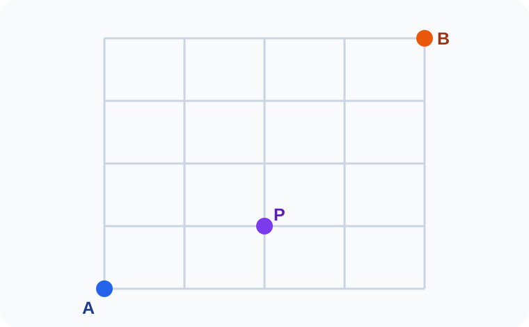
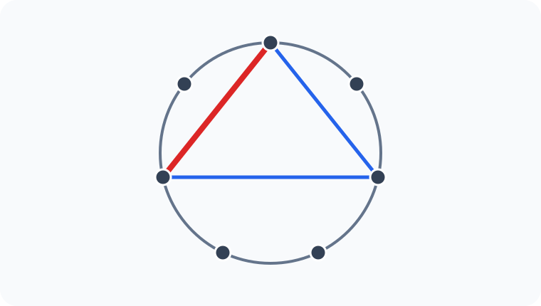

# Konu 21 — Kombinasyon

## Test 22 — Temel Düzey

- Soru sayısı: 10
- Her soruda yalnız bir doğru seçenek vardır.
- Önerilen süre: 17 dakika

## Soru 1

`K21-T22-Q01`

Aşağıdaki kareli zeminde A noktasından B noktasına yalnız sağa veya yukarı doğru birer birimlik adımlarla gidilecektir. Yol P noktasından geçecektir.

Buna göre A'dan B'ye kaç farklı en kısa yol vardır?

A) $20$

B) $30$

C) $36$

D) $40$

E) $45$

## Soru 2

`K21-T22-Q02`

Sekiz elemanlı bir kümenin üç elemanı kırmızıyla işaretlenmiştir. Dört elemanlı bir alt kümede çift sayıda kırmızı eleman bulunacaktır.

Buna göre seçim kaç farklı biçimde yapılabilir?

A) $25$

B) $30$

C) $35$

D) $40$

E) $45$

## Soru 3

`K21-T22-Q03`

Aralarında A, B ve C'nin de bulunduğu 12 öğrenciden dört kişilik bir grup oluşturulacaktır.

A, B ve C'den en çok birinin grupta bulunması koşuluyla grup kaç farklı biçimde oluşturulabilir?

A) $330$

B) $342$

C) $360$

D) $378$

E) $396$

## Soru 4

`K21-T22-Q04`

Çember üzerinde işaretlenmiş 7 noktadan üçü seçilerek bir üçgen çizilecek ve bu üçgenin bir kenarı kırmızıyla belirtilecektir.

Buna göre üçgen ve kırmızı kenar kaç farklı biçimde belirlenebilir?

A) $70$

B) $84$

C) $90$

D) $98$

E) $105$

## Soru 5

`K21-T22-Q05`

Aralarında A ile B'nin de bulunduğu 10 öğrenciden dört kişilik bir grup oluşturulacaktır.

B grupta bulunuyorsa A da grupta bulunacağına göre grup kaç farklı biçimde oluşturulabilir?

A) $154$

B) $150$

C) $144$

D) $140$

E) $136$

## Soru 6

`K21-T22-Q06`

Kökleri

$$\{-3,-2,-1,1,2,3\}$$

kümesinden seçilen, iki farklı gerçek köklü ve baş katsayısı 1 olan ikinci dereceden denklemlerden kaçının sabit terimi negatiftir?

A) $6$

B) $9$

C) $12$

D) $15$

E) $18$

## Soru 7

`K21-T22-Q07`

$1,2,3,\ldots,10$ sayıları, toplamları 11 olan beş çifte ayrılmıştır. Bu sayılardan beşi seçilecektir.

Toplamı 11 olan hiçbir sayı çifti birlikte seçilmeyeceğine göre seçim kaç farklı biçimde yapılabilir?

A) $20$

B) $24$

C) $32$

D) $40$

E) $48$

## Soru 8

`K21-T22-Q08`

Sekiz elemanlı bir kümenin ikişer elemanlı A ve B alt kümeleri için

$$|A\cap B|=1$$

olacaktır. A ile B farklı adlara sahip olduğuna göre $(A,B)$ ikilisi kaç farklı biçimde belirlenebilir?

A) $224$

B) $280$

C) $320$

D) $336$

E) $360$

## Soru 9

`K21-T22-Q09`

Dört öğrencilik bir sınıf ile altı öğrencilik başka bir sınıftan üç kişilik ortak bir ekip seçilecektir. Ekipte her iki sınıftan da en az bir öğrenci bulunacaktır.

Buna göre ekip kaç farklı biçimde seçilebilir?

A) $72$

B) $80$

C) $84$

D) $90$

E) $96$

## Soru 10

`K21-T22-Q10`

Bir sınavdaki birbirinden farklı 8 sorudan dördü seçilecektir. İlk iki sorudan en çok biri, son üç sorudan ise en az biri seçilecektir.

Buna göre seçim kaç farklı biçimde yapılabilir?

A) $53$

B) $50$

C) $48$

D) $45$

E) $42$
