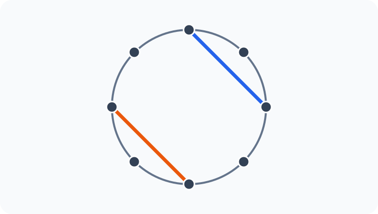
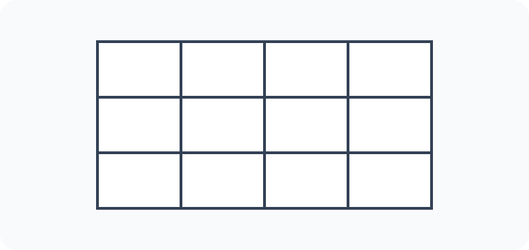
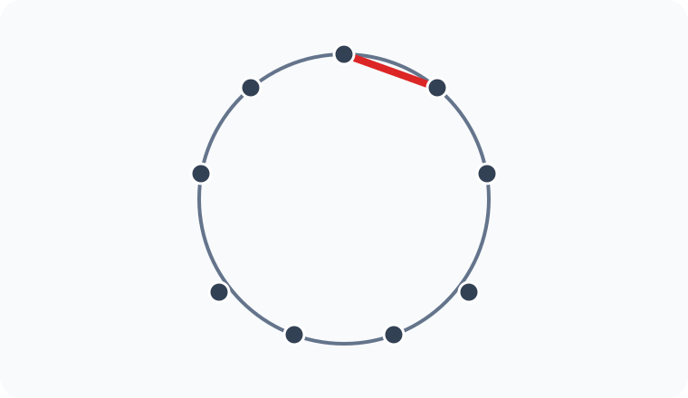
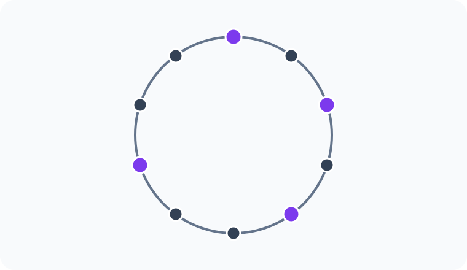

# Konu 21 — Kombinasyon

## Test 23 — Temel Düzey

- Soru sayısı: 10
- Her soruda yalnız bir doğru seçenek vardır.
- Önerilen süre: 17 dakika

## Soru 1

`K21-T23-Q01`

$$\binom80+\binom81+\binom82+\cdots+\binom88$$

toplamının değeri kaçtır?

A) $128$

B) $224$

C) $256$

D) $288$

E) $512$

## Soru 2

`K21-T23-Q02`

Birbirinden farklı 6 kırmızı ve 4 mavi karttan dördü seçilecektir. Seçilen kartların tamamı aynı renkte olmayacaktır.

Buna göre seçim kaç farklı biçimde yapılabilir?

A) $180$

B) $190$

C) $192$

D) $194$

E) $196$

## Soru 3

`K21-T23-Q03`

Çember üzerinde işaretlenmiş 8 noktadan, ortak uç noktası bulunmayan iki doğru parçası çizilecektir.

Buna göre çizim kaç farklı biçimde yapılabilir?

A) $105$

B) $140$

C) $168$

D) $180$

E) $210$

## Soru 4

`K21-T23-Q04`

$1,2,3,\ldots,9$ sayılarından üç farklı sayı seçilecektir. Seçilen sayılar küçükten büyüğe sıralandığında ortadaki sayı 5 olacaktır.

Buna göre seçim kaç farklı biçimde yapılabilir?

A) $16$

B) $18$

C) $20$

D) $24$

E) $28$

## Soru 5

`K21-T23-Q05`

Birbirinden farklı 11 kitabın altısı romandır. Beş kitaplık bir seçkide en az dört roman bulunacaktır.

Buna göre seçki kaç farklı biçimde oluşturulabilir?

A) $75$

B) $81$

C) $85$

D) $90$

E) $96$

## Soru 6

`K21-T23-Q06`

$x,y,z$ tam sayıları için

$$x+y+z=12,\qquad x\ge2,\ y\ge2,\ z\ge2$$

olduğuna göre bu koşulları sağlayan kaç $(x,y,z)$ üçlüsü vardır?

A) $21$

B) $24$

C) $28$

D) $32$

E) $36$

## Soru 7

`K21-T23-Q07`

Aşağıdaki tabloda iki hücre seçilecektir. Seçilen hücreler aynı satırda ve aynı sütunda bulunmayacaktır.

Buna göre seçim kaç farklı biçimde yapılabilir?

A) $24$

B) $28$

C) $32$

D) $36$

E) $40$

## Soru 8

`K21-T23-Q08`

Çember üzerinde işaretlenmiş 9 noktadan dördü seçilerek bir dörtgen çizilecektir. Şekilde kırmızıyla gösterilen, çember üzerindeki ardışık iki noktayı birleştiren doğru parçası dörtgenin bir kenarı olacaktır.

Buna göre dörtgen kaç farklı biçimde çizilebilir?

A) $10$

B) $12$

C) $15$

D) $18$

E) $21$

## Soru 9

`K21-T23-Q09`

$1,2,3,\ldots,16$ sayılarından 4 ile bölündüğünde aynı kalanı veren üç farklı sayı seçilecektir.

Buna göre seçim kaç farklı biçimde yapılabilir?

A) $16$

B) $20$

C) $24$

D) $28$

E) $32$

## Soru 10

`K21-T23-Q10`

Çember üzerinde eşit aralıklarla işaretlenmiş 10 noktadan dördü seçilecektir. Seçilen noktaların hiçbiri çember üzerinde yan yana olmayacaktır.

Buna göre seçim kaç farklı biçimde yapılabilir?

A) $20$

B) $25$

C) $30$

D) $35$

E) $40$
