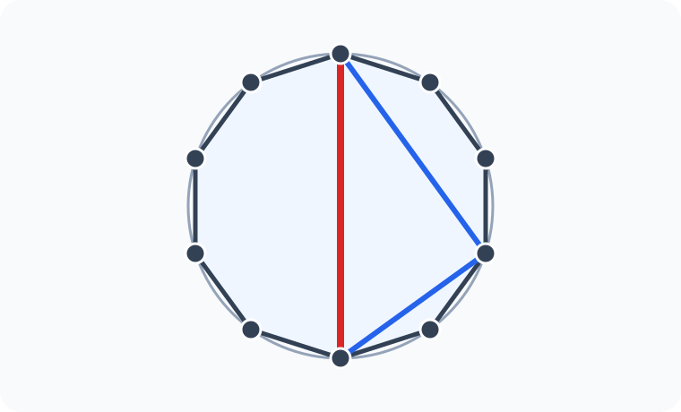
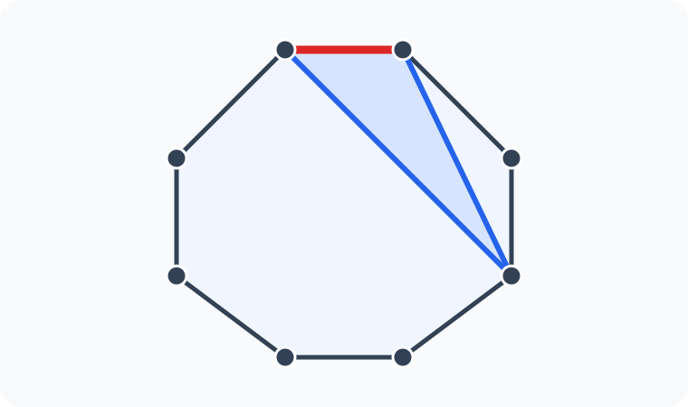

# Konu 21 — Kombinasyon

## Test 24 — Temel Düzey

- Soru sayısı: 10
- Her soruda yalnız bir doğru seçenek vardır.
- Önerilen süre: 17 dakika

## Soru 1

`K21-T24-Q01`

Birbirinden farklı 7 sorudan iki veya üç tanesi seçilecektir.

Buna göre seçim kaç farklı biçimde yapılabilir?

A) $35$

B) $42$

C) $49$

D) $56$

E) $63$

## Soru 2

`K21-T24-Q02`

Beş evli çiftten üç kişilik bir grup oluşturulacaktır. Grupta eş olan en az bir çift birlikte bulunacaktır.

Buna göre grup kaç farklı biçimde oluşturulabilir?

A) $20$

B) $24$

C) $30$

D) $36$

E) $40$

## Soru 3

`K21-T24-Q03`

$a,b,c$ pozitif tam sayılar olmak üzere

$$a+b+c=5$$

eşitliğini sağlayan kaç $(a,b,c)$ üçlüsü vardır?

A) $6$

B) $8$

C) $10$

D) $12$

E) $15$

## Soru 4

`K21-T24-Q04`

10 öğrenci ikişer kişilik beş gruba ayrılacaktır. A ile B aynı grupta bulunmayacaktır. Grupların adları ve grup içindeki sıra önemli değildir.

Buna göre gruplandırma kaç farklı biçimde yapılabilir?

A) $735$

B) $840$

C) $875$

D) $900$

E) $945$

## Soru 5

`K21-T24-Q05`

Bir sınavdaki birbirinden farklı 9 sorudan dördü seçilecektir. İlk üç sorudan en az biri, son iki sorudan ise en çok biri seçilecektir.

Buna göre seçim kaç farklı biçimde yapılabilir?

A) $84$

B) $90$

C) $96$

D) $102$

E) $108$

## Soru 6

`K21-T24-Q06`

$1,2,3,\ldots,9$ sayılarından üçü seçilecektir. Seçilen sayılar arasında ardışık en az bir sayı çifti bulunacaktır.

Buna göre seçim kaç farklı biçimde yapılabilir?

A) $35$

B) $42$

C) $45$

D) $49$

E) $56$

## Soru 7

`K21-T24-Q07`

Bir düzgün ongenin köşelerinden üçü seçilerek bir üçgen çizilecektir. Üçgenin bir kenarı ongenin çevrel çemberinin çapı olacaktır.

Buna göre üçgen kaç farklı biçimde çizilebilir?

A) $20$

B) $25$

C) $30$

D) $35$

E) $40$

## Soru 8

`K21-T24-Q08`

Bir düzgün sekizgenin köşelerinden üçü seçilerek bir üçgen çizilecektir. Üçgenin tam olarak bir kenarı sekizgenin de kenarı olacaktır.

Buna göre üçgen kaç farklı biçimde çizilebilir?

A) $32$

B) $28$

C) $24$

D) $20$

E) $16$

## Soru 9

`K21-T24-Q09`

Birbirinden farklı 4 kırmızı ve 4 mavi karttan dördü seçilecektir. Seçilen kırmızı ve mavi kartların sayıları birbirine eşit olmayacaktır.

Buna göre seçim kaç farklı biçimde yapılabilir?

A) $32$

B) $34$

C) $36$

D) $38$

E) $40$

## Soru 10

`K21-T24-Q10`

Yedi elemanlı bir E kümesinin A ve B alt kümeleri için

$$A\subseteq B\subseteq E$$

olduğuna göre $(A,B)$ ikilisi kaç farklı biçimde belirlenebilir?

A) $729$

B) $1458$

C) $2187$

D) $2916$

E) $6561$
