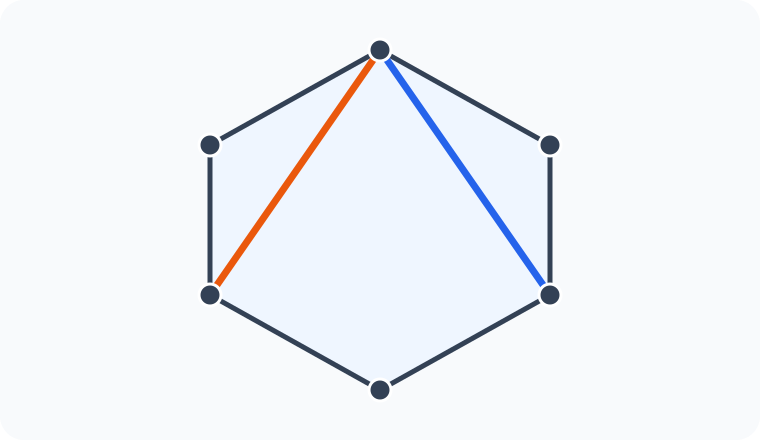
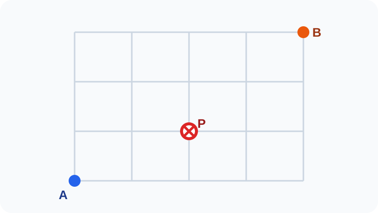
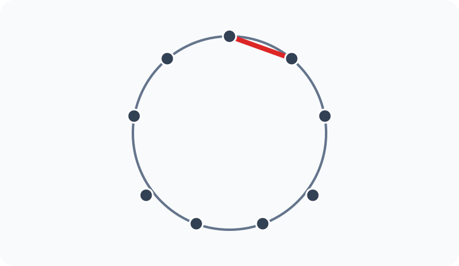
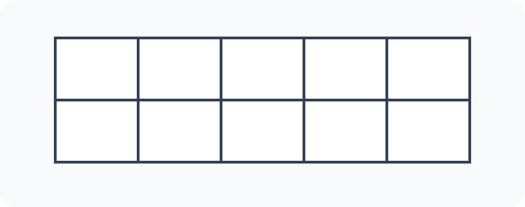

# Konu 21 — Kombinasyon

## Test 25 — Temel Düzey

- Soru sayısı: 10
- Her soruda yalnız bir doğru seçenek vardır.
- Önerilen süre: 17 dakika

## Soru 1

`K21-T25-Q01`

$1,2,3,\ldots,12$ sayılarından dört farklı sayı seçilecektir. Seçilen sayıların en büyüğü 9 olacaktır.

Buna göre seçim kaç farklı biçimde yapılabilir?

A) $35$

B) $40$

C) $45$

D) $50$

E) $56$

## Soru 2

`K21-T25-Q02`

Bir düzgün altıgenin köşelerinden ortak uçlu iki farklı köşegen çizilecektir.

Buna göre çizim kaç farklı biçimde yapılabilir?

A) $18$

B) $15$

C) $12$

D) $9$

E) $6$

## Soru 3

`K21-T25-Q03`

Aşağıdaki kareli zeminde A noktasından B noktasına yalnız sağa veya yukarı doğru birer birimlik adımlarla en kısa yoldan gidilecektir. Yol P noktasından geçmeyecektir.

Buna göre A'dan B'ye kaç farklı yol vardır?

A) $15$

B) $17$

C) $18$

D) $20$

E) $21$

## Soru 4

`K21-T25-Q04`

$$(1+x)^{10}$$

açılımında $x^4$ lü terimin katsayısı kaçtır?

A) $120$

B) $180$

C) $210$

D) $252$

E) $330$

## Soru 5

`K21-T25-Q05`

Bir sınavdaki birbirinden farklı 12 sorunun ilk altısından ve son altısından eşit sayıda olmak üzere toplam 6 soru seçilecektir.

Buna göre seçim kaç farklı biçimde yapılabilir?

A) $225$

B) $300$

C) $360$

D) $400$

E) $450$

## Soru 6

`K21-T25-Q06`

$x,y,z$ negatif olmayan tam sayılar olmak üzere

$$x+y+z=10,\qquad x\le2$$

eşitliğini sağlayan kaç $(x,y,z)$ üçlüsü vardır?

A) $21$

B) $24$

C) $27$

D) $28$

E) $30$

## Soru 7

`K21-T25-Q07`

$1,2,3,\ldots,8$ sayılarından toplamı tek olan dört farklı sayı seçilecektir.

Buna göre seçim kaç farklı biçimde yapılabilir?

A) $32$

B) $30$

C) $28$

D) $24$

E) $20$

## Soru 8

`K21-T25-Q08`

Birbirinden farklı 12 kart, ikişerli altı eşlenmiş çift hâlindedir. Bu kartlardan aynı eşlenmiş çifte ait olmayan iki kart seçilecektir.

Buna göre seçim kaç farklı biçimde yapılabilir?

A) $54$

B) $60$

C) $66$

D) $72$

E) $78$

## Soru 9

`K21-T25-Q09`

Çember üzerinde eşit aralıklarla işaretlenmiş 9 noktadan üçü seçilerek bir üçgen çizilecektir. Şekilde kırmızıyla belirtilen doğru parçası üçgenin bir kenarı olacaktır.

Buna göre üçgen kaç farklı biçimde çizilebilir?

A) $5$

B) $6$

C) $7$

D) $8$

E) $9$

## Soru 10

`K21-T25-Q10`

Aşağıdaki iki satır ve beş sütundan oluşan tabloda üç hücre seçilecektir. Aynı sütundan birden fazla hücre seçilmeyecektir.

Buna göre seçim kaç farklı biçimde yapılabilir?

A) $60$

B) $64$

C) $72$

D) $80$

E) $96$
