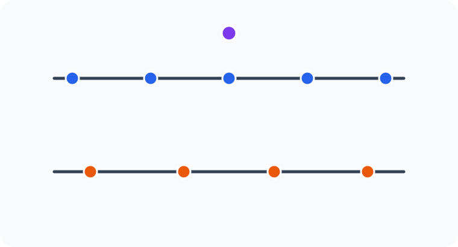

# Konu 21 — Kombinasyon

## Test 26 — Gelişim ve Pekiştirme

- Soru sayısı: 10
- Her soruda yalnız bir doğru seçenek vardır.
- Önerilen süre: 21 dakika

## Soru 1

`K21-T26-Q01`

Aralarında A, B ve C'nin de bulunduğu 10 öğrenciden beş kişilik bir grup oluşturulacaktır.

A ile B'nin birlikte grupta bulunması ve C'nin grupta bulunması durumları ya ikisi birden gerçekleşecek ya da ikisi de gerçekleşmeyecektir.

Buna göre grup kaç farklı biçimde oluşturulabilir?

A) $112$

B) $105$

C) $98$

D) $120$

E) $126$

## Soru 2

`K21-T26-Q02`

Dokuz elemanlı bir kümenin A ve B alt kümeleri için

$$|A|=3,\qquad |B|=4,\qquad |A\cap B|=2$$

olduğuna göre $(A,B)$ ikilisi kaç farklı biçimde belirlenebilir?

A) $3360$

B) $3780$

C) $3920$

D) $4200$

E) $4320$

## Soru 3

`K21-T26-Q03`

12 öğrencinin A, B, C ve D adlı dördü birinci grupta; E ve F adlı ikisi ikinci grupta değerlendirilmiştir. Beş kişilik bir ekip seçilecektir.

Ekipte birinci gruptan tam iki, ikinci gruptan ise en az bir öğrenci bulunacağına göre seçim kaç farklı biçimde yapılabilir?

A) $180$

B) $204$

C) $216$

D) $228$

E) $240$

## Soru 4

`K21-T26-Q04`

Birbirinden farklı 10 kitabın dördü matematik, üçü fizik ve üçü kimya kitabıdır. Beş kitaplık bir seçkide her üç dersten de en az bir kitap bulunacaktır.

Buna göre seçki kaç farklı biçimde oluşturulabilir?

A) $180$

B) $192$

C) $198$

D) $204$

E) $210$

## Soru 5

`K21-T26-Q05`

Aralarında A ile B'nin de bulunduğu 9 öğrenci; iki, üç ve dört kişilik üç gruba ayrılacaktır. Gruplar büyüklükleriyle birbirinden ayrılmaktadır.

A ile B farklı gruplarda bulunacağına göre gruplandırma kaç farklı biçimde yapılabilir?

A) $840$

B) $875$

C) $896$

D) $900$

E) $910$

## Soru 6

`K21-T26-Q06`

Birbirinden farklı 12 kart, ikişerli altı eşlenmiş çift hâlindedir. Bu kartlardan altısı seçilecektir.

Seçilen kartlar arasında tam olarak iki eşlenmiş çiftin iki kartı da bulunacağına göre seçim kaç farklı biçimde yapılabilir?

A) $360$

B) $336$

C) $320$

D) $300$

E) $288$

## Soru 7

`K21-T26-Q07`

Birbirine paralel iki doğru üzerinde sırasıyla 5 ve 4 nokta, bu doğruların dışında ise bir nokta işaretlenmiştir. Belirtilen iki doğru dışında aynı doğru üzerinde bulunan üç işaretli nokta yoktur.

Köşeleri bu noktalardan seçilen kaç farklı üçgen çizilebilir?

A) $100$

B) $106$

C) $110$

D) $114$

E) $120$

## Soru 8

`K21-T26-Q08`

$1,2,3,\ldots,12$ sayılarından dördü seçilecektir. Seçilen sayılar küçükten büyüğe sıralandığında yan yana gelen sayılardan tam bir çifti ardışık olacaktır.

Buna göre seçim kaç farklı biçimde yapılabilir?

A) $210$

B) $225$

C) $252$

D) $280$

E) $315$

## Soru 9

`K21-T26-Q09`

Aralarında A, B ve C'nin de bulunduğu 12 öğrenciden altı kişilik bir grup oluşturulacaktır.

A, B ve C'den ya hiçbiri ya da tam ikisi grupta bulunacağına göre grup kaç farklı biçimde oluşturulabilir?

A) $420$

B) $441$

C) $450$

D) $462$

E) $480$

## Soru 10

`K21-T26-Q10`

Dokuz elemanlı bir E kümesinin A ve B alt kümeleri için

$$A\cup B=E,\qquad |A\cap B|=2$$

olduğuna göre $(A,B)$ ikilisi kaç farklı biçimde belirlenebilir?

A) $4032$

B) $4320$

C) $4480$

D) $4536$

E) $4608$
