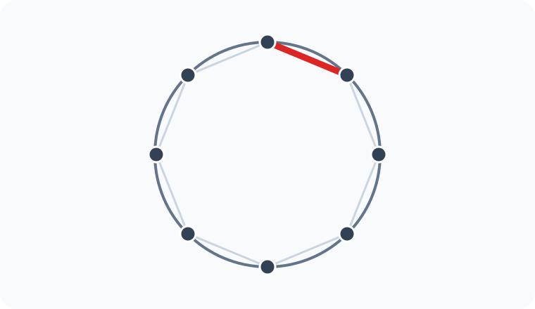

# Konu 21 — Kombinasyon

## Test 29 — Gelişim ve Pekiştirme

- Soru sayısı: 10
- Her soruda yalnız bir doğru seçenek vardır.
- Önerilen süre: 21 dakika

## Soru 1

`K21-T29-Q01`

$1,2,3,\ldots,12$ sayılarından dört farklı sayı seçilecektir. Seçilen sayıların tam olarak ikisi 3'ün katı olacaktır.

Buna göre seçim kaç farklı biçimde yapılabilir?

A) $140$

B) $150$

C) $160$

D) $168$

E) $180$

## Soru 2

`K21-T29-Q02`

Aralarında A, B ve C'nin de bulunduğu 9 öğrenciden beş kişilik bir kurul seçilecektir.

A, B ve C'den en az ikisinin kurulda bulunması koşuluyla seçim kaç farklı biçimde yapılabilir?

A) $60$

B) $68$

C) $72$

D) $78$

E) $75$

## Soru 3

`K21-T29-Q03`

Yedi elemanlı bir kümenin A ve B alt kümeleri için

$$A\subset B,\qquad |A|=2,\qquad |B|=3$$

olduğuna göre $(A,B)$ ikilisi kaç farklı biçimde belirlenebilir?

A) $105$

B) $90$

C) $84$

D) $120$

E) $140$

## Soru 4

`K21-T29-Q04`

Altı evli çiftten üç kişilik bir grup oluşturulacaktır. Grupta tam olarak bir eş çifti birlikte bulunacaktır.

Buna göre grup kaç farklı biçimde oluşturulabilir?

A) $48$

B) $60$

C) $72$

D) $84$

E) $96$

## Soru 5

`K21-T29-Q05`

Birbirinden farklı 10 kitabın dördü matematik, üçü fizik ve üçü kimya kitabıdır. Dört kitaplık bir seçkide her üç dersten de en az bir kitap bulunacaktır.

Buna göre seçki kaç farklı biçimde oluşturulabilir?

A) $108$

B) $120$

C) $126$

D) $132$

E) $144$

## Soru 6

`K21-T29-Q06`

$x,y,z$ negatif olmayan tam sayılar ve $x,y,z$ çift olmak üzere

$$x+y+z=10$$

eşitliğini sağlayan kaç $(x,y,z)$ üçlüsü vardır?

A) $15$

B) $18$

C) $20$

D) $21$

E) $24$

## Soru 7

`K21-T29-Q07`

$1,2,3,\ldots,10$ sayılarından dört farklı sayı seçilecektir. Seçilen sayıların toplamı çift olacaktır.

Buna göre seçim kaç farklı biçimde yapılabilir?

A) $80$

B) $90$

C) $100$

D) $105$

E) $110$

## Soru 8

`K21-T29-Q08`

Çember üzerinde işaretlenmiş 8 noktadan dördü seçilerek bir dörtgen çizilecektir. Şekilde kırmızıyla gösterilen ardışık iki nokta, dörtgenin bir kenarı olacaktır.

Buna göre dörtgen kaç farklı biçimde çizilebilir?

A) $15$

B) $18$

C) $20$

D) $21$

E) $24$

## Soru 9

`K21-T29-Q09`

Dokuz öğrenciden dört kişilik bir ekip ve ekipte bulunmayan öğrencilerden iki kişilik bir yedek grup oluşturulacaktır.

Buna göre ekip ve yedek grup kaç farklı biçimde belirlenebilir?

A) $630$

B) $1260$

C) $1512$

D) $1680$

E) $1890$

## Soru 10

`K21-T29-Q10`

12 öğrenci, adlandırılmamış üçer kişilik dört gruba ayrılacaktır.

Buna göre gruplandırma kaç farklı biçimde yapılabilir?

A) $14000$

B) $14700$

C) $15400$

D) $16100$

E) $16800$
